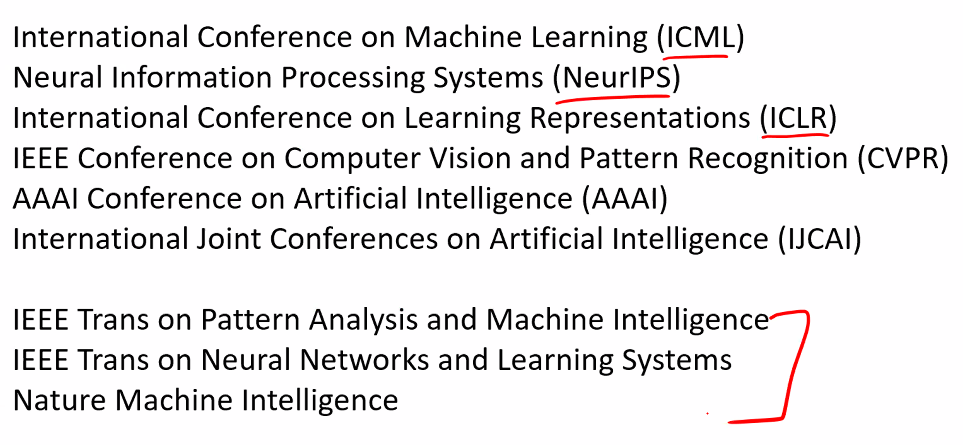

# Intro

~~기계학습, 강재우 교수님~~

기계학습, 육동석 교수님

## 끊기기 전

## 여러 경진대회

- DREAM Challenges

의료 관련 Challenge 들 중에서 DMIS (강재우 교수님 연구실)이 여러 개를 수상했다.

# Lecture : Introduction

## Big data

- 우리는 데이터의 생산자이면서 소비자이다.
- 데이터는 random 하지 않고 structure 를 가진다
- 과정의 이해
- 앞으로 일어날 일을 예측한다.
- 더 싼 computaitional power

## Data Mining (application of ML to large data set)

- Retail
- Finance
- Manufacturing
- Medicine
- Web mining
- ...

## 왜 학습해야하는가

calculate payroll 할 때는 배울 필요가 없다.

이럴 때

- 어떻게 작동하는지 설명할 수 없을 때 (speech recognition)
- 해답이 시간에 따라 바뀔때
- adapted to particular cases (얼굴 인식할 때 변화가 일어날 수 있다.)

## Definition of ML

task T

performance measure P

experience E

## ML algorithms

### Association

ex) Basket analysis

$P(Y|X)$ probability X 라는 물건을 구매한 고객이 Y도 구매할 확률

---

### Supervised Learning

**Classification** ex) 대출해줄 때 low-risk 고객인지 high-risk 고객인지

통계에서는 Discriminant 라고도 함.

가장 error 를 minimize 하는 discriminant 를 찾는다.

feature 를 여러 개 쓴다.

**Regression** ex) 집값 예측

$y=g(x|\theta)$

g : model

$\theta$ : parameters

직선일 필요는 없다.

Classification 과 Regression 의 차이는 무엇인가?

> discrete / continuos

Supervised Learning 에서는 "right answers" 가 주어진다.

---

### Unsupervised Learning

Supervised 에서는 right answer 가 있지만 여기선 없다.

> 데이터에 내재되어 있는 structure 를 발굴을 하자.

- No output
- Clustering : grouping similar instances
- ex) CRM, Learning motifs, News clustering, Social network analysis, Market segmentation

### Reinforcement Learning (알파고)

Learning a policy : A sequence of outputs

> output 의 sequence 를 학습한다.

No supervised output but delayed reward

ex)

- Game play
- Robot in a maze

## Question

- 기계학습 모델이 항상 blackbox 인가?

항상 그렇지는 않다.. 간단한 모델 같은 경우에는 설명할 수 있으나, deep learning 같은 것들은 복잡해서 원래는 설명이 어려웠으나

최근 들어 많은 연구를 걸쳐 개선이 될 것으로 보인다.

- 딥러닝에서도 은닉층이 얇으면 해석 가능성이 높은가?

그렇다. 덜 복잡하면 용이
