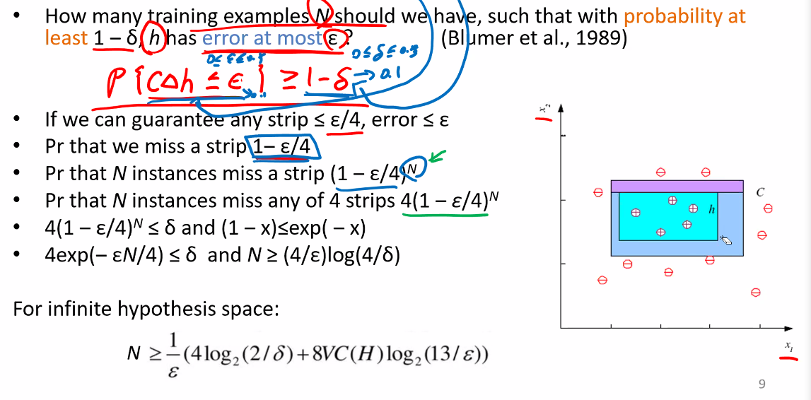
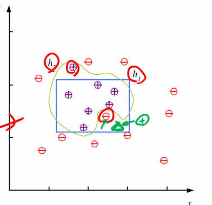
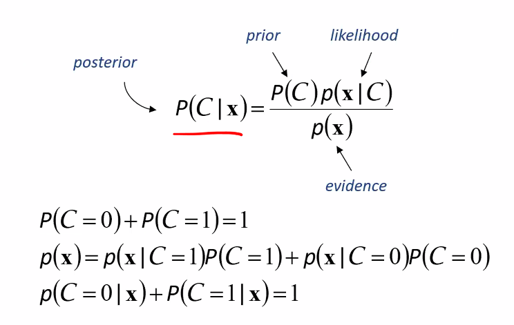
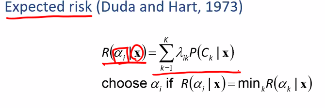

## Hypothesis class H

hypothesis class sms $x$ 가 positive 인지 negative 인지 판별하는데

- False Positive
- False negative

error 가 있다.

Error : miss classification 된 example 들의 갯수로도 정할 수 있다.

이것을 $N$ 으로 나눠주면 error rate 가 되겠다.

## S, G and the Version Space

example 을 바운딩 할 때 타이트하게 바운딩 할수도, 가장 널널하게 바운딩 할 수 있다.

- S : most specific hypothesis
- G : most general hypothesis
- Version Space : S와 G 사이의 공간

### Margin

h with largest margin

h 를 선택할 때 S 부터 h 까지의 거리와 G 부터 h 까지의 거리(margin) 둘다 최대화 시킨 것을 고른다. (max margin classifier) (ex) SVM

- hypothesis class as axis aligned rectangle
- choose max margin
- get unique h

만약 true class C 가 axis aligned rectangle 로 만들기 힘들다면?

C를 포괄하기 위해선 flexible 해야 한다.

그래서 나온 개념이

## Vapnik-Chervonenkis (VC) Dimension

VC(H) = N

binary classification 에서 N 개의 point 가 있다 생각하자. 그렇다면, $2^N$ 개의 방법의 label 방법이 있겠다.

어떤 H안의 h 가 error 없이 H shatters N 이라면 VC(H) = N

ex) $2^4 = 16$

VC Dimension 이 보다 큰 것을 통해 보다 더 복잡한 학습을 가능케한다.

단순한 linear classifer 도 생각할 수 있다. 이것의 VC Dimension 은 어떻게 될까?

VC(H) = d + 1

d : feature dimension

예시에서는 feature 가 2차원이기 때문에 linear classifier 로는 VC(H) = 3 이라고 할 수 있다. 직사각형의 경우는 4 이다.

4개 밖에 안돼? 이럴 수도 있지만 실제 data 에서는 positive 근처에 positive 가 있고 이렇기 때문에 예시와는 다르다.

그렇다면 보편적으로 N dimension에서 N-1 dimension classifiar(2차원에서는 linear, 3차원에서는 평면)에서의 VC(N) = d + 1로 볼 수 있을까요?
아 VC(H)

## Probably Approximately Correct (PAC) Learning

> Probably : 최소 $1-\delta$ 확률로
>   AC : error at most $\epsilon$

최소 $1-\delta$ 확률로 error 가 최대 $\epsilon$ 을 가지려고 할 때 몇개의 training examples N 이 필요한가?

정할 때 h = S 로 정한다.

식을 보면 $\frac1\epsilon$ 과 N 이 linear 하게 비례한다는 것을 알 수 있다.
또한, $\frac1\delta$ 와 N이 logarlism 하게 비례한다는 것을 알 수 있다.

> 아래의 식은 꼭 이해할 필요는 없으나..

이것은 noise 가 없는 데이터를 상정한 것이나 현실에서는 noise 가 발생할 수 있다.

noise 가 있으면 더 큰 N 이 요구될 것

### Noise and Model Complexity

모델의 성능 차이가 크지 않다면 최대한 단순한 모델을 선택하자.

- Simpler to use
- Easier to train
- Easier to explain
- Generalizes better (lower variance)

모델이 복잡해질 수록 training data 자체에는 점점 다가서겠지만 unseen data 에 대해서는 성능이 더 떨어질 수 있다. overfit
또한, 복잡해질 수록 노이즈 데이터까지도 학습 할 수 도 있다. FP 와 FN이 unseen data 에서 발생할 수 있다.

> occam's razor (불필요한 복잡성은 면도날로 쳐내어라.)

## Multiple Classes

$C_i, i=1,...,K$

각 class 에 대해 h 를 갖는데 이렇게 하면 grey area 가 생긴다.
이러한 것은 결정을 유보하고(reject) 사람이 해주는 방법도 있다. 결과를 무조건 내놓고 싶다면 h 를 probability value 로 내놓게 하여 p 가 높은 것을 택하면 된다.

## Regression

> Continous 한 value 를 prediction 하는 task

MSE (Mean Squared Error)

loss 를 minimizer 시키는 $w_1$ 과 $w_0$ 을 찾는다.

## Model Selection & Generalization

- Learning 은 deterministic 하게 identify 할 수 있는 문제가 아니다. (ill-posed problem)
- The need for inductive bias, assumptions about H
- Generalization : 새 데이터에 얼마나 잘 작동하는지
- Overfitting : H more complex than C or f
- Underfitting : H less complex than C or f

## Triple trade-off

1. Complexity of H, c(H)
2. Training set size, N
3. Generalization error, E on new data

트레이닝 데이터 사이즈(N)가 커지면 에러(E)가 줄어든다.

모델 complexity(c(H)) 가 올라가면 에러가 적정선까지는 줄어들다가 다시 올라간다.

## Cross-Validation

generalization error 를 측정하기 위해서 data를 나눈다.

- Training set (문제집) 70%
- Validation set (training 할 때 튜닝하는데 쓰임 모의고사) 20%
- Test set (수능) 10%

만약 N 이 매우 크다면(e.g 10M)

- Tr 98%
- Val 1%
- Test 1%

> split 엔 정답이 없고 경험과 직관으로 model 에 따라 다르게 나누어준다

## Dimensions of a Supervised Learner

1. Model
2. Loss function

Regression 에서는 MSE 였다.

3. Optimization procedure

Loss 를 minimize 시키는 $\theta$ 를 찾는 것

$\theta = argminE(\theta|X)$

[inductive-bias](http://mlgalaxy.blogspot.com/2019/08/inductive-bias.html)

# Ch3. Bayesian Decision Theory

## Probability and Inference

불확실성 속에서 Probability 를 기반으로 선택한다.

동전 던지기 예시

$X {1,0}$

Bernoulli : $P {X=1} = p^X(1-p)^{1-X}$

Estimation p = #heads / #Tosses

## Classification

P 가 0.5를 넘으면 1
넘지 않으면 0

## Bayes's Rule

_여기부터 잘 이해 못함_

> 얘를 어떻게 사용할까

## Bayes' Rule : K > 2 Classes

## Losses and Risks

주어진 evidence 에 대해서 predict 하는 행위를 $\alpha_i$ 로 명명하겠다.

Loss of $\alpha_i$ when the stae is $C_k$ : $\lamba_{ik}$

: i 로 했지만 사실은 k 였을 때

## 0/1 Loss

loss가

i = k 라면 0

i != k 라면 1

이라고 했을 때,

$R(\alpha_i|x) = 1 - P(C_i|x)$

암환자의 경우에서 정상인을 암으로 오인하는 것과 암환자를 정상인으로 오인하는 것은 큰 차이가 있다.
