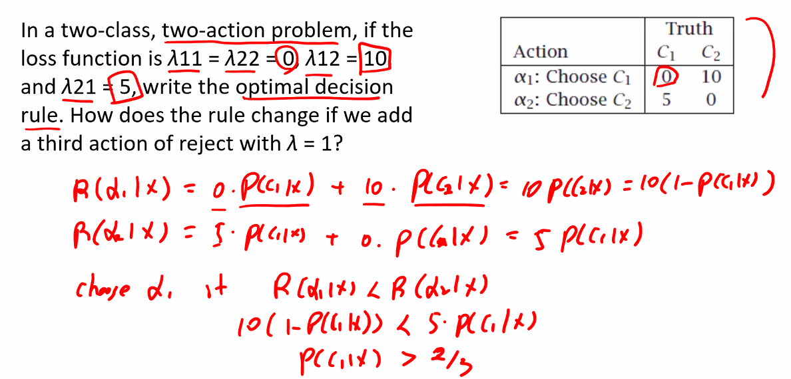
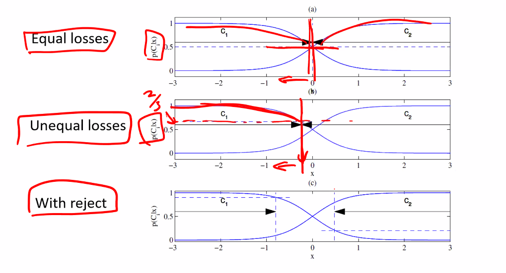
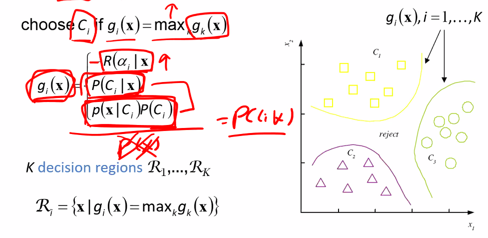
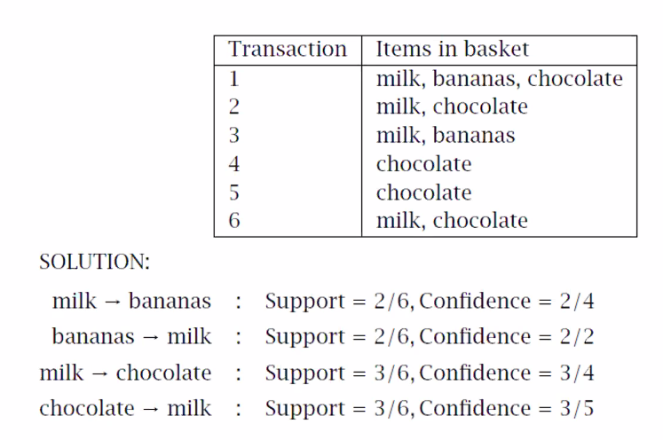
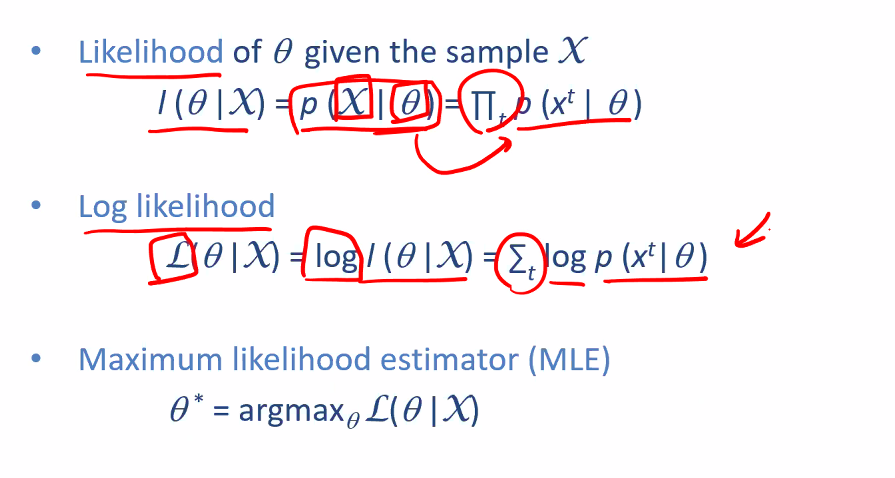
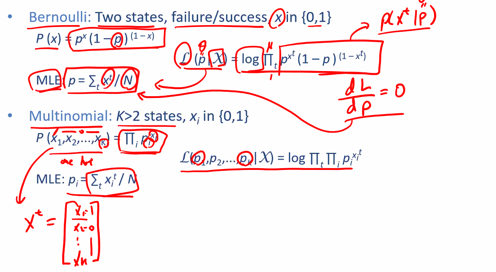
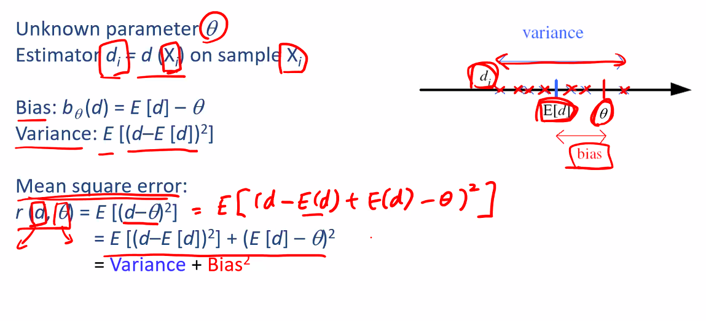
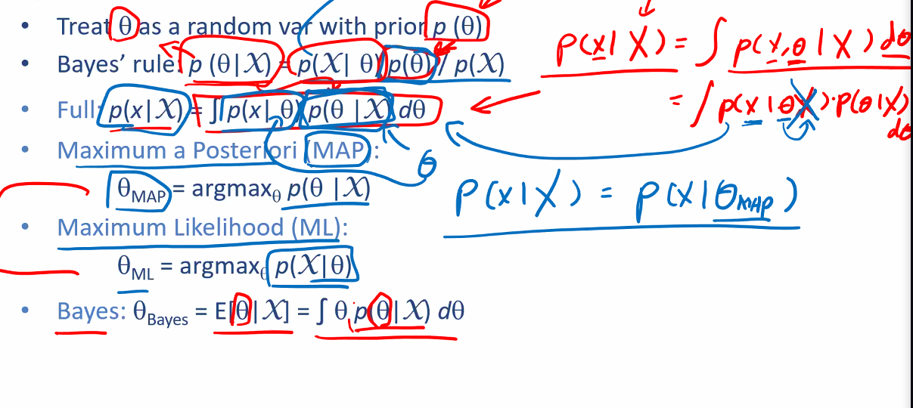
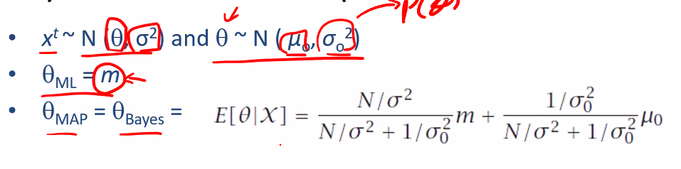
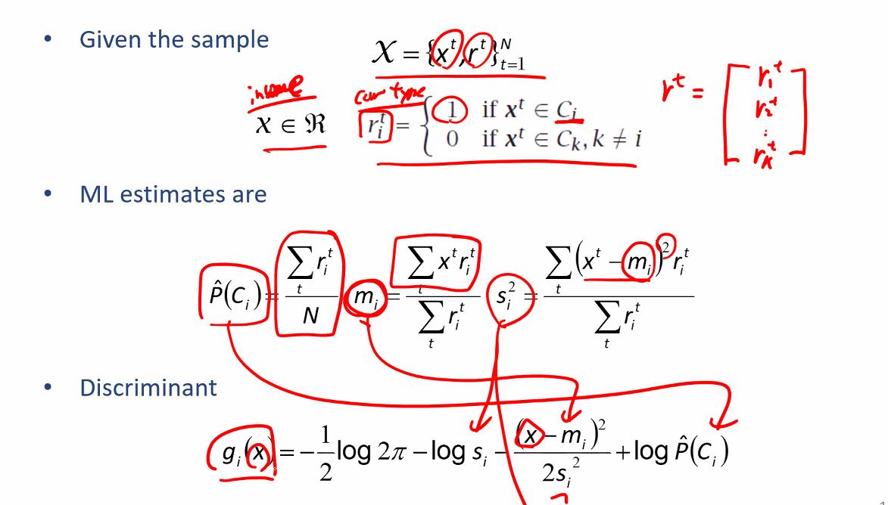

## Overview

$p_0$ 를 estimate 하게된다.

Action $\alpha_i$ : $C_i$ 를 선택하는 행위

리스크를 최소화 시킬 때는 P 가 최대일 때이다. 그렇다면 리스크는 왜 사용하는가?

0과 1 로 결정하는게 아니라 결과가 doubt 된다면.. reject 할 수 있다. 결정 못 할 때 발생할 risk 를 $\lambda$ 라 한다면 이때의 decision rule 은 어떻게 바뀔까?

given x 에서 다른 C들에 비해 Probability 가 가장 크며 (= 다른 것들의 Risk보다 작아야 한다.), $P(C_i|x) > 1 - \lambda$ 여야 한다. (= 리스크가 reject risk $\lambda$ 보다 작아야 한다).

만약 $\lambda$ 가 1보다 크거나 같다면 reject 하지 않겠다.

만약 $\lambda$ 가 0이라면 모두 reject 하겠다.

그렇다면 어떤 경우에 reject 하는 것이 합리적인가? miss classification 이 발생시키는 cost 가 상당히 크다면 결정을 유보할 수 있도록 reject option 을 추가해서 모델링 할 수 있다.

> > Ch 3. 초반부를 다시 공부해봐야 할듯..

# Start

$$
C_1 if P(C_1|x) > \frac{9}{10}
\\\\
\\
C_2 if P(C_1|x) < \frac15
$$

## Different Losses and Reject

## Discriminant Functions

$g_i(x)$

### K=2 Classes

Dichotomizer (2) vs Polychotomizer (2보다 클 때)

$g(x) = g_1(x) - g_2(x)$

라고 하여 g(x) > 0 을 고른다.

## Association Rules

- X -> Y
- market basket 에 관하여 소개되었다. 빵을 구매한 고객이 우유도 사더라 라는 룰을 발견해낸다. (bread -> milk)
- rule 은 association 을 의미하지, causation 을 의미하는 것은 아니다.

### Association measures

처음 두 개를 많이 사용한다.
Support 와 Confidence 둘 다 높아야한다.

- Support (X -> Y) : P(X, Y)
- Confidence : P(Y|X)
- Lift : $\frac{P(X,Y)}{P(X)P(Y)} = \frac{P(Y|X)}{P(Y)}$

이 Lift 값이 1이라면 X, Y 가 independent 하다는 의미이다. 1보다 크다면, association 이 more likley 해진다.

### Example

## Apriori algorithm

(X,Y,Z) 라는 3-item set 이 있을 때, transaction 을 counting 해야 한다. 그러기 위해선 전체 DB를 스캔해야한다. 이것을 어떻게 minimize 할까

(X,Y,Z) 가 frequent 하려면 모든 subset (X,Y) (X,Z) (Y,Z) 가 frequent 해야한다. subset 중 하나라도 frequent 하지 않다면 (X,Y,Z) 에 대한 scan 을 그만해도 되는 것이다.

1. frequent 한 item 들을 추려낸다.
2. item 들의 조합을 추려낸다.
3. candidate 을 만들고 counting 한다.
4. mining

# Ch 4. Parametric Methods

> Acknowledgement : Slides are prepared using Ethem Alpaydins's Intro to ML and Andrew Ng's CS229 and Coursera coureses' lecture matreials

- Parametric : sample 이 우리가 아는 모델을 따를 때를 가정하고 decision making 을 한다.

assumed model 에 해당하는 parameter $\theta$ 를 추정하기만 하면 된다. = Parametric estimation
e.g., 정규 분포를 따른다면 $\theta = {평균, 분산}$

## Maximum Likelihood Estimation

$p(x|\theta)$ 를 최대화 시키는 $\theta$ 를 찾겠다.

Log likelihood 를 많이 사용한다.

곱셈을 한다면 numerical error 가 발생할 수 있어서 sum 으로 표현하여 reliable 하게 처리할 수 있다.

### Ex

- Bernoulli : Two states, failure/success, x in {0,1}
  이라면 p 만 찾으면 모델을 완성시킬 수 있다. 이때의 log liklihood 도 나타낼 수 있고 MLE 도 구할 수 있다.

## Gaussian (Normal) Distribution

표준화 (z-score) 를 하면 normal distribution 을 따른다.

z 가 -1부터 1까지가 68.27% 이다.
z score 가 1 이라면 평균에서 1 $\sigma$ 만큼

normal distribution 은 두 개의 parameter 만 알게되면 전체 distribution 을 알게된다.

- MLE for 평균 and 분산 은 원래 알던 정의

## Bias and Variance

Unknown parameter $\theta$ 를 estimate 한다.

Estimator $d_i = d(X_i) on Sample X_i$

MSE = Variance + $Bias^2$

## Bayes' Estimator

MLE 가 가장 많이 활용되기는 하지만, prior($p(\theta))$ 를 가정할 수 있는 근거가 있다면 베이즈 룰을 이용하여 구해볼 수 있다.

### Example

> 결과르 보고 insight 를 얻는 것이 중요하다.

m 과 $\mu_0$ 의 계수는 알고 있고 $\mu_0$ 는 prior guess 이다. m 은 sample 로 부터 얻어짐.

만약, N이 커지면 $\theta_{Bayes}$ closer to m

반면, $\sigma^2$ 가 작은 경우 or N이 작을 때는 prior guess 에 대한 불확실성이 적다. prior guess 에 더 weight 을 줄 수 있다.

> 분포에 대한 prior knowlegde 가 있을 때 Bayes' 를 이용할 수 있다.

이걸 가지고 결국 뭘하려는 것이냐?

## Parametric Classification

### Example
