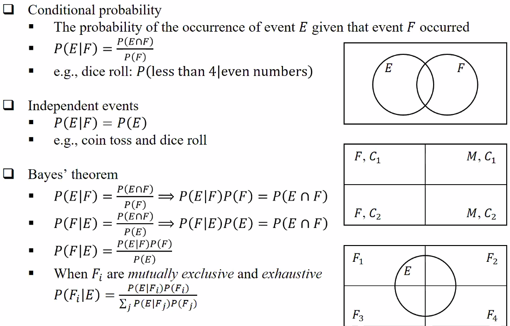
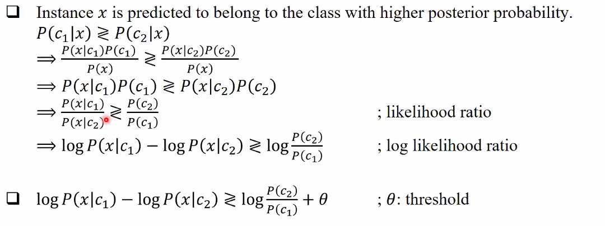
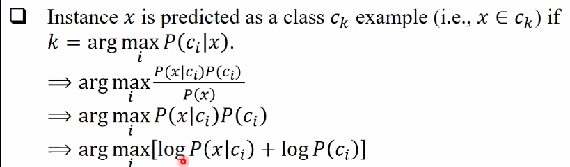
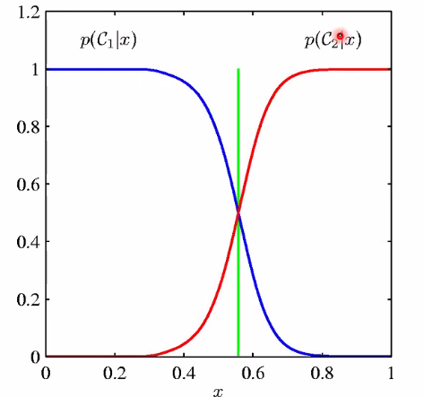
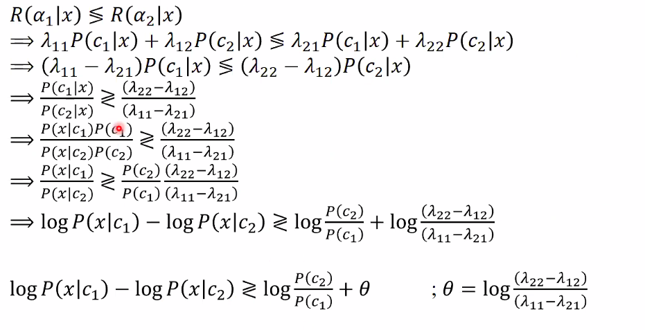
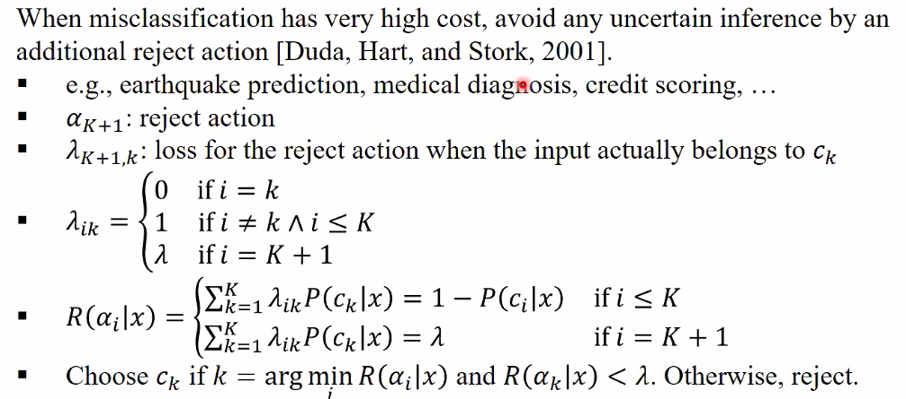

# Ch 3. Bayesian Decision Theory

## Bayesian classification

### Why do we need probability anyway?

내일 삼성전자 주식이 내릴 것인가 오를 것인가?
많은 요인들을 다 알아야 하는데, 다 알 수가 없다.
coin toss 또한 마찬가지이다. 요인들 중 관측할 수 없는 것 사람들의 심리 같은 것은 **unobservable varibale z** 라 하고, 다른 것들을 **observable variable x** 라 한다.

: 확률로 모델링을 하자

### 확률 Review

**Bayes' theorem**

$P(F|E) = \frac{P(E|F)P(F)}{P(E)}$

- $F_i$ 가 **mutually exclusive and exhaustive** 일 때.

> (independent 하며 다 더하면 전체가 된다.)

그럴 때, 위 식은 $\frac{원과 F_i 의 교집합}{원}$

## BTC

### Class posterior probability

x 를 관측한 후에 class 가 무엇인지에 대한 확률 (사후 확률.posterior)

class c 에서 x 가 발생할 확률 likelihood

사전 확률 prior

evidence

### Class posterior probability for multi-class

일 때, 위의 **Bayer's theorem** 에서의 마지막 식을 적용시켜 볼 수 있다.

## for binary class

Bayesian theorem 을 적용시켜서 **likelihood ratio** 를 적용시킬 수 있다. $\theta$ : threshold 를 더해주기도 한다. 예를 들어 지문 인식 도어락이 있다면 주인인 c - 주인이 아닌 c 를 했다 하자. 그럴 때, threshold 를 더한다면 외부 침입자를 더 잘 막아낼 수 있을 것이다.

> log 를 씌워야 계산이 편한 경우가 많다.

## for multi class

## probability of Error

왜 posterior 가 큰 쪽으로 classification 을 하는가?

예를 들어 binary class 의 경우에 각각의 poserior 라고 보자. 확률이 exhaustive 하므로 둘을 더하면 1이 나올 것이다. boundary 에 따라서 x 가 왼쪽이면 $C_1$ 오른쪽이면 $C_2$ 로 한다. 하지만, 이러면 error 가 발생한다.
$C_1$ 의 posterior 가 0.8 일 때 $C_1$ 을 고르면 $C_2$ 는 0.2 를 가지고 있기 때문에 0.2 만큼의 error 가 발생할 수 있는 것이다. 그래서, 겹치는 부분을 넘어가야 판단을 하는 새로운 방법이 있다.

## Bayesian Decision Rule

> 위의 것들을 일반화 시킨 것

스팸이 아닌데 스팸이라고 분류 한 것이 스팸인데 스팸이 아니라고 분류 한 것을 보면 그것의 경중이 차원이 다르다.

- $\alpha_i$ : $c_i$ 로 판단하는 행위
- $\lambda_{ik}$ : $\alpha_i$ 로 하였는데 사실은 $c_k$ 여서 발생한 loss (병이 없는데 병이 있다고 판단하여 **수술을 하게 된 비용**)
- expected risk for taking action 알파 =
  $\sum\lambda P(c_k|x)$

결국에 Risk R 이 가장 작은 쪽으로 선택하자. 아까 posterior 가 큰 것을 선택 한 것과는 반대겠지.

**결국 아까 배운 threshold 를 $\lambda$ 로 나타낼 수 있다.**

### 0/1 Loss

만약 i = k 인 경우엔 loss 가 0 이고 아닐 경우 loss 가 1이라면... Risk가 argmin 인 class = Posterior 가 agmax 인 class

### Reject

중대한 결정을 내릴 때 additional reject action 을 내려서 expert 인 사람이 결정을 내릴 수 있다.

## Discriminant Functions

Posterior 를 사용할 수도, - Risk 를 사용할 수도 있다. 이것을 그래프로 나타내면 K 개의 decision regions 가 나타나며 그 사이에 reject region 이 나타날 수 있다.

## Expected Utility (~Risk)

action $\alpha$ 를 취했을 때 얼마나 $U_{ik}$ 만큼 유리할 것이냐. Expected Utility EU 가 arg max 인 방향으로 선택한다.

# Example
