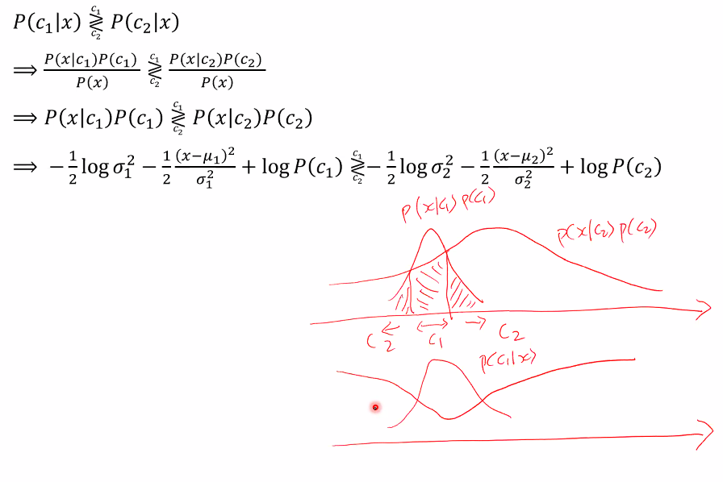

$N(\mu, \sigma^2)$ 을 따를 때,

$P(x|\mu, \sigma^2) = \frac{1}{\sqrt{2\pi}\sigma}exp(-\frac{-(x-\mu)^2}{2\sigma^2})$

MLE 를 여기에 적용시켜보자.

## MLE for Gaussian Distribution

$log$ 를 취하여 덧셈의 형태로 바꿔준다. 위의 것은 데이터가 주어졌을 때 sample mean 과 sample variance 를 구하는 방법이다. 우리는 머신러닝에 이것을 적용시켜보자.

## MLE for Supervised Learning

prior 는 전체 횟수 중에 class k 가 나온 것. $r_k^t$ 는 0 또는 1 즉, 해당 class 이거나 아니거나 이다. 해당 트릭은 앞으로 자주 사용될 것이다.

## Training Algorithm : MLE for Gaussian distribution

### Example

height (x1), weight (x2) 를 보고 어떤 키인지 prediction 하겠다.

2 번째 dimesion 에 대해서도 똑같이 구할 수 있다.

그렇다면 학습 데이터에 없는 $h(x_1 = 165, x_2 = 55)$ 가 주어졌다면 어떨까? 이전엔 할 수 없었다.

아까 구해놨으므로 gaussian distribution 을 각 dimesion 에 대해서 구한다. 하지만 이것을 계산하기가 힘들다. 진짜로 계산해야할까?

## Classification Using Gaussian Distribution

어떠한 x 가 주어졌을 때 이 식이 최대가 되는 class 를 찾아낸다.

## Binary classification Using Gaussian Distribution

무엇이 더 큰지 결정하자. 그런데, likelihood 가 gaussian distribution 이므로 대입해주고, log 에 대해 정리해주면 식이 나온다.

분산이 만약 같다면 2번째 식으로 정리할 수 있다. 분산이 같고 prior 도 같다면 3번째 식이 나온다. 3번째 식에서 주의해야 할점은 **마이너스가 곱해져서 반대로 classification 한다는 점이다.** ~~제곱은 오타다~~

### 분산과 prior 가 같을 때

$\mu_1$ 과 $\mu_2$ 가 있을 때 거기서부터 떨어진 거리를 보고 classification 하는 것과 같다. 어느 쪽에 가까운지 prediction 하여 가까운 class 를 선정하겠다.

가운데가 error 가 될 수 있다. posterior 의 그래프를 그려보자. 색칠된 부분이 error 의 확률과 비례하겠다.

### 분산은 같으나 prior 가 다를 때

만약 두 번째의 prior 가 더 크다면 이것은 늘어나고 첫 번째 것은 상대적으로(이전 예시에 비해서) 줄어들겠다. prior 가 달라지면 경계점이 달라진다.

### 분산도 다르고 prior 도 다를 때 (Genral)

분산이 넓은 gaussian 과 작은 gaussian 이 있다면 어느 순간 $c_2$ 가 더 커져서 decision 영역이 2개가 생긴다.

여기서도 마찬가지로 색칠한 부분에서 error 이다.

# Problems

**navie Bayes classifiers 만 했을 때의 문제들**
세가지가 있는데 discrete-valued inpput vectors 만 받는 문제를 gaussian distribution 으로 해결했다. continous 까지 입력으로 받을 수 있게 되었다. 다음시간에는 마지막 문제점인 독립일 때만 가능했던 문제를 풀어보게따.

**extensions of naive Bates classifiers**
