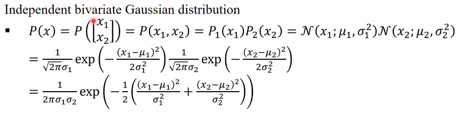
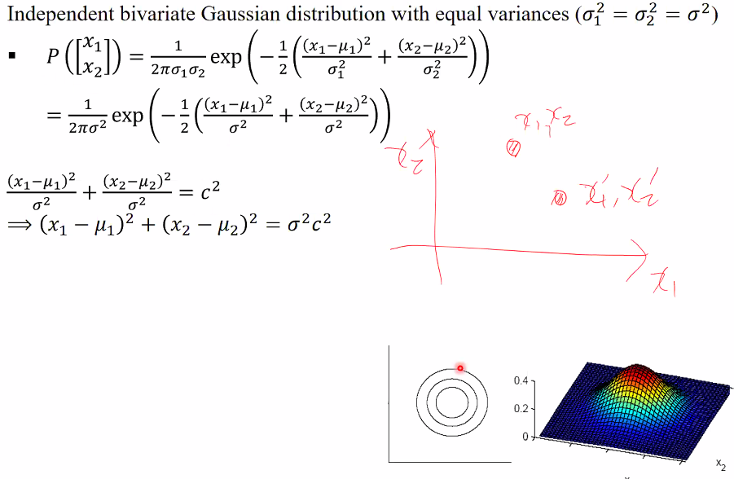
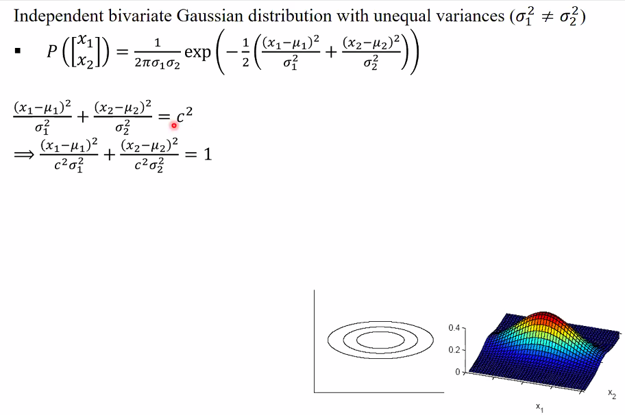
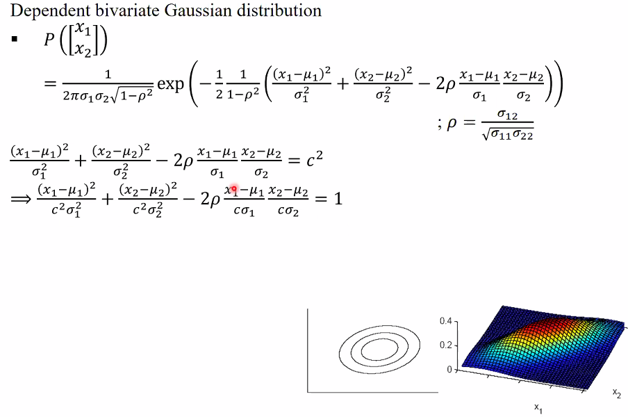

# 안 들은 부분

multivariate 변수들에 대해 설명함

## Independent Multivariate Distribution

Independent 할 때는 각 dimension 에서 다 곱해주면 된다. d = 2 인 예시를 보자.

### Independent bivariate Gaussian distribution (varinace 가 같을 때)

c 가 같으면 같은 확률 값을 같는데 이것은 결국 원의 방정식의 형태를 띤다. 동심원에서 안으로 들어갈수록 높은 확률값을 같겠지. 3d로 그려보면 산과 같은 형태를 띤다.

### Independent bivariate Gaussian distribution (varinace 가 같지 않은 경우)

이것 또한 c 가 같으면 같은 확률 값을 같는데, 이것은 결국 타원의 방정식의 형태를 띤다. 타원 위에 있다면 같은 확률 값은 가질 것이다.
3d 에서 본다면 장축 단축을 가지는 늘어진 산이 될 것이다.

## Dependent Bivariate Gaussian Distribution

결론부터 보자면 타원의 방정식의 형태를 띠지만, 축과 평행한 타원이 아니라 기울어진 타원의 형태를 띤다. 사선으로 삐뚤어진 산을 볼 수 있다.

## Question

- 교수님 식이 되게 많은데 이 모든 식의 종착역이 있는건지 아니면 식 하나하나가 중요한지 질문드립니다...
  : 5장에 해당하는 내용이다. 책에서는 그냥 식이 나와있는데 다 이해를 해야지 되죠. 그렇지 않다면 결과만 가지고 사용하는 그런 입장이 되는거죠 종착역은 multivariate 입니다. 사이언티픽한 접근 방법으로 접근하는게 이 수업이다. 원리를 배우는 게 중요해. 앞으로 강의에서도 설명을 많이 할거다.