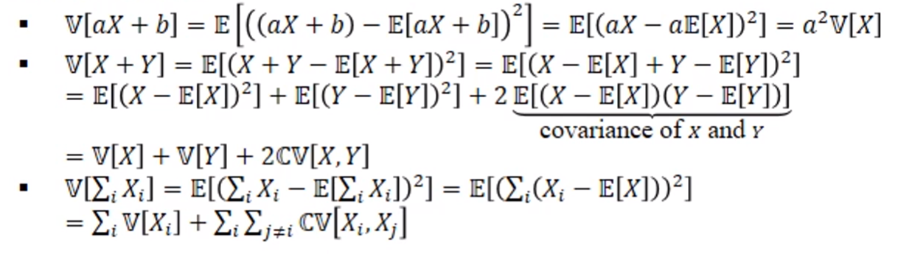
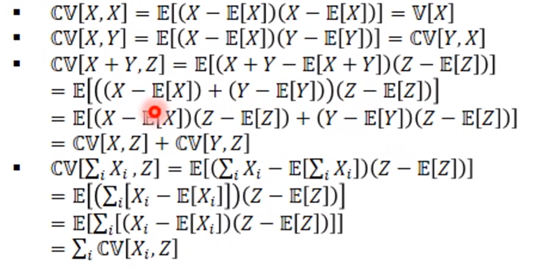
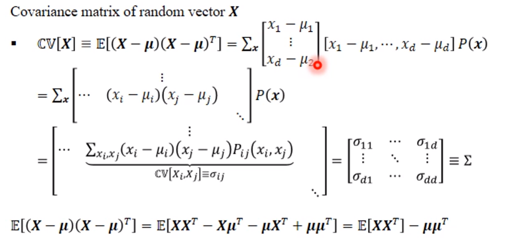
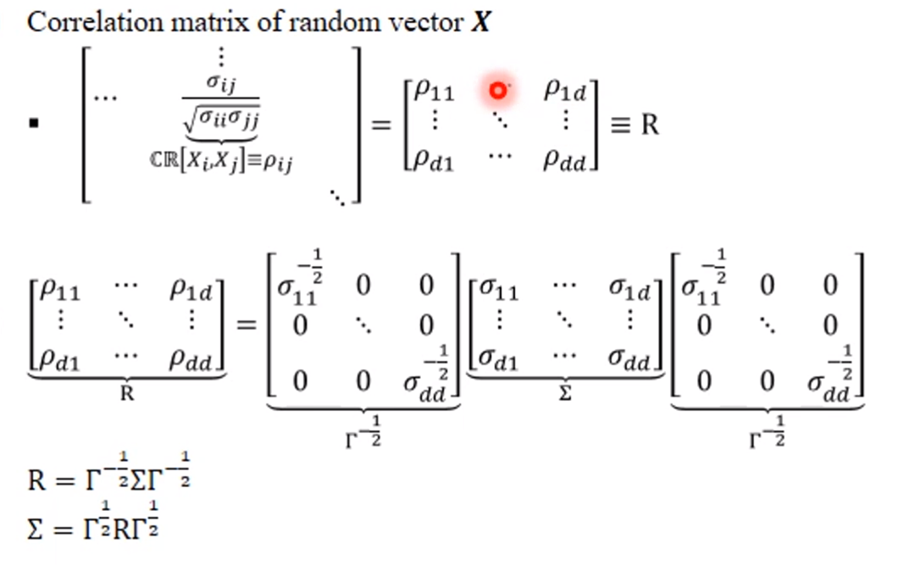
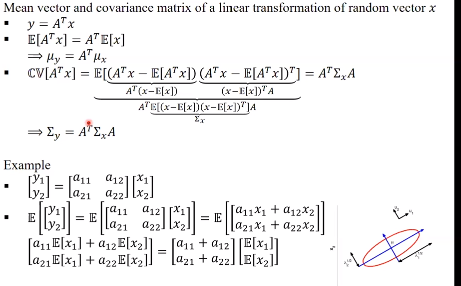
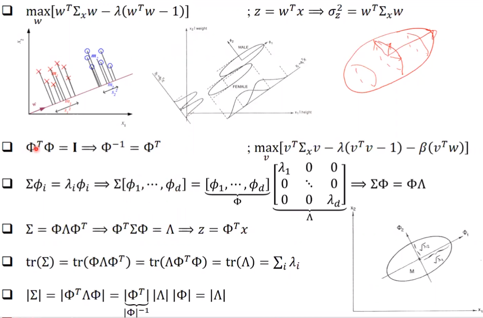

# 학습 목표

1. multivariate Gaussian distrbution 을 학습하고 estaimate 할 수 있어야 하며 의미를 이해할 수 있어야 한다.

# 확률 Review

## Random Variable

값을 가져야 한다. **Discrete** (주사위, 동전) 하거나 **Continous** 할 것이다.

### Expectation

기댓값 = 평균

pmf, pdf 굳이 구별하지 않겠다.

### Properties of Expectation

$E(aX+b) = aE(x) + b$

$E(X+Y) = E(X) + E(Y)$

### Expectation of Real-Valued Function

$f(X) = X^n$ 일 때, 이것을 $n^{th}$ moment of X 라 한다. 평균은 **first moment** 이다.

하지만 기댓값을 구할 때, 확률은 그대로 P(x) 를 곱해주되 거기에 Y 를 곱해준다.

### Variance

$E(X^2) - \mu^2$

평균값이 0 이라면 variance 는 **second moment** 가 된다.

$V(aX+b) = a^2V(X)$

### Covariance

$CV(X,Y) = E(XY) - \mu_x\mu_y$

x 가 변함에 따라서 y 가 어떻게 변하는가? 를 나타낸다. x 가 커질 때 y가 커지면 Covariance 는 양수일 것이며, 반대라면 음수일 것이다.

### Correlation

$CR(X,Y) = \frac{CV(X,Y)}{(\sqrt{V(X)V(Y)})}$

Correlation 은 Normalized 된 Covariance 라고 볼 수 있다. 그러므로, correlation 값은 -1 이상 1 이하 이다. 그래프가 날씬할수록 correlation 이 커지는 것이다.

## Multivariate Data

e.g., 어떤 사람의 **몸무게**와 **키**

$d$ dimensions (d 개의 feature 를 가진다.)

$N$ examples ( N 개의 sample 을 가진다.)

그러므로, $(d, n)$ 의 꼴을 나타낸다. label 이 들어가면 $(d+1, n)$ 이 될 것이다.

## Mean Vector

dicrete 인 경우로 설명하겠다.

Mean vector 는 결국 (d, 1) 의 shape 을 갖게 되는데 $E(X_1), E(X_2) ... E(X_d)$ 의 $\mu$ vecotr 이다.

## Covariance Matrix

diagonal 은 variance 이고 위의 삼각형값과 아래 삼각형 값이 같다.

## Correlation Matrix

$\rho$

diagonal 은 모두 1이 되겠다.

> > Assignment 1 과 관련이 이제부터 크겠군. **(43분부터)**

## Sample Mean Vector

## Sample Covariance Vector

## Sample Correlation Vector

> **Random vector** 는 진하게 표시하였고 vairable 은 연하게 표시하였다. 앞으로는 구별하지 않겠다. 모두 다 small $x$ 로 쓰겠다.

# MLE for Multivariate

## 독립인 Multivariate Distribution

독립인 경우에는 각각을 그냥 곱해주기만 하면 된다. $x_i$ 가 나올 확률을 곱해준다.

## Independent Bivariate Gaussian Distribution

> Bivariate : 2차원. 변수가 2개

## 독립인데 sigma 가 같을 때

> > 50분부터 안들음

---

# 9.28 월 자 수업

## Linear Transformation of Random Vector

## Eigenvector and Eigenvalue

> 6장에 해당하는 내용인데 6장까진 강의하지 않겠다. 6장에 나오는 Eigenvector Eigenvalue 만 요약 강의하겠다.

**분산이 가장 큰 축**을 찾자는 것이 **Eigenvector** 를 찾자는 것과 같다. 하나만 찾는 것이 아니라 **여러개**를 찾는다.
이 축과 직각을 이루는 축은 3차원에서는 매우 많을 것이다. 이것중에서도 분산이 가장 큰 것을 찾는다. 3차원에서는 또 이것과 직각이며 분산이 가장 큰 것을 찾는다.

원래 domain covariance determinant 는 바뀐 covariance determinant 와 같으며 tr 도 이와 같다.

**정리**

eigenvetor 들을 구해서 eigen value 를 큰 순서대로 하여 diagonal 에 넣는다. 이를 x 에 곱하면 새로운 z 축에서 이것을 바라볼 수 있다. 이러한 z 축에서는 서로 independent 하다.

산을 움직이는 것이 아니라 우리가 보는 시점을 바꾸는 것이다. 산 자체는 같지만 나를 기준으로 한 좌표가 달라짐. 그러므로 z 를 기준으로 확률을 구해도 같음.
