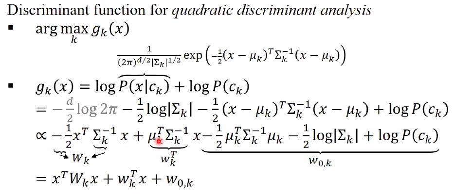
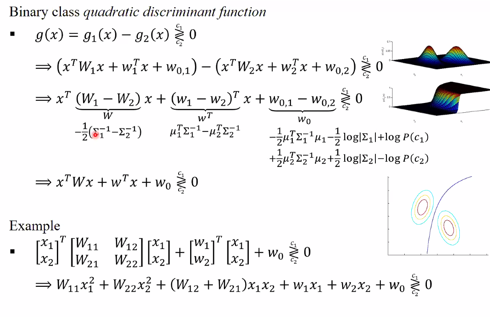
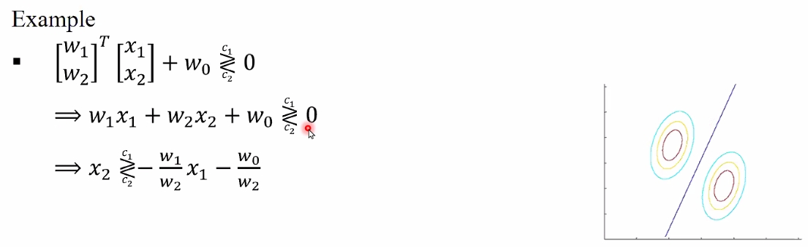
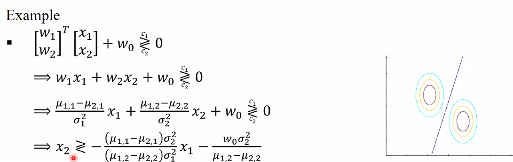
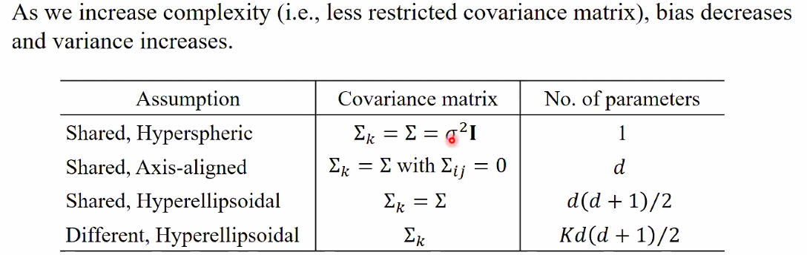
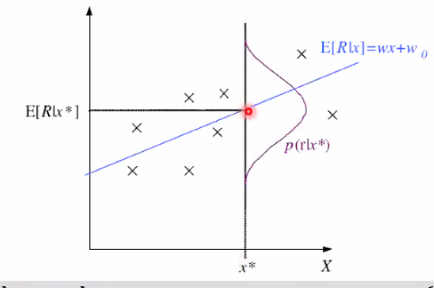
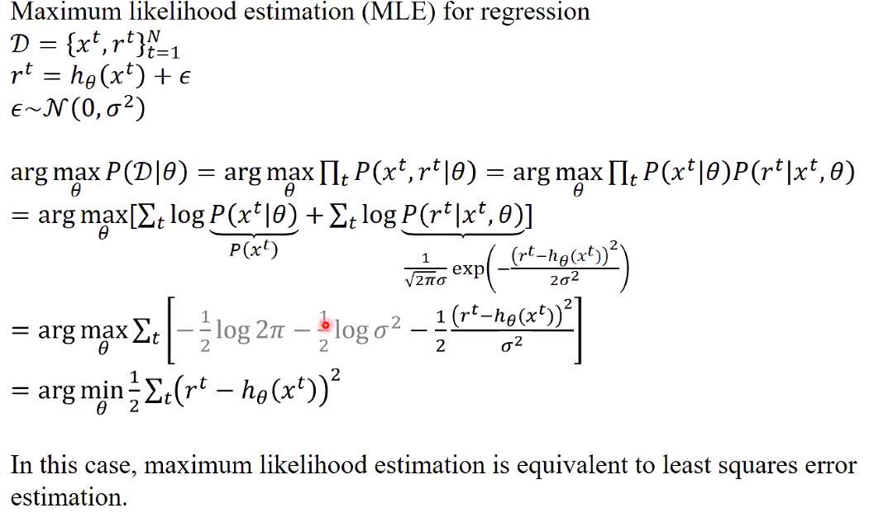
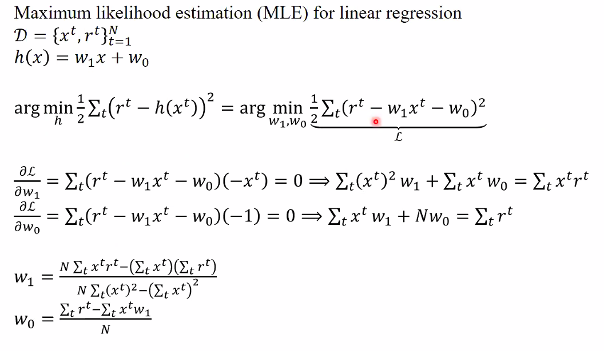

likelihood + posterior 가 가장 큰 것을 고르면 되는데, likelihood 가 gaussian distribuition 을 따르고 이를 정리하여 x 에 따라 달라지는 변수쪽과 상수 $w_0$ 쪽을 나눈다. w 를 먼저 계산해 둔 뒤 x 에 따른 계산만 해주면 되는 것이다. 결과를 보면 x 의 이차방정식인 것을 알 수 있다. **quadratic discriminant analysis**

## Binary class discriminant function for MVN

둘 중에 큰 것을 뽑으면 된다. 차수에 따라 인수분해 하여 정리한다. $W$ 를 다시 생각해보면 covariance 의 차. 계산이 매우 간단해진다. 미리 계산해 둘 수 있는 constant 가 많기 때문에 x 에 대한 간단한 곱, 덧셈만 하면 classification 이 가능해진다.

결국엔 3d 에서 보면 $x_1, x_2$ 가 있을 때 고도가 더 높은 점을 알아낸다는 것이다.

### covariance matrix 가 같다면?

$W_1 - W_2$ 가 0이 될 것이므로 결국엔

$w^Tx + w_0$ 가 0 보다 크다면 $c_1$ 작다면 $c_2$ 가 될 것이다. 아까는 이차식이었다면 이번엔 일차식이 된다. **linear discriminant function**

직선의 위라면 c_1, 아래면 c_2

### covariance matrix 가 같으며, corelation off diagonal = 0

일차식이 된다.

$\mu_{1,1}$ 은 첫 번째 class 의 1번째 dimension 을 의미한다. $\mu_{2,1}$ 은 두 번째 class 의 1번째 dimension 을 의미한다. off diagonal 이 0이기 때문이다.

이전 페이지와 같이 직선의 위냐 아래냐를 따지는 것인데 off diagonal 이 0 이라서 축에 평행한 타원이 나오게 된다.

### covariance matrix 가 같으며 모든 variance 가 같을 경우

아래 식을 보면 평균 뺀 것과 x 와의 내적 값을 의미하는데, 이것이 $-\sigma^2w_0$ 보다 크느냐 마느냐를 보는것이다.

## Model Selection

1. .
2. off diagonal 이 0 이니깐 diagonal 을 구해줘야 하므로 d 개
3. diagonal 기준으로 위 아래가 같으므로 반만 기억하면 되므로 $\frac{d(d+1)}{2}$
4. .

parameter 가 많을수록 복잡한 model 이다.

# Regression

Supervised Learning 에서, 이제까지는 Classification 만을 배웠다. 지금부터는 Regression 을 배워볼 것이다.

- Output 이 numeric value, r 이다. 하지만 정확한 r 값을 알 수는 없기 때문에 $\epsilon$ 을 더한다. 약간의 오차 허용.
- Empirical error : regression 의 경우에는 $\epsilon^2$ 의 평균을 낸다.
- Learning : Empirical error 가 최소가 되게 학습을 한다.

## Parametric Method for Regression

만약 $\epsilon$ 이 표준 편차(N(0, $\sigma^2$))를 따른다면,

+- 방향으로 error 가 더해져서 보라색 선의 분포가 된다.
이것은 또다른 정규분포를 따르게 된다.
parameter 를 estimate 하는 과정이 learning 이다.

## MLE for Regression

h 는 deterministic 하지만 r 은 아니다.

정규분포를 따르는데 $r$ 만큼 벗어난 정규 분포이다.

max 와 관계없는 상수들은 쳐낸뒤 $-$ 를 곱한 뒤 argmin 으로 변형해준다. 결국 이것은 empirical error 가 된다.
= least squares error estimation = MLE

## Linear Regression

h 가 일차식이다.

저번 페이지의 argmin 을 찾기 위해 $w_1$, $w_2$ 에 대해 각각 미분한다. 연립방정식으로 저 식을 연립하면 w_1 w_0 를 찾을 수 있다.

## Polynomial Regression

다항식. 아까와 마찬가지로 미분해주는 것이지만, 식이 더 많아졌을 뿐이다. ppt.

## Multivariate Regression

## Question

- Q : 교수님 Linear Regression에서 dL/dw_1과 dL/dw_0를 계산할 때, 결론에서 r^t = h(x^t) 처럼 계산을 했는데, 이는 L이 최소가 되는 w_1과 w_0에 대한 식이기 때문이라고 이해하면 될까요? 하지만 궁금한 점이 L이 최소가 된다고 해도 어차피 estimation이기 때문에 epsilon 만큼의 차이가 있어서 완전히 등호로 h(x^t) = r^t이 성립하지는 않을 것 같다는 점입니다. polynomial regression에서도 마찬가지 질문입니다.

- A : data 가 있을 때 error 가 min 이 되는 직선을 긋는 것이 목적이다. 곡선을 긋지 않는 이상 r 과 h 가 일치하는 경우는 거의 없다. 하지만 그 차이가 min 이 되는 것이 liner Regression 이다.
