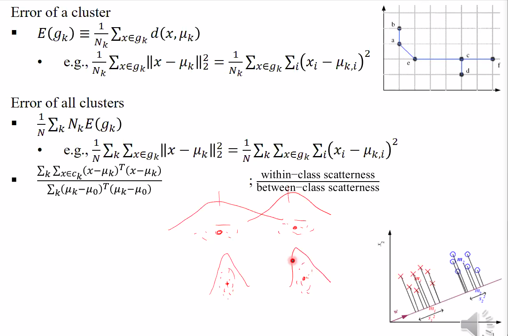
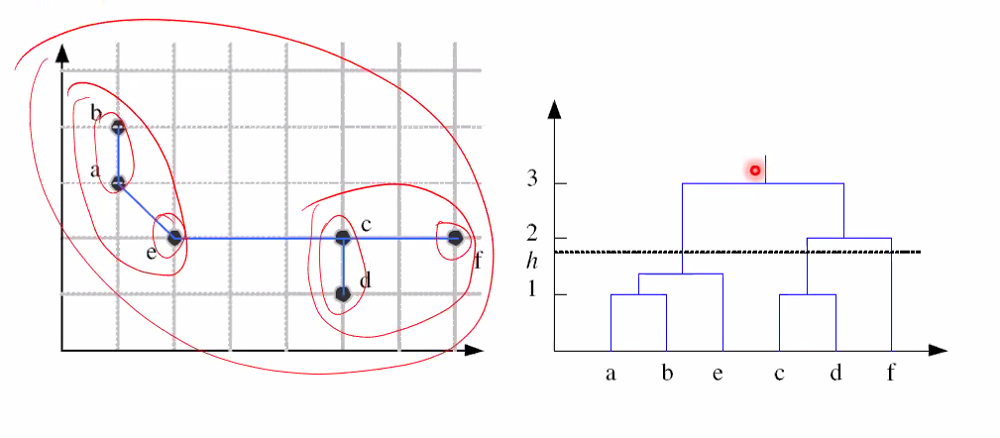

## Distance between Instances

1. **City block distance** : 수직으로만 이동
2. **Euclidean distance** : 점과 점 사이의 거리
3. **Mahalanobis distance** : 2 번에서 variance 로 나눠준다는 차이점
4. **Hamming distance**

## Distance between Clusters

1. **Single-link** : 그룹 간의 instance 간의 pair 의 거리 중 가장 작은 것을 distance 로 한다.
2. **Complete-link** : single-link 의 반대. pair 중 가장 멀리 있는 것을 cluster 의 distance 로 한다.
3. **Average** : 그룹 간의 instance 간의 모든 pair 의 거리의 평균
4. **Centroid distance** : 각 그룹의 평균점간의 거리
5. **Bhattacharyya distance** : 

두 개의 그룹이 가우시안 분포를 따른다고 가정하면 그것의 평균 vector 와 cov 를 이용하여 **Mahalanobis distance** 를 구한다. 각 **분포의 분산으로 scaling 하여 표현**한 것. 분산을 고려했기 때문에 위의 그래프가 더 가깝다고 할 수 있다. **error 와 관련**이 있다. 위 그래프의 error 가 더 클 것. 그렇다면 뒤의 log 상수는 무엇인가? 

이 상수는 분산이 같으면 0이 되는데, 분산이 같지 않은 위와 같은 경우라면 분산이 다른만큼 거리를 측정할 수 있다.

## Cluster Error

Cluster 가 얼마나 잘 cluster 되어 있느냐를 어떻게 알까.

1. Error of **a cluster**

**cluster 의 평균과 각 instance 들의 거리의 평균**이 error of cluster 라 할 수 있다. **거리** 라는 것은 아까 배운 것 중 하나를 선택하여 쓰면 되겠다. $E(g_k)$

2. Error of **all cluster**

i) $E(g_k)$ 에 weighting 을 해준 뒤 평균을 내준다.

ii) cluster 안에서는 조밀하게 모여있고, cluster 간에는 떨어져 있는 것이 좋은 방법이다.

ii) 의 분모는 **class 간의 catterness** 분자는 **class 안의 scatterness**

이 개념은 ch 6 에 나온다

오른쪽 아래 그래프에서, 이것을 $x_2$ 에 투사하면 왼쪽처럼 $x_1$ 에 투사하면 아래처럼 그래프가 나올 것이다. w 축으로 투사하면 이렇게 나올 것이다. 축에 대해 **ii)** 가 가장 작은 축을 찾아내는 것이 좋을 것. 한 축에 대해 투사했을 때, **cluster 안에서는 잘 모여있고, cluster 간에는 떨어져 있는 것** 을 찾는 것

## Hierarchical Clustering

### Bottom-Up Clustering

처음에는 모든 점이 cluster 가 된다. 그 다음 거리가 가장 작은 pair 을 찾아 새로운 cluster 를 구성한다. 이 과정을 반복한다.

시작할 땐 data 가 N개 였는데 결국엔 cluster 가 하나의 cluster 가 된다. 그러므로, 중간의 적당한 시점 h 에서 끊는다. 

#### Algorithm

**멈추는 방법**

1. 둘 사이의 거리
2. 합쳤을 때 cluster error 
3. 합쳤을 때 전체 cluster error
4. 이전 step 에서의 현재 step 에서의 diff

### Top-Down Clustering

처음에는 전체가 한 cluster 이다. 그 다음 두 개로 나눈다. 그러고는 **제일 error 가 큰 cluster 를 선택하여 해당 cluster 를 둘로 나눈다.**
그러고는 또 제일 error 가 큰 cluster 를 선택하여 해당 cluster 를 둘로 나눈다. euclidian 을 선택한다면 sample 들과 가장 먼 것을 선택하여 나누면 된다... 이것을 반복하면 모든 점이 cluster 가 될 것이다. 그러므로 중간에서 멈춰준다.

#### Algorithm

6 번 줄이 시간이 많이 걸리는 $2^N$ 만큼 경우의 수가 걸린다. cluster 를 나누는데 **clustering error 가 min 인 경우를 찾아 cluster** 를 나누는 것이다. 이것을 빨리 할 수 있는 방법은 **decision tree** 가 있다. *중간고사 이후*

## K-Means Clustering

Hierarchical 의 문제는 locally 하게 본다는 것이다. 

Hierarchical 에서 본다면, 이러한 분포가 있다면 가운데 두 점이 cluster 가 될 것이다. local 하게 본다면 맞는 판단이지만 결국 global 하게 본다면 틀린 clustering 이다. 이러한 단점은 **K-Means clustering** 은 극복할 수 있다.

# Question

Q : mixtuer model 에서 MAP 을 쓰지 않는 이유

A : 써도 된다.

Q : 월요일에 수업하나?

A : 한다. 시험범위도 들어가는데 아마 **K-Means Clustering** 까지가 범위 일 것이다.