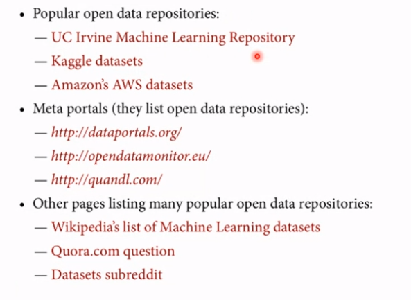
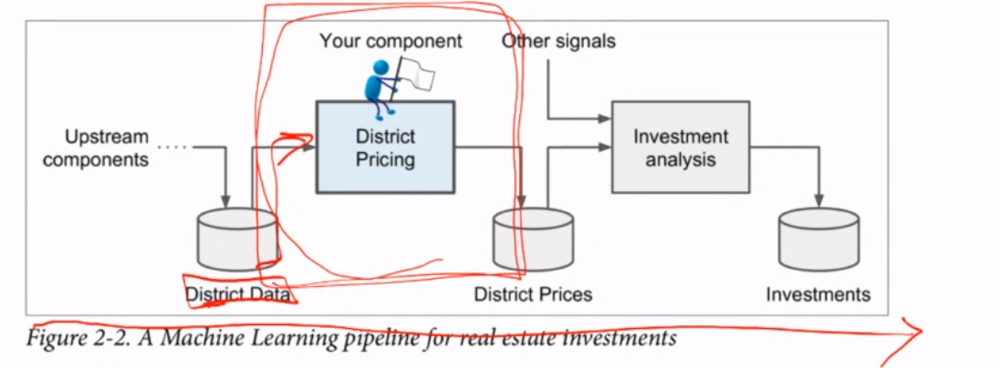
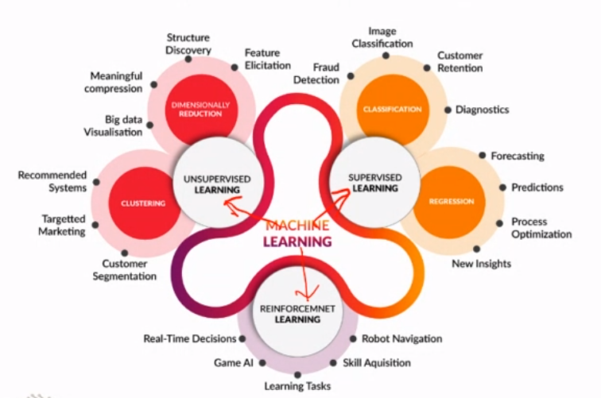
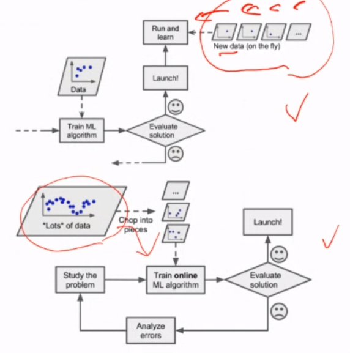
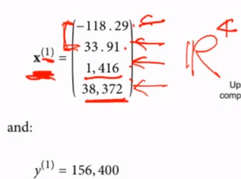
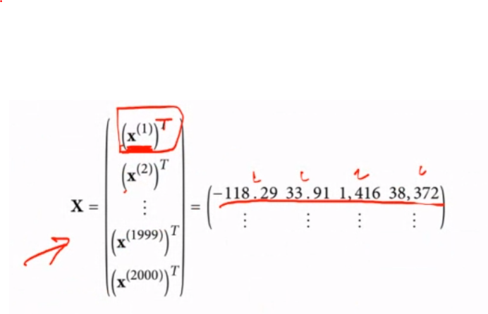
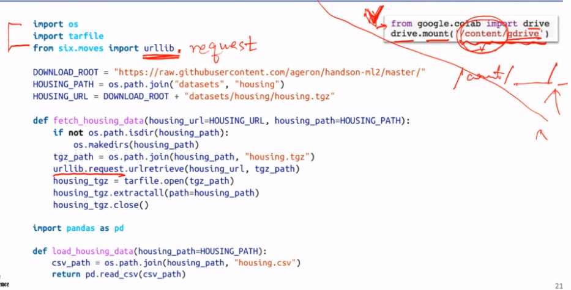

> 중요한 챕터가 될 것이다.

**이번 챕터에서는 내가 real estate company 에 data scientist 로 취업했다고 생각하고 프로젝트를 진행한다.**

## data 얻는 곳

# Assignmnet 1

- Colab 다루기
- univariate/multivariate Gaussian distribution 이해하기
- data analysis 배우기

## Dataset

### alzheimers-disease_dataset.csv

**Column**

- ID
- Diagnosis group (0, 1, 2)
- volume of hippocampus (numeric)
- volume of an entorhinal cortex (numeric)

## 목표

- Hippocampus 의 **univariate** Gaussian distribution per group 나타내기
- Entorhinal cortex 에 대해 위와 같이 나타내기
- Hippocampus-Entorhinal cortex **bivariate** Gaussian distribution 나타내기

# 수업

## building a model of housing prices in California

- California census data (인구수, 수입 중간값, 집값 중간값) 를 이용
- 각 Block = district 에 대한 data

**Goal** : to predict the median housing price in any district, given all the other metrics

### Frame the Problem

무엇이 정확한 **business objective** 인가? 모델을 설계하는 것이 end goal 이 아닐 것이다. 이 모델을 사용해서 company 는 무엇을 기대하는가

문서를 살펴보았을 때, housing prices 를 정하는 것은 현재 수동으로 진행하고 있었다. 이는 매우 costly and time-consuming 하다. 이 상황에서 data scientist 를 고용하므로써 problem 을 해소할 수 있다. 또한, census data 같은 좋은 dataset 이 있다.

- supervised
- unsupervised
- reinforcement

중 하나를 결정해야 하며 또한 이런 것들도 정해야 한다.. 어떤 전략을 쓸 것인가?

- online learning
- batch learning

> > supervised learning 의 regression 을 써야겠군
> > batch learning 을 써야겠군

#### Notations

$x^i$ 는 4개의 feature 를 가지는데

- longitude : 경도
- latitude : 위도
- 거주자 수
- 수입 중간값

그리고 $y^i$ 는 집값의 중간값인 dataset 을 가진다.

이 모든 x, y 쌍을 vectorization 하여 $X$ 에 모두 넣는다.

이렇게 한다면 $X$ 의 shape 은 (sample 의 개수, feature 의 개수) 가 될 것이며 위 예시에서는 (2000, 4) 가 될 것이다.

### Select a Performance Measure

#### RMSE (Root Mean Square Error)

변화가 크면 더 큰 가중치를 준다.

#### MAE (Mean Absolute Error)

## Google Colaboratory

