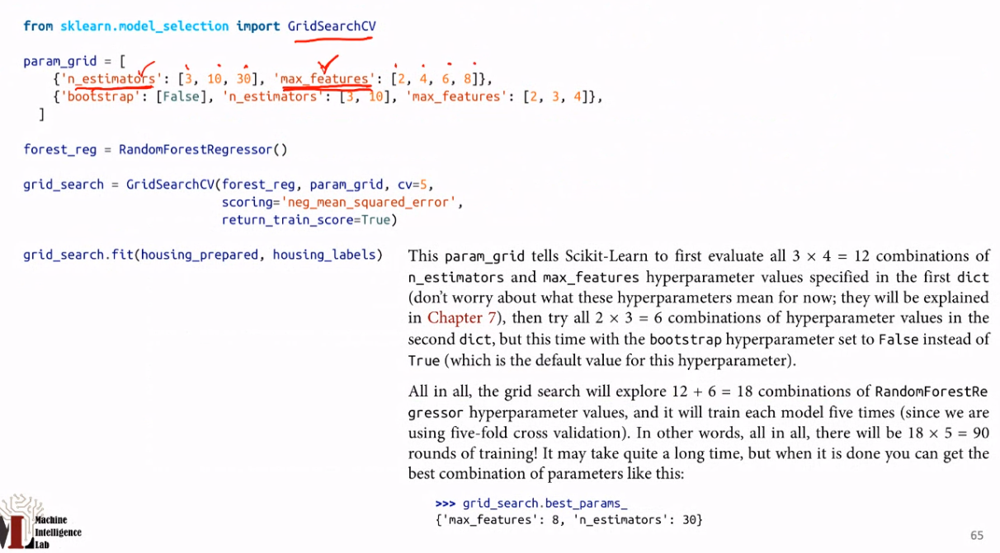

## 데이터 전처리에 대해 설명

- one-hot encoding

**normalization**

1. Min-max scaling
2. Standardization

## Transformation Pipelines

위의 데이터 전처리를 `Scikit-Learn` 에서 `Pipeline` 으로 제공함. 이것으로 간결하고 압축적인 전처리가 가능

pipeline 각 pipeline 들을 `ColumnTransformer` 을 통해 데이터를 모아줌

train, validation split 해주어야함.

> > train_test_split 쓰겠군

## Model 선정하기

가장 간단한 `LinearRegression` 을 보자.

> > `sklearn` 을 많이 쓰는군

`full_pipeline.transform` 을 쓰면 자동으로 전처리? 해주는 듯

간단한 모델로 predict 하였더니 정확하지 않고 많은 오차를 보여주었다. 이것을 측정하기 위해 RMSE 를 써보자.

```py
from sklearn.metrics import mean_squared_error
```

해보았더니 RMSE 가 68628\$ 이 나왔다. 120,000 ~ 265,000 의 값을 가지는 data 에서 이정도의 error 는 불만족스럽다. 이는 data 가 underfit 된 것이다. 충분하지 못한 정보가 주어졌구나 model 이 powerful 하지 않다는 것이다.

이번엔 `DecisionTreeRegressor` 를 써보자. 이것은 `LineraRression` 보다 powerful 하고 flexible 하다.

```py
from sklearn.tree import DecisionTreeRegressor
tree_reg = DecisionTreeRegressor()
tree_reg.fit(housing_prepared, housing_labels)

# predict 해보자

housing_predictions = tree_reg.predict(housing_prepared)

# RMSE 구하기

tree_mse = mean_squared_error(housing_labels, housing_predictions)
tree_rmse = np.sqrt(tree_mse)
0.0
```

RMSE 가 0 이 나왔다. 아까보다 훨씬 나은 성능을 보인다. 하지만, data 를 memorize 했다는 뜻이라고 볼 수도 있다. 이는 **overfitting** 이 발생했다는 것이다. 100% 의 prediction rate 를 보인다고 무조건 **overfitting** 이 발생한 것이 아니다. 이것을 확인하기 위해 model validation step 이 필요하다.

## Better Evaluation Using Cross-Validation

```py
from sklearn.model_selection import cross_val_score
scores = cross_val_score(tree_reg, housing_prepared, housing_labels,
        scoring="neg_mean_squared_error", cv=10)
tree_rmse_scores = np.sqrt(-scores)
```

> > 이것을 통해 **K-fold cross-validation** 을 할 수 있다. train-val 이란 fold 를 K 개 생성하여 train 시킨다. 매우 간단히 할 수 있었군. cv=10 은 model 을 10번 train and evaluates 한다는 것인데, 매 evaluation 마다 다른 fold 를 사용한다. cv=10 이라면 해당하는 scoring 이 10개가 나올 것이다.

tree 의 test score 가 10개 나왔다. 하지만, Mean 이 71407 에 해당하는 많은 error 수치를 보여준다. 이는 매우 Overfitting 되었다는 것을 보여준다.

> badly overfit the data. 이는 더 간단한 linearRegression 보다 더 낮은 성능을 보여주는 것이다.

**K-fold CV 를 잘 사용해보자!**

## Ensemble Learning

이번엔 를 이용하여 ensemble 을 해보자.

```py
from sklearn.ensemble import RandomForestRegressor
forest_reg = RandomForestRegressor()
fores_reg.fit(...)
```

한다면, 아까 써 본 Tree 같은 것을 Ensemble 한 값을 내놓는데 아까보다 더 나은 성능을 보인다.

> 더 detail 한 Ensemble Learning 에 대해 배워보자. 이는 SVM, NN 등에서.. 어디에서나 쓰일 수 있다.

```py
from sklearn.externals import joblib

joblib.dump(my_model, "my_model.pkl")
# and later...

loaded = joblib.load("my_model.pkl")
```

저장 불러오기를 할 수 있다.

## Fine-Tune My Model

이전까지 많은 hyperparameter 들이 있었다. 어떤 value 가 들어가야 optimer 이 되는지 모르기 때문에 tuning 이 필요하다

이를 위해

### Grid Search

```py
from sklearn.model_selection import GridSearchCV
```



위의 중괄호에서는 (3,10,30) (2,4,6,8) 12개에 해당하는 grid 를 본다.
ㅇ래에서는 1 \* 2 \* 3 = 6

그렇게 한다면 해당 option 에 해당하는 최적의 model 을 return 한다.
이렇게 한 후 `grid_search.best_params_` 를 출력하면 아래와 같이 나온다.
다른 함수들을 사용하여 사용되었던 각각의 model 들의 정보를 볼 수 있다.

data preparation steps 또한 hyperparameter 라고 할 수 있다. 하지만, 너무 많은 hyperparameter 를 설정하는 것은 너무 많은 시간을 할애하게 할 수 있다. 이럴 때..

### Random Search

grid search 는 해당하는 grid 를 모두 test 하지만, randomized search 는 search space 가 너무 클 때, 사용한다. 지정된 random combinations 만 평가한다.
`RandomizedSerachCV`

위의 과정들을 통해 best_estimator 를 찾았다. 처음에 배운 pipeline 을 통해 test 한다.

가장 중요한 것은

1. Select data
2. model selection
3. Validate model
