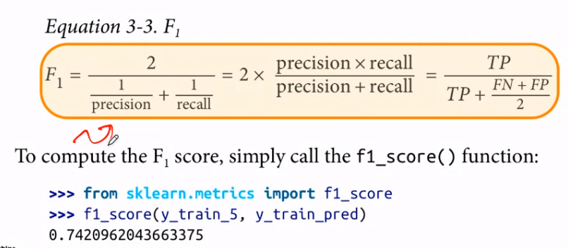

## mnist 소개

28 \* 28 pixel 로 이루어져있는 숫자 손끌씨 data set

sklearn 에서 MNIST dataset 이 70,000 개로 이루어져있는데 이미 60,000 : 10,000 으로 training set 과 test set 으로 나누어져 있다. 그것을 슬라이싱하여 사용하면 되겠다. 일반적으로는 split 할 때 섞어서 나누는 것이 좋다.

## Training a Binary Classifier

위의 MNIST data 에서 **5와 5가 아닌 수**를 구별해내는 model 을 만든다고 생각해보자. 이렇게 한다면 train set 의 60,000 개 중에 5는 6,000 개가 있을 것인데, 5가 아닌 수는 54,000 개가 있으므로 imbalance 가 발생한다.

**Logistic regression** model 을 이용할 것이다. `SGDClassifier` 를 이용하여 구현해보자.

## Performance Measures

전시간에 배웠던 regression 에서는 **RMSE**, **MAE** 같은 것들이 있었다. 그렇다면 classification 에서는 중요하게 다뤄야 할 measure 가 무엇일까?

`cross-validation` 으로 accuracy 측정하기.

```py
from sklearn.model_selection import cross_val_score
cross_val_score(sgd_clf, X_train, y_train5, cv=3, scoring="accuracy")
```

하지만, Never5Classifier 라는 이상한 것을 만들어보자. 무엇이 들어오든 0 을 return 하는 것이다. 그렇게 한다면 `cross_val_score` 가 90%가 넘는다! 왜 이러한 현상이 발생하는가? 이것은 바로 data set 의 imbalance 때문이다. 위에 말했듯이 data set이 1 : 9 의 비율로 나누어져있기 때문에 발생하는 오류이다.

> data set 의 balance / imbalance 를 파악하는 것이 중요하다.

> `accuracy` 는 그리 좋은 metric 이 아니다.

## Confusion Matrix

classifier 측정에 더 좋은 방법으로 `confusion matrix` 가 있다. 위의 경우에서는 binary classification 이므로 2 \* 2 의 matrix 가 있을 것이다.


each cell 에는 그렇게 예측한 숫자가 들어갈 것이다.

digonal 에는 number of right classification 이 들어가고 나머지에는 wrong classification 경우가 들어갈 것이다. 이것은 multi-class classification 에서도 쓰일 수 있다.

이를 사용하기 위해

```py
from sklearn.model_selection import cross_val_predict
from sklearn.metrics import confusion_matrix

y_train_pred = cross_val_predict(sgd_clf, X_train, y_train)
confusion_matrix(y_train_5, y_train_pred)
```

Each row 는 **actual class**, coulmn 은 **predicted class** 를 나타낼 것이다. 위 경우에선 TN, FP, FN, TP 로 나눠질 것이다.
이를 통해 **precision** 을 구할 수 있는데,

$precision = \frac{TP}{FP + TP}$

positive 로 판별한 것 중 진짜 positive 로 판별한 것의 비율을 보는 것이 **precision** 이다.

**recall** 도 있다.

$recall = \frac{TP}{TP + FN}$

실제 모든 positive sample 중에 positive 로 판별한 비율을 보는 것이 **recall**(=**sensitivity, true positive rate**) 이다.


```py
from sklearn.metrics import precision_score, recall_score
precision_score(y_train_5, y_train_pred)
recall_score(y_train_5, y_train_pred)
```

결과를 살펴보면 아까보다 매우 score 가 떨어진 것을 알 수 있다.

이것들을 합친 **$F_1$** 이라는 것이 있다.



threshold 를 잘 설정하는 것도 중요하다.


**threshold** 는 reason of performance 를 가져야한다. **high precision**을 가져야한다면 treshold 를 높여야 할 것이지만, **high recall** 만을 생각한다면 threshold 를 낮추면 될 것이다.

threshold 값에 따른 precision 과 recall 값을 그래프로 그려볼 수 있다.


## ROC Curve

> 시간이 없어서 다음에 하겠다.
