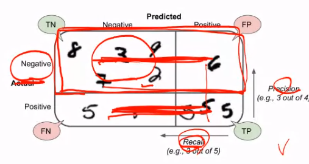
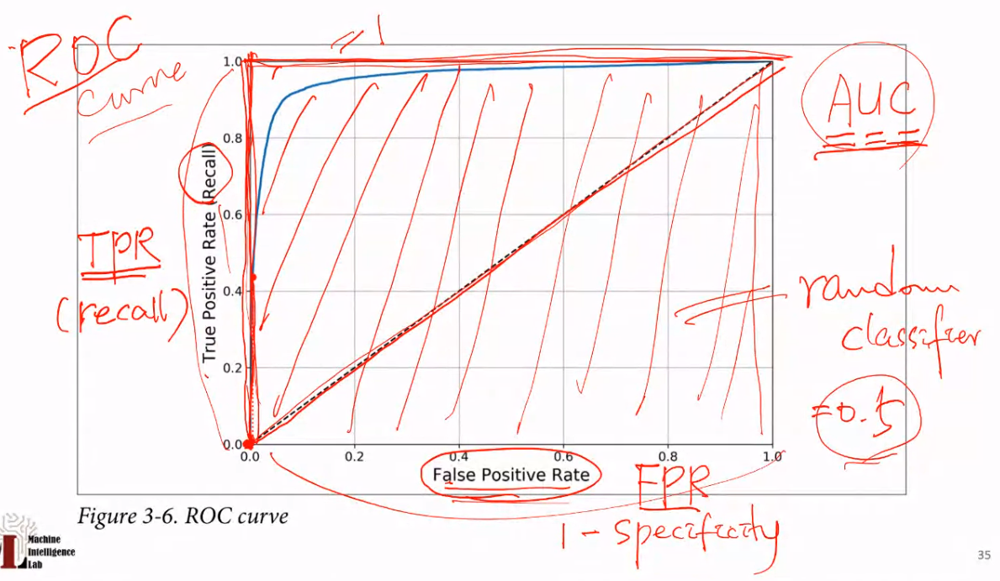
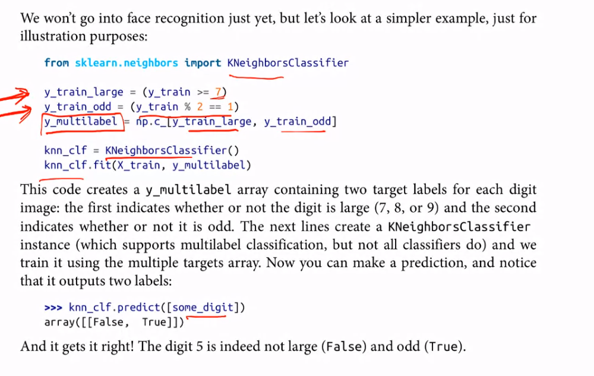

# Review

## ROC curve (receiver operating characteristic curve)



confusion matrix 에서 두 개의 row 를 본다. 첫번째 row 는 TNR 이며 두번째 row 는 FPR 이다. TNR 은 **specificity** 로 불린다. ROC curve 는 **TPR(recall) vs FPR** 이다.



**AUC** Area Under the Curve.

위 그림에서의 그래프 아래 면적을 보는 것이 **AUC** 이다.
AUC가 높을수록 좋은 classifier 이다.

```py
from sklearn.metrics import roc_auc_score
roc_auc_socre(y_train_5, y_scores)
```

를 통해 점수를 바로 확인할 수 있다.

PR curve 를 쓸 경우도 있다. positive class 가 rare 하고 FP 가 중요할 때 쓴다.

이러한 방법은 **multi class classification** 에서도 사용 가능하다. confusion matrix 가 커지는 것 뿐이다.

## Multilabel Classification



`KNeighborsClassifier` 를 사용할 수 있다.

# Ch4.

더 복잡한 모델이나 parameter 나 optimization 들을 소개할 것이다.

**Gradient Descent** 를 하고 **Batch GD, Mini-batch GD, SGD** 를 소개한다.

REgression 에서의 f 를 classification 에서도 사용할 수 있지만, 마지막에 g 를 해주어야 한다.

> > dacon 에서 해본 `softmax` 겠다.

## Linear Regression

여러 개의 feature 들을 vectorized form 으로 바꾸어 사용한다.

**MSE** cost function 을 Linear Regression model 에 사용해보자.
