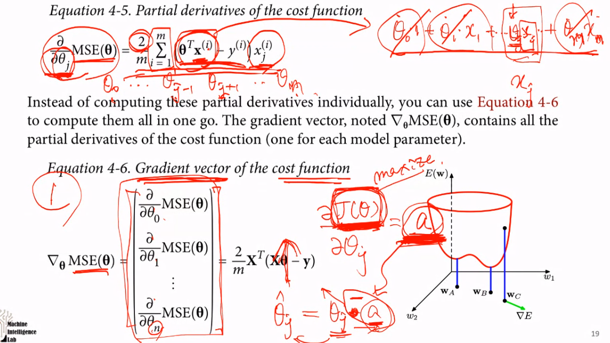
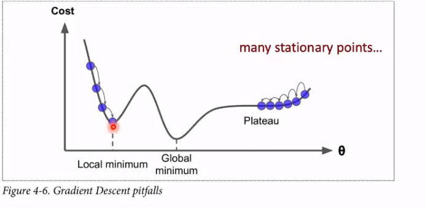
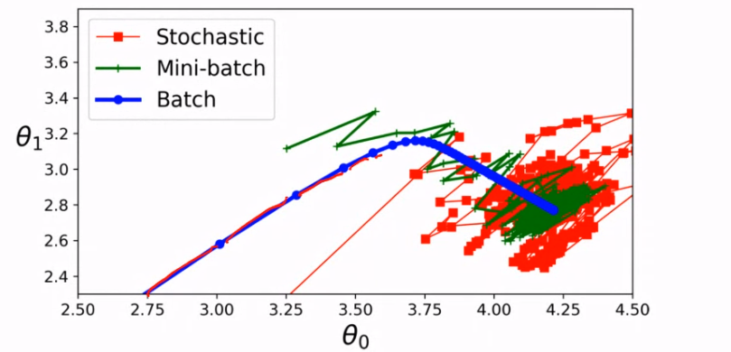
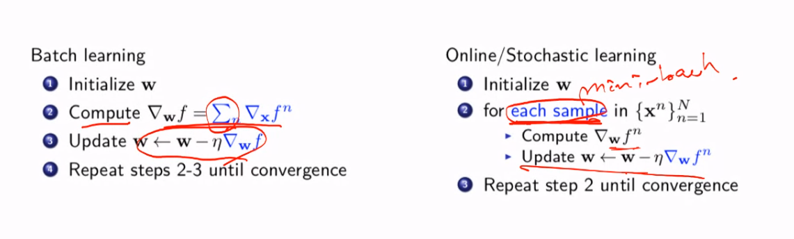

## Gradient Descent

### Batch Gradient Descent

**partial derivative** 를 써야한다. cost function 을 각 parameter 에 대해 partial derivative 하기 때문에 M(parameter 의 개수) 개의 값이 나올 것이다. **pariaal derivative** 를 기존의 파라미터에서 빼서 갱신하는 것이 Gradient Descent 이다. 더한다면 Gradient Ascent 다.
derivative 값에 learning rate 를 곱하여 downhill step 을 조정한다.

grid search 를 통해 좋은 hyperparameter 를 찾아낼 수도 있다.

하지만, 우리가 minimum 을 찾아냈다 할지라도 그것이 globlal minimum 인지 알수는 없다.

convex function 만이 global minimum 이 보장된다.

batch 는 한번에 다하는 것.

### Stochastic Gradient Descent

Stochastic 에서는 m 개의 sample 이 있다면 m 번 update 한다. Batch 에서는 m 개의 sample 에 대해 1 번 update 하는 것과는 다르다.

Batch 에서 local minmum 에 빠진다면 빠져나갈 방법은 없다. 하지만 Stochastci Gradient Descent 에서는 그럴 수도 있다.

**learning schedule**

Stochastic 을 쓸 때는 각 instance 가 independent 하고 identically distributed 되어야 한다. 이것을 보장하는 간단한 방법은 training 중에 instance 들을 random 하게 섞어주는 것이다.

### Mini-batch

