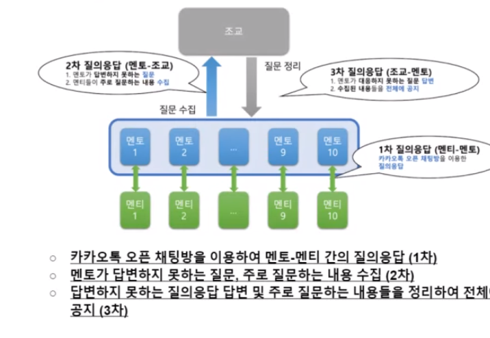
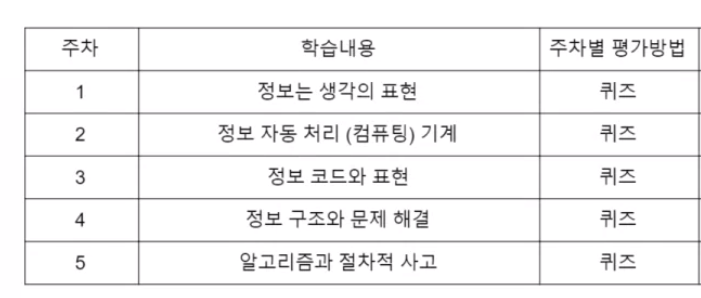
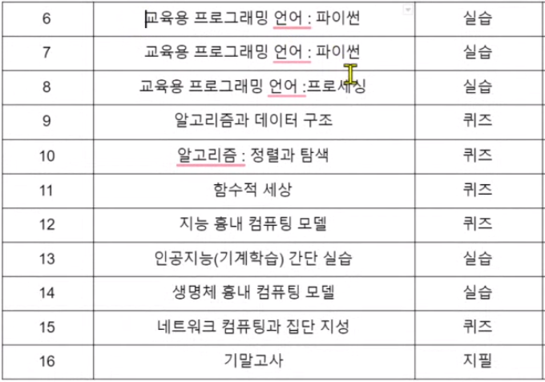
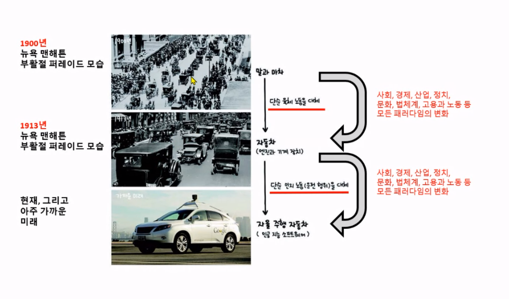

# 수업소개

**데이터로 표현하는 세상, 김현철 교수님**

## 온라인 진행

실시간이 베이스지만 네트워크 안 좋으면 녹강

## Textbook

1. [데이터로 표현하는 세상, 김현철, 2014년, 고려대학교 출판부](https://book.naver.com/bookdb/book_detail.nhn?bid=7443647)
2. 정보적사고에서 인공지능까지, 김현철, 2019년, 한빛아카데미

교재를 중심으로 강의 진행

ppt 없음..

## 평가

**절대평가**

1. 수업시간의 퀴즈 및 숙제
2. 실습 결과물
3. 출석 (전반적인 출석을 본다)

중간중간에 성적 알려줌

## 질의 응답

## 일정

- 시험, 퀴즈 오프라인인가?

O

- 평가 반영 비율은?

수강 정정 기간 끝나고 말해줌

- 실습 팀플인가?

개별임

- 오픈북 어디까지?

모든 걸 사용가능

[강의 자료](https://docs.google.com/document/d/1tZZc0WmKUWSRIbq6ElfKfqzm1xbCZdD8sqW4jHflLzY/preview?pru=AAABdGt-XA4*m_FU6iT6LtL1Ldm-t02XIg)

# 수업

인류의 역사는 '자동화 기술'의 역사와 함께 진행하였다.

산업혁명(단순 육체 노동의 자동화) / 인터넷 / 산업혁명(단순 인지 노동의 자동화) => 컴퓨터 / 소프트웨어 / 인공지능 / 클라우드 이런것들

인지 노동의 자동화는 생산성을 크게 향상 시킨다.

ex) 번역가와 번역 프로그램의 예
