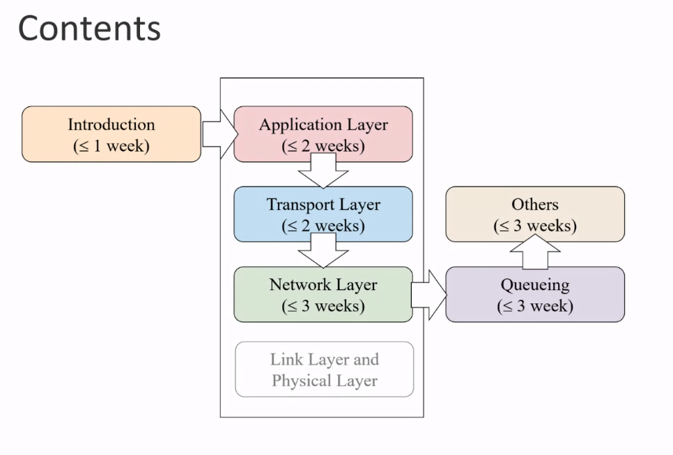
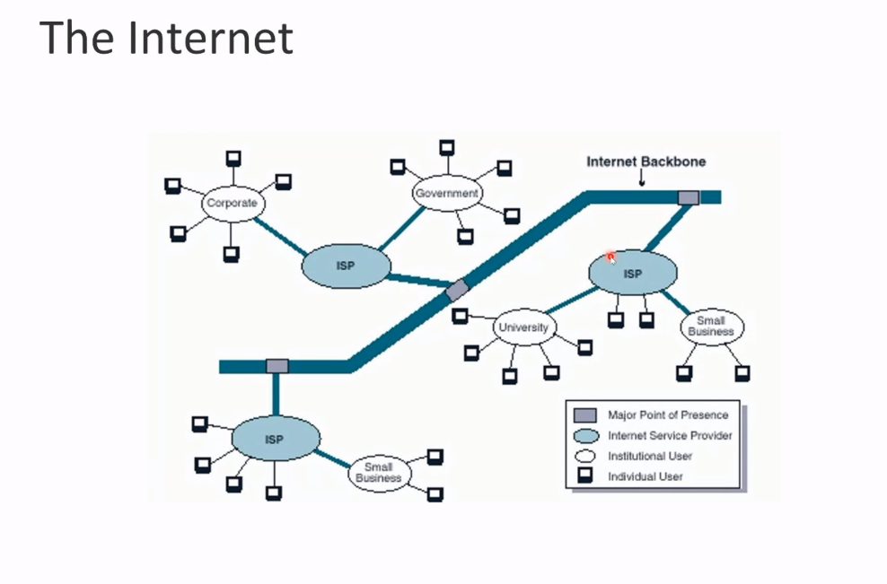
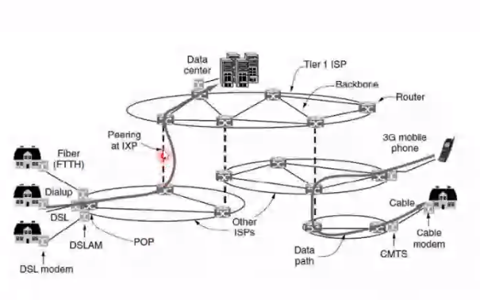

## 수업 소개

- COSE342

- Introduction to Computer Networks, Changhee Joo

- Online class

영상 녹화가 제공된다

### Grading

- HW 10%
- Mid-term 40%
- Final 50%

코로나 나아지면 중간 기말 대면

### Text book

- Computer Networking ($7^{th}$ Edition) (Jim Kurose, Keith Ross)
- Performance Modeling and Design of Computer Systems (Mor Harchols-Balter)
- Networked Life ($1^{st}$ Edition) Mung Chiang

1번째꺼로 주로 가지만 어쩔땐 다른거 쓸수도

세번째꺼 예시가 많음

### Contents

# Introduction

## The Internet

인터넷은 커넥션과 같다.

큰 회사(미국의 Level 3 같은 거)가 Internet Backbone 에서 Connection 을 만든다.

Backbone 에 ISP(LG, SK 같은 거) 가 연결되어 있다.

ISP 가 우리에게 인터넷을 제공해준다.

국제적으로 ISP를 제공하는 Tier 1 이 있고 국가적인 National ISP도 있고 지역만 연결해주는 Regional ISP 도 있다.

그것보다 작은 Local ISP 도 있다.

- Tier 1
- National ISP
- Regional ISP
- Local ISP

서로 연결되어 있어서 Local 이 끊기면 다른 연결로 넘어간다.

USA 에서는 주마다 ISP 가 다르다. (cox, at&t ...)

## Network Core/Edge

### Network Edge -- Access Networks

- WWAN(2G, 4G ...)
- WMAN(WiMAX)
- WLAN (Wifi)
- WPAN (Bluetooth)

=> Data rate vs. Range

## Protocol

모든 communication in Internet 은 goverend bt protocols

> protocols define format, order of messages sent and received among network entities, and actions taken on message transmission, receipt

## Transmission Unit = Packet

- 메시지를 받는다
- 작은 chunk 들, packets of lenght L bits 로 나눈다.
- transmits packet into access network at transmission rate R(link capacity, link bandwidth)
- delay = $\frac{L (=bits)}{R (=bits/sec)}$

## Packet Switching : Store-and-Forward

데이터가 L bits per packet 으로 나누어져서 R bps로 보내진다고 생각하자.

한 패킷의 절반이 intermidate node 에 도착한다면, 해당 packet 이 완벽하게 도착하기 전까지 아무것도 하지 않는다. 패킷이 다 도착하고 나서야 destination 으로 간다.(**store and forward**)

위의 delay 공식은 one-hop 이므로 end-end delay 는 2를 곱해주면 될 것.

## Packet Switching : Queueing, Loss

첫 전송속도가 빠르고, 중간점에서의 전송이 느리다면 중간에서 packet 의 queue 를 만들어서 FIFO 을 해준다. 중간점에 여러개의 데이터가 들어와도 그렇겟지

packet can be dropped if memory fills up

## Packet Switching : Routing, Forwarding

destination address 가 packet 의 header 에 있어서 그걸 따라간다.

routing algorithm 을 따라 만든 routing 표에 따라서 forwarding 을 해준다.

# Circuit Switching

이해못함

Old (ex) Telephone Networks

Easier to guarantee service quality

Routing 이 더 오랜 시간이 걸릴 수 있다.

Resources are dedicated for the entire duration of the call
=> 과정 중에 다른 것들을 쓸 수 없기에 비교적 비효율적이다.

비효율적이지만 suitable for smooth traffic (ex) voice

No packet loss

# Packet Switching

New (ex) The Internet

Hard to guarantee service quality when resources are limited
**"Best effort"**

위의 loss 때문에 버려질 수 있다는 점. 전달이 완벽한지 장담할 수 없다.

Physical routing or switching 은 line speed 로 행해져야 한다.

Network 가 요구에 따라 쓰여진다 => 더 높은 네트워크 효율성

효율적이고 suitable 하지만 for bursty traffic (ex) file transfer

짧은 시간에 많은 data

packets may be dropped
