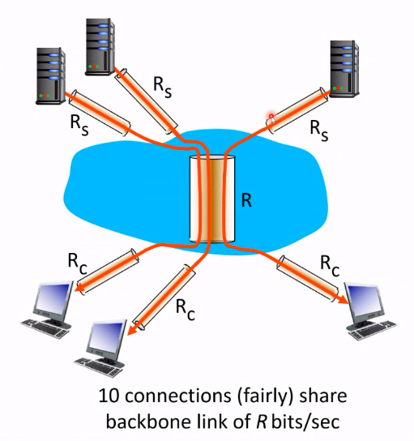
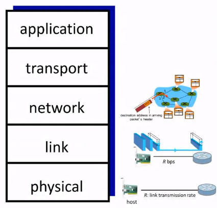
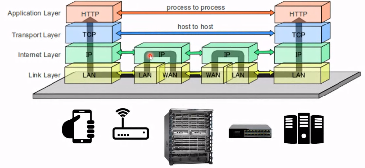
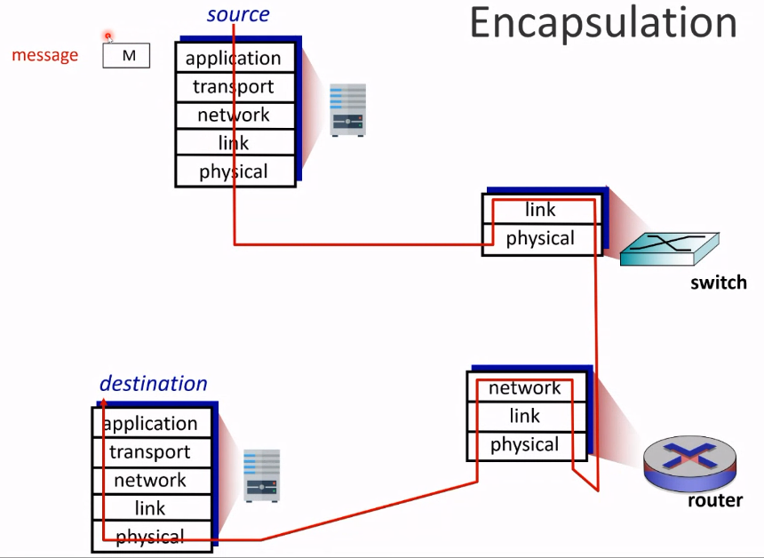

# Overview

# Today's Lecture Start!

## Contents

1. Network delay
2. Internet protocol stacks (layering)
3. Biref Internet history

## Loss and Delay

- packet being transmitted 딜레이
- queueing 하며 발생하는 딜레이

### Queueing and Delay (and Throughput)

$d_{e2e} = d_{proc} + d_{queue} + d_{trans} + d_{prop}$

- end to end delay
- deterministic in L2/L3/L4 swithces (bariable in L7 switch) => 보통 고정된 값이다
- 거의 unpredicatable 하다. 다른 사람의 행동을 알 수 없기 때문
- increases in multi-hop (store-and-forward 와 관련있다.)
- propagation delay : physical delay 이다. 도착지와 얼마나 먼지 이런 것과 관련되어 있다.

## Real Internet Delay

간단하다. 해당하는 주소로 small chunk of data 를 보내어서 ping packet 을 받는다. ttl 만큼의 hop 뒤에는 packet 이 discard 되는데 필요한 hop 보다 커야 하므로 크게 잡는다.

traceroute 를 이용할 수 있다. hop-by-hop ping

ttl 을 1로 줘서 보내고
ttl 을 2로 줘서 보내고
...

> 같은 패킷을 ttl 같게 보내더라도 다른 시간에 보내면 다른 path 로 올 수 있다.

## Throughput and Bottleneck

#### Throughput : rate at which bits transferred between sender/receiver

1. instantaneous
2. average

처음 전송하는 속도 $R_s$ 가 그 후 전송 속도 $R_c$ 보다 크다면 ?

#### Bottleneck link 가 일어난다.

이때, end-to-end throughput 의 min 은

$\frac{R_sR_sR}{10}$ 이다.

하지만, 실제로는 $R_c$ 혹은 $R_s$ 는 보통 bottleneck이다.

## how a packet is delivered?

1. 어떤 functions 가 필요한가 패킷을 사이트로부터 내 컴퓨터로 전송하기 위해?
2. 그것의 핵심 features 는 무엇인가?

설명하기에 너무 복잡하다.. 많은 complex interactions 들이 있기 때문. network function 을 이해하기 위해 사람들은 **Layer** 라는 개념을 발전시켰다.

## Internet Protocol stacks (Layering)

- physical : bits **on the wire**. 0을 보내면 0 volt 1을 보내면 5 volt 이런 느낌. AM/FM. frequency 차이
- link : data transfer between neighboring network elemenets

  e.g) Ethernet, wifi, bluetooth. 만약 0000이 계속 오면 그것이 연결이 끊긴 것인지 0000인지 구분하기 힘들다.

- network : routing of datagrams from source to destination

  e.g) IP, routing protocols

- transport : process to process data transfer 는 transport layer 에서 행해진다. end to end 가 이루어진다.

  e.g) TCP, UDP

왜 필요한가? network 상에서 전달되는 packet 이 loss 되는 것을 transport layer 에서 보상해주는 느낌으로 처리해준다.

- application : supporting network application

  e.g) FTP, SMTP, HTTP

## Communitaction over the Internet

Link layer 는 hop-by-hop 에 쓰인다. 다른 Link 로 넘어가기 위한 것.

IP layer 는 모두 연결 되어 있다. 하지만, Link layer 는 모두가 연결되어 있는 것이 아니다. 하나에만 연결되어 있으며 외의 곳으로 가기 위해서는 IP를 거쳐야한다.

하나의 Link layer 는 다른 하나의 Link layer 와 만 연결되어 있다. 예를 들어, 핸드폰에는 와이파이를 위한 Link, 데이터를 위한 Link 여러 개가 있겠지만 IP는 하나이다.

different layer 는 서로를 이해할 수 없다.

## Encapsulation

- application layer 에 Message M 이 들어온다.
- transport layer 에서는 그 뜻은 모르지만 어디로 가야할지는 안다. Header H_t 를 추가한다.
- network layer 에서는 H_n 을 추가하여 datagram 을 만든다.
- link layer 에서는 H_I 를 추가하여 frame 을 만든다.
- physical 에서는 switch 를 커쳐 router 로 보낸다.
- 또 다시 link layer에 도착하면 H_I 를 지우고 network layer 로 보낸다.
- H_n 을 보고 다시 link로 보낸다.
- 다시 frame 을 만들어서 physical layer 에서 destination 으로 보낸다.
- 그러면 올라가면서 header 들을 해독한다.
- 결국 destination의 application 에서 갖는 것은 Message M 뿐이다.

화살표를 잘 따라가보자

## Packet Capturing

> user space, kernel space

Link 에서 보내지는 packet 을 packet capture 라는 것에 보낸다.

## Internet History

PPT 를 보도록
