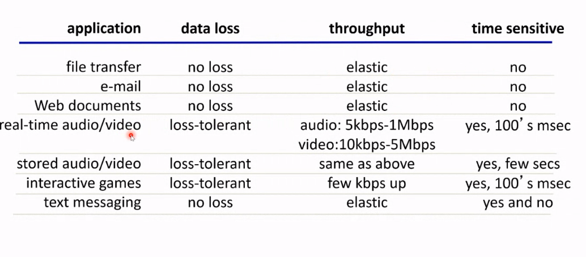
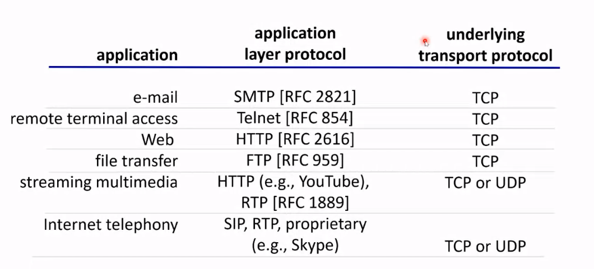
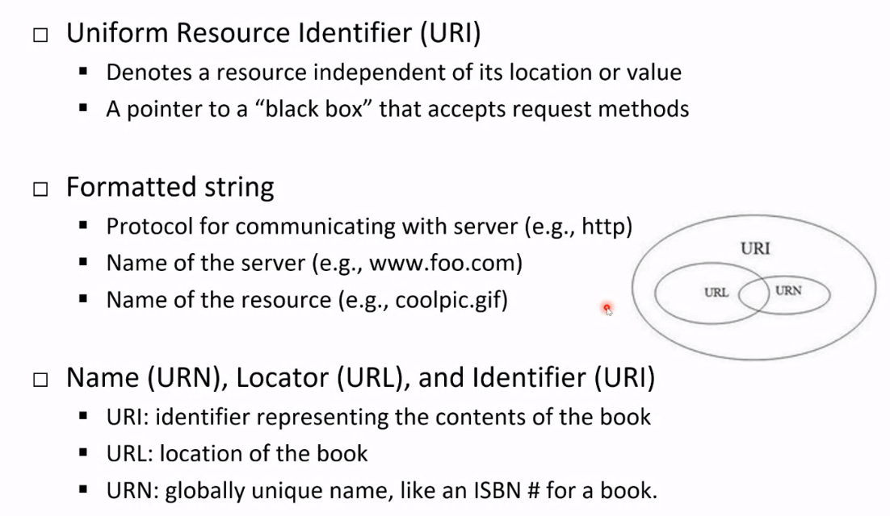
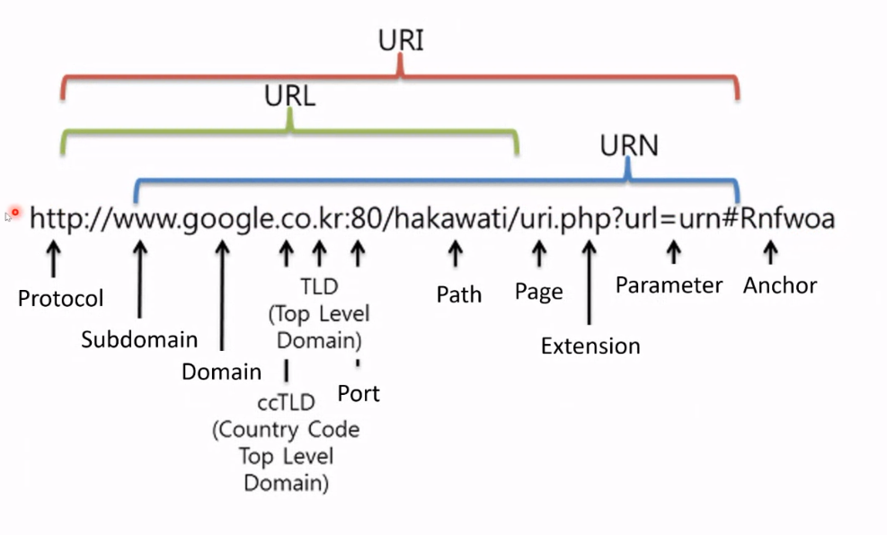
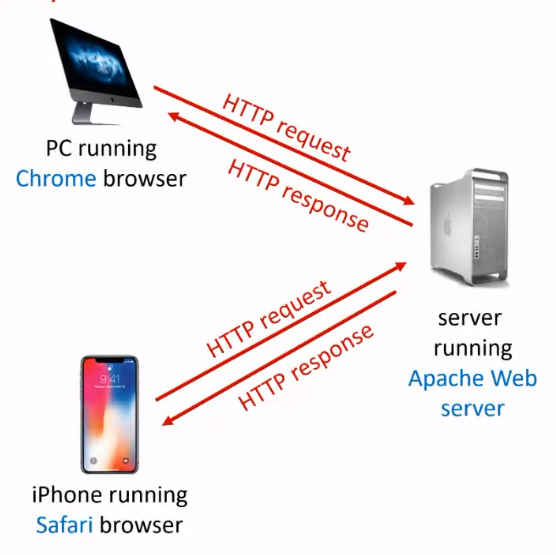

# Review

## Application Layer - What to learn

개념적인 network application protocols

### GOal

application of protocols With an example of Web service

## Creating a Network application

- run on diffenernt end systems
- communicate over network
- e.g. web server software

## Application Architecture

### Client-Server

**Server :**

- 항상 켜져있다.
- 영구적인 IP 주소
- data centers for scaling

**Clients:**

- 서버와 communicate
- 어쩔 땐 connected 어쩔 땐 아님
- may have dynamic IP 주소
- client 끼리 직접적으로 연결 되지 않음

### P2P

file transfer 에 잘 사용

**no always-on server**

**peer 가 peer 에게서 service 를 제공받으며 제공함**

- self scability

## Process as a Communication Unit

- Process : program running within a host

client process : process that 시작 communication
server process :

## Process and Socket

Process 는 socket 을 통해 messages 를 주고 받는다.

## Process Addressing for Communications

메시지를 받기 위해서 process 는 **identifier** 를 가져야 한다.

e.g. Host devies 는 **unique 32-bit IP 주소** 를 가지고 있다.

하지만 어떤 process 가 pkt 에 속해있는 지 알기에 충분하지 않다. 그래서, process 는 IP address 와 **port numbers** 를 가진다.

IP : 128.119.245.12

port number : 80

이런 느낌으로

## Application-layer Protocol defines..

1. **Types of messages exchagned** : request, response
2. **Message syntax** : IP address
3. **Message semantics** : IP address 가 어떤 의미인지
4. **Rules** for when and how processes send & respond to messages

- Open protocols : RFCs

  e.g., HTTP, SMTP

- Proprietary protocols :

  e.g., Skype

## Transport Services

어떤 app 은 다른 종류의 transport service 가 필요할 수 있다.

- Data inegrity
- Timing

### Transport Service Requirements

## Tow Dominant Internet Transport Protocols

**TCP service** :

- reliable transport
- flow control : sender 와 receiver 의 속도를 맞춰줌
- congestion control :
- dose not provide : 메시지를 무조건 전송하지만 언제 도착할지는 불확실
- connection-oriented : client 와 server 사이의 setup이 필요

> standard service 이다. application 이 TCP 에 맞지 않다면 UDP 를 쓴다.

**UDP service** :

- unreliable data transfer
- does not provide : reliability, flow control, congestion control, timing, ... 다없음

> 최소한의 기능만 가졌다.

> > UDP 는 nodeJS 같은 느낌이고 TCP 는 Django 같군

### Intrenet Apps and Transport Protocols

## Web History

> > ppt 를 보자..

## Web and HTTP (HyperText Transport Protocol)

**Web page 는 objects 들의 구성이다**

- **base HTML**, **several referenced objects**
- Each object is **addressable** by URL

host name/path name

## URI URL URN

## HTTP Overview

Web 은 application layer protocol 이다.

stateless

client 가 page 를 받으면 contents 를 보여주는데, 돌아와서 same page 를 요구하면 똑같은 행동을 또한다.
