# HTTP connections

> HTTP 는 20년 전에 만들어졌는데, 그때는 컴퓨터가 상당히 느렸다. Ram 이 64kb 정도일 때 였다. stupid 해 보일 수 있다.

## Non-Persistent HTTP

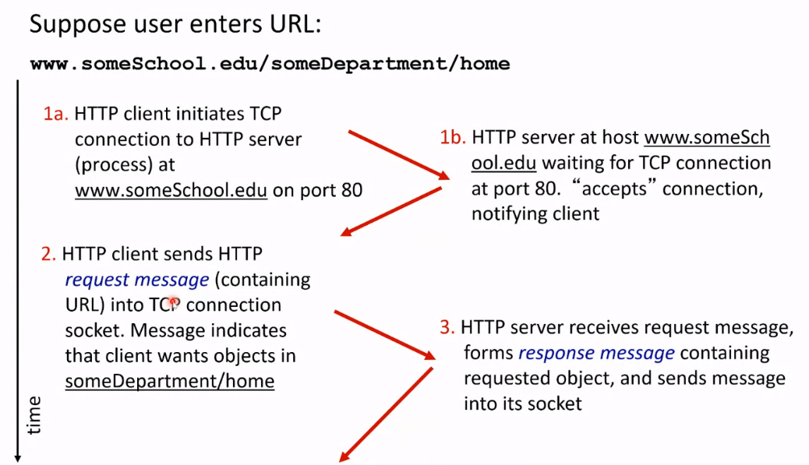
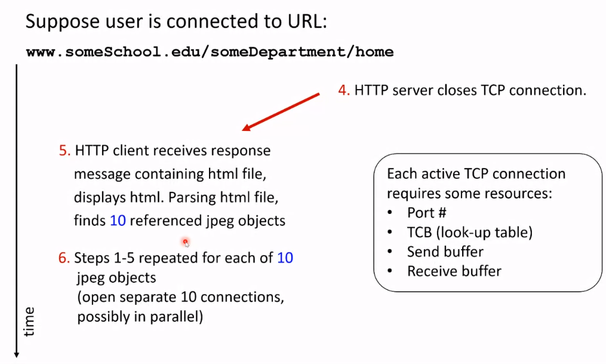

1a -> 1b, 1b-> 2 는 TCP 와 관련이 있다.

4. HTTP 가 TCP connection 을 끊는다.
5. HTTP client 가 html files 와 objects 를 받는다.
6. 모든 contents 를 받을 때까지 Step 1-5 가 반복된다.

socket 을 생성하면 send buffer 와 Receive buffer 가 둘 다 생성된다.

> keep in mind 해야 한다.

## : Response Time

**RTT** : small packet 이 client 로 부터 server 를 갔다가 돌아올 때 까지의 시간

**A HTTP connection response time**

- TCP connection 을 시작하는데 1 RTT
- TCP connection 을 설립하고 file 을 요청 하는데 $frac12$ RTT
- 요청된 file 을 전송하는데 $frac12$ RTT + transmission time
- = $2*RTT$ + file TX time

## Non-Persistent vs. Persistent

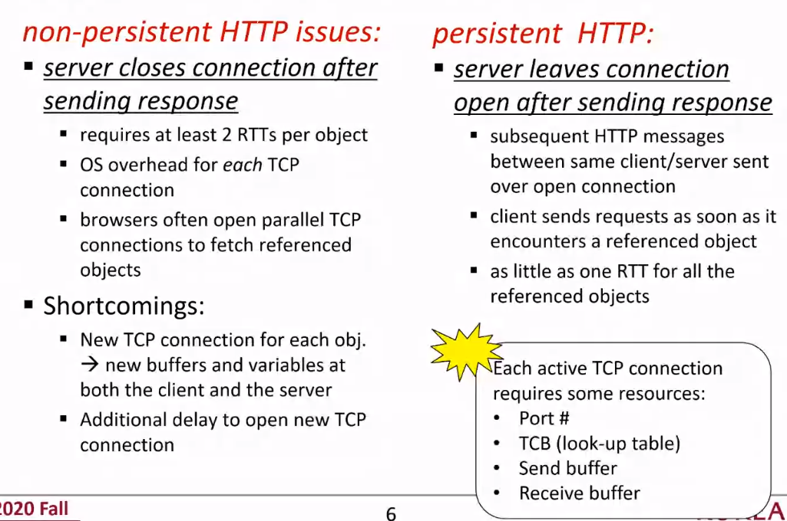

persistent 는 더 빠른 것에서 할 수 있다.

persistent 의 shortcoming :

- persistent HTTP 의 server 는 항상 켜져있어야 해서 좀 더 dedicate 해야 한다. 더 나은 성능을 가질 때 쓸 수 있다.

## HTTP 1.1 and 2.0

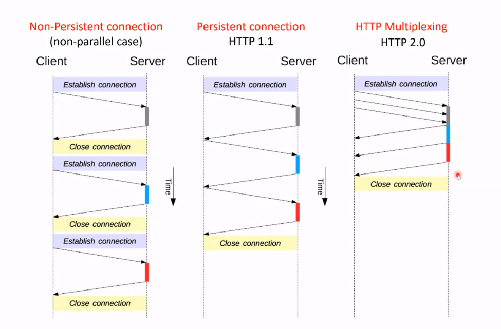

**Non-persistent :**
시작하고 받고 끊고 시작하고 받고 끊고.. 반복

**Persistent connection (HTTP 1.1) :**
Same TCP connection 을 유지하면서 계속 받아낸다.

**HTTP 2.0** :
Speed up delivery. One single TCP 를 통해 여러 개의 object를 받을 수 있다. get more performance. 여러 개의 object 에 대한 request 를 각각 보내어서(multiple requests) 순차적으로 request 를 처리한다.

> 최근에 많은 computer resource 가 발전하여 HTTP 2.0 버전을 쓴다.

## HTTP Server Architecture

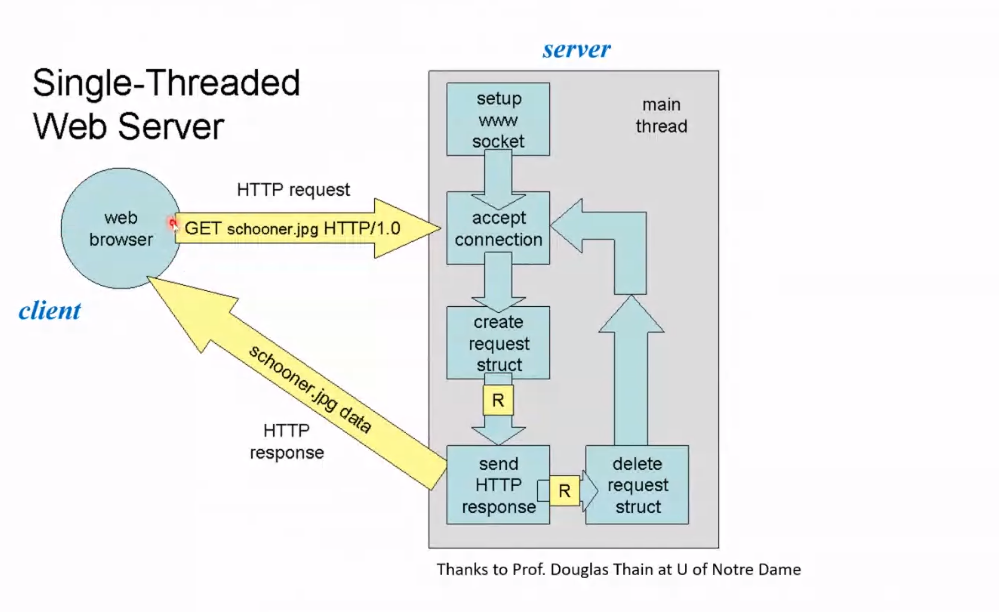

send HTTP response 한 뒤 TCP 끄고 delete request struct 한다. old style webserver. 과제를 한 명의 교수가 채점하는 느낌.

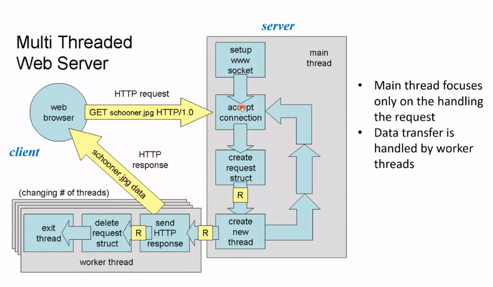

여러 개의 worker thread 를 사용하여 빠르다.
Main thread 는 단지 request 를 다루고 worker thread 에 넘겨주기만 한다. 과제를 조교들 동원해서 채점하는 느낌.

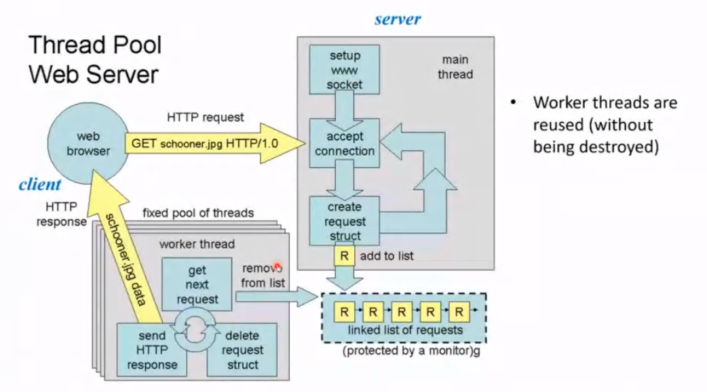

이전 버전은 비효율적일 수 있다. 여러 개의 과제를 받았을 때 이전에는 조교들에게 전화해서 과제 하나 가져가~ 이런 느낌이었다면 지금은 desk 에 과제를 놔두고 조교가 와서 채점하는 느낌이다. (queueing)
거의 모든 server 가 이런 방식으로 돌아간다.

## HTTP Message Format

1. **request** : ASCII (human-readable format). 여러 개의 line 으로 구성되어 있다. header 뒤에 body

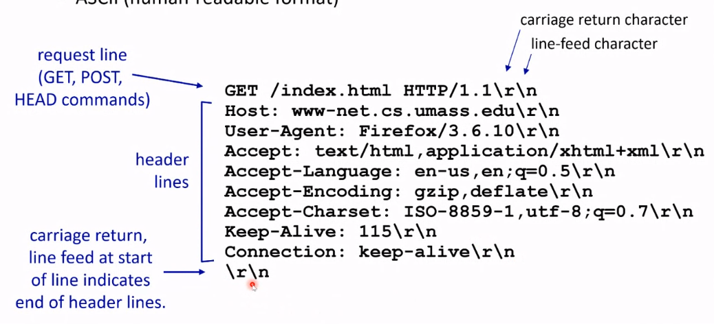
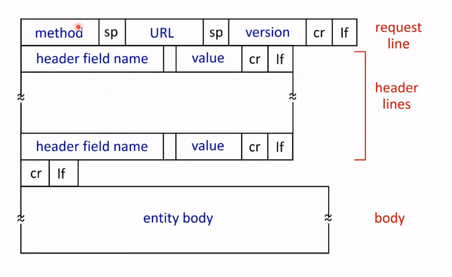

위의 예시는 GET method 이다.

- POST method : Input 이 body part 에 포함되어 server 에 uploaded.
- URL method : GET method 를 사용한다. Inputs is uploaded in URL filed of request line.

> > query 를 생각하면 되겠군.

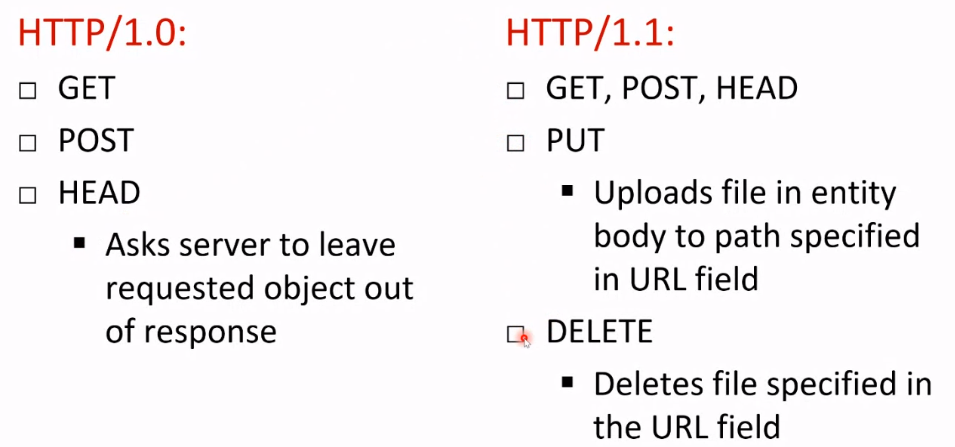

HTTP 1.1 이 easily file upload 를 할 수 있다.

2. **response**

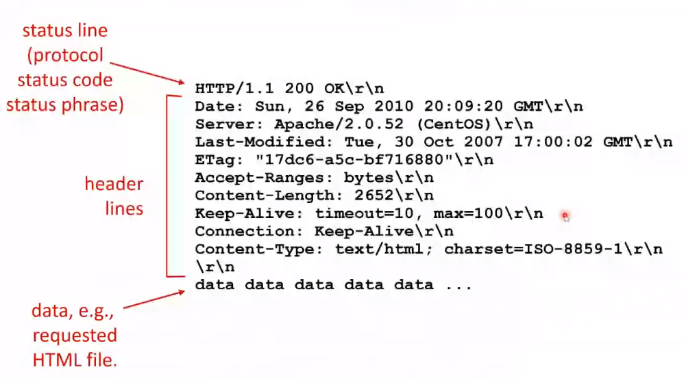

### Response Status Code

- 200 : OK
- 301 : Moved Permanently. 다른 곳으로 옮겨졌다.
- 400 : Bad Request. msg 서버가 이해 못함
- 404 : server 에 존재하지 않음
- 505 : HTTP Version Not Supported

## Cookies : User-side State

많은 Web sites 가 cookies 를 사용한다. 단어로 설명하기 어렵지만 예시로 들면 이해하기 쉽다.

**four componenets**

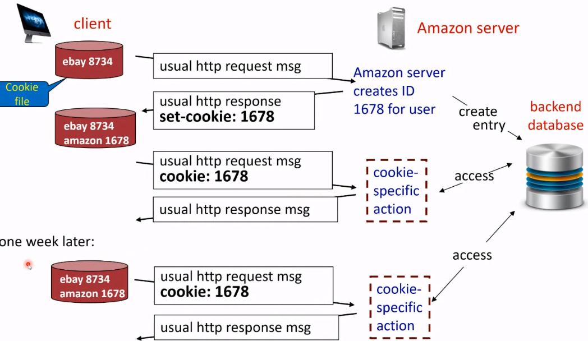

작은 cookie file 이 있다. usual http request msg 가 Amazon server 에 도착하였을 때 user 에게 ID 를 준다.
이 ID 가 Amazon 의 db 에 저장된다. 이 1678 이라는 ID 가 usual http response 를 통해 돌아오는데, cookie 에 이것 또한 저장되며 돌아온다. 다시 request msg 를 보냈을 때,cookie 의 1678 정보를 이용하여 접근을 승인할 수 있다.

일주일 뒤에도, cookie 를 이용하여 amazon에 접근할 수 있다

**Client Side**에서 1678 이 저장되는 것이다.

### Cookies

cookies for..

1. Authorization
2. Shopping carts
3. Recommendations
4. User session state

Cookie 는 나에 대해 많은 것을 site 에게 알려줄 수 있다.
Cookie 를 얼마동안 저장할 것인지는 내맘이다.

## Web Caching (Proxy Server)

> origin server 를 포함시키지 않고 client request 를 만족시키는 것이 목적이다.

Proxy server 에 처음 보는 request 가 들어오면 origin server 에 연락해서 cache 를 생성하여 그것을 client 에 보내준다.

cache 에 있는 request 가 들어오면 cache 가 바로 returns object.

> response time을 줄여준다.

### Example

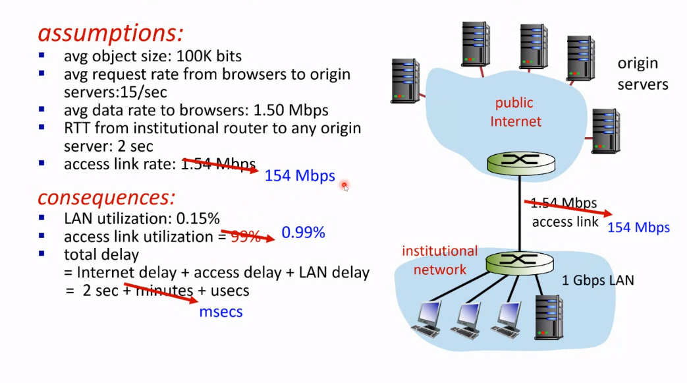

access link utilization 이 99% 가 되는 것은 큰 문제이다

위 처럼 바꾼다면 모두가 좋은 결과를 낳지만 이것은 비싸다. increased access link speed 를 하기 때문이다.

## Caching Example

> > 잘 못 들었다. 녹화를 참고하자.

local cache 를 설치하기. 더 싸다!
