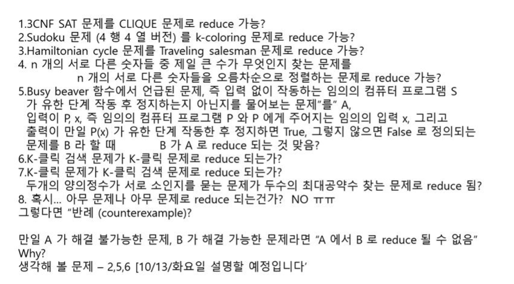

**12 시 정각에 본다.**

# 정리 강의

## 정량적 사고

1. 모델링 : 항해가능성 (프사이 공식.. 정량적 모델링이 가능하다)
2. 분석
3. 계산 문제 해결

1, 2, 3 의 전반적인 것 설명 가능해야 함

## 하이퍼텍스트 개념의 시초

- 하이퍼텍스트의 시초는 어떠한 것인가
- Hypertext 의 시작과 아이디어 알기

## 메멕스

- 베네바 부시가 제안

## 하이퍼텍스트 - 특별한 형식의 텍스트

- 하이퍼텍스트 라는 단어 자체는 테드 넬슨이라는 사람이 비순차적인 글쓰기를 지칭하는 용어. 신조어를 만듦 1960년대

### 하이퍼텍스ㅡ가 무엇인가

1. 독자가 일관하는 순서를 자기가 클릭하면서 정할 수 있는 텍스트
2. 텍스트 임의의 두 지점 사이에 하이퍼링크로 연결
3. 정보랑 상호작용하면서 사용자가 새로운 지식을 창출 할 수 있게 함

## 웹사이트의 항해가능성

- 사용자가 방문했을 때 찾고자 하는 것이 있을 때 사용자가 그것을 자유자재로 클릭하면서 원하는 정보를 얼마나 쉽게 찾을 수 있는가
- 키워드 검색 등의 기능은 제공되지 않으며 사용자는 **웹 사이트 주소** **자신이 찾고자 하는 정보** 만을 가짐
- 수치화되진 않지만 정량적으로 될 수 있다 그 사이에 분석이 필욯ㅁ

### 프사이 정리

- 외운다기 보다는 항해가능성을 모델링하기 위해서 어떠어떠한 요소들이 어떻게 가해졌는지 정리해볼 필요가 있으며 그것을 통해 정량적 사고가 무엇인지 알아냄.

## 세가지 타입의 링크들

1. virtual link
2. mandatory link
3. real link

## 경로의 강도를 정의하는 한가지 방법

- 프사이가 어떻게 나오게 된 건지를 설명한 것

## 두 페이지 간 내용적 연관성을 가중치로 부여하는 방법

- 특정 경로를 사용자가 많이 지나갈 확률에 대한 것을 고려해서 가중치를 고려해서 강도를 계산

### 예제

- 예제를 해봤던 거를 이제 자기가 여기서 중요한거는 항해가능성이라는게 노드가 뭐 의미는 없지만 계산해볼라고 위에 같이 설정되어있을 때 왼쪽 오른쪽 작은 것 같지만 구성이 되는 거에요. 왼쪽같이 되어있을 때 오른쪽 같이 되어있을 때 정량적인 기준을 갖고 계산을 했죠. 아 이케이케 되는 거구나 손으로 해보면서 이해 해보면 되겠죠

## 항해가능성 공식 Psi 공식을 도출하는 과정

- 예제를 직접 계산해보자 

- 어떻게 계산한다라는 것을 수업시간에 했는데 알아야할듯

## WWW 의 특징 및 시맨틱 웹이 등장하게 된 배경

## Semantic web 의 두가지 특징

1. 정보들을 컴퓨터가 직접ㅇ ㅣ해할 수 있는 형식으로 표현한다. RDF 형식으로 표현한다. HTML 같은 경우에가 WWW 를 쓰는 것이라면 Semantic 에서는 RDF 를 썻다.
2. 하이퍼링크들로 연결되는 것들 사이에는 내용적인 관련성이 존재한다. 일반 WWW 에서는 전혀 관련없는 것도 연결 가능 했지만 Semantic 웹에서는 내용적인 관련성이 존재하는 것에만 하이퍼링크가 존재

## 시맨틱 웹의 장점

- 새로운 정보를 자동적으로 추론할 수 있는 가능성
- 컴퓨터가 프로그램이 정보를 자동 추출함

WWW 에서는 반고흐가 사람이라는 정보를 추출하기가 쉽지 않으나, 시맨틱 웹에서는 새로운 정보를 추론 가능하게 한다.

## 시맨틱 웹에서 정보 표현에 사용RDF

- 주어, 서술어 목적어로 이루어져 있다 .고것만 기억하면 되겟져

## 시맨틱 웹을 바라보는 세가지 관점 및 시맨틱 웹이 등장하게 된 세가지 배경

- 세가지 설명하시오. 그러면 이거에요.. 중요하겟죠?
- 이걸 우리가 잘 이해해야 되는게 왼쪽에 보면 시맨틱 웹이 뭐냐 세가지 관점으로 설명하시오 그러면 이거에요. 

**Universal library**, **Computational agent 들이 활동할 수 있는 어떤 특정한 환경 backdrop**, **database 라든가 지식 base 들을 합병시키는  특정한 방법이라고도 할 수 있다.** 세 가지 설명하시오 라 하면 이거 쓰면 돼여

## RDF 를 이용한 정보 표현의 구체적인ㅇ ㅖ

테크니컬 한거니까 넘어가자

## 문맥자유문법의 정의

구조의 이해죠? 그런 예로써 하나.. 문맥자유 문법이 뭔지 설명하시오 라고 하면

네 개의 구성요소 V, T, S, P 로 이루어진 수학적인 구조이고

- V 는 논터미날이라고 부르는 심볼들의 유한 집합
- T 는 터미널이라고 부르는 심볼들의 유한 집합
- S 는 시작하는 논터미널
- P 는 생성 규칙 들의 유한 집합

이것을 갖고서 Hypertext 의 구성요소들을 표현했었다.
예제를 이해할 수 있을 정도가 되어야 함. 문맥자유문법가지고 이거를 표현할 수 있겠구나~ 문맥자유문법의 개념을 구조의 예로써 소개한 것도 있고 그걸 갖고서 하이퍼텍스트의 구성요소를 표현할 수 있다. 

## Hypertext is a structure

1. Matched pair 들의 유한집합
2. Hyperlink 들로 이루어져있다.

## 램지 정리 / 반데르바덴 정리

하나의 집합과 집합의 원소들이 어떤 관계이느냐 어떤 관계들이 그 안에 있느냐 등등 을 통틀어서 구조라고 한다. 구조가 복잡하다 간단하다 라는 기준이 쉽지 않다. 절대적인 기준이 있는 건 아니지만 이런 걸 표현하는 수학적으로 의미하는 표현하는 대표적인게 **The guiding result**. 이게 뭘 말하는가?
**양의 정수들에 대해서 덧셈과 곱셈으로 표현된 number theory 의 임의의 명제 하나를 참이냐 거짓이냐를 결정할 수 있는 알고리즘은 존재하지 않는다.**
이 말은 무슨 말이냐? 존재하지 않을만큼 구조가 복잡하다. 중간고사 이후에 또 다룰것이야.

램지 정리를 시험에 낼 순 없고 그런가 보다.

## 계산 문제, 인스턴스, 알고리즘

인스턴스가 중요하다. 하나의 계산문제가 주어질 때 인스턴스가 어떤 것이 주어지더라도 유한 단계를 거쳐서 답을 찾는 방법을 기술한 것이 그 계산문제의 알고리즘이다. 입력될 수 있는 모든 것이 인스턴스

## Euclid 알고리즘
어떻게 작동하는지 이해하는 것이 중요하다.

## 결정적 알고리즘과 비결정적 알고리즘

그냥 알고리즘 이러면은 결정적 알고리즘이다. 차이가 어떻다 이렇다는 것은 해야한다. node, edge

## 해밀토니언 경로 문제

입력 : 유향 그래프 $G=(V,E),a,b$ 
출력 : 만일 a 에서 시작해서 G 안의 모든 노드들을 단 한번씩만 방문하여 b에 도달하는 것이 가능하면 yes, 아니면 no

한붓그리기군

해밀토니언 경로 문제를 해결하는 비결정적 알고리즘을 했다. **추측 / 검증** 의 단계로 이루어졌다. 하지만, 비결정적 알고리즘은 단 하나만 있는 것은 아니다. 수업시간에 이렇게 했던거는 이런 방식으로 굳이 왜 했냐면 나중에 수업에서 해밀토니언 경로 문제를 DNA 어쩌구에서 쓰기 때문이다. 꼭 이렇게 비결정적 알고리즘을 쓰지는 않아도 된다.

## 비결정적 알고리즘

임의의 입력을 주었을 때 자기가 설명할줄 알아야 한다.

## 3 Coloring 문제

3 개의 색을 지정해놓고 색으로 동그라미들을 색칠하는데 간선으로 연결되어 있는 것은 다른 색으로 색칠하는 문제

## 삽입 정렬

처음 보는 학생들은 버거울지는 모르지만, 이거를 자기가 하나하나 해석한다고 생각하고 실제 Instance 가 주어지면 따라갈 수 있을 정도가 되어야 한다. 삽입 정렬 알고리즘을 써라 이런 걸 할수는 없다.

## 알고리즘 분석

- 시간 복잡도

똑같은 알고리즘인데도 Instance 가 어떻게 주어지느냐에 따라서 걸리는 시간을 달라질 것이다. 최악의 경우 시간 복잡도 / 최선의 경우 시간 복잡도
를 통해서 시간 복잡도를 generalize 할 수 있는 것이다.

## 다항식 시간 알고리즘 (= 효율적인 알고리즘)

결정적 알고리즘을 의미.

비결정적 알고리즘도 다항식 시간 알고리즘일 수 있다.

위의 해밀토니언이나 3 coloring 도 다항식 시간 알고리즘이다.

P = x | x 는 결정 문제이고 x 를 해결하는 효율적인 알고리즘 존재

NP = x | x 는 결정 문제이고 x 를 해결하는 효율적인 비결정적 알고리즘 존재

=> 해밀토니언, 3 coloring

## 계산가능하다라는게 뭔지

모든 값들을 계산하는 알고리즘이 존재하다면 계산가능하다.

우리가 연구를 하는 경우가 아니라고 한다면 대부분의 다루는 함수는 계산가능하다. 실제론 많이 없다. 여기서는 뭐냐 수업에서 계산가능성과 연관되는 것이고 분석의 예가 되며 정량적 분석의 예가 되기도 한다.

## 계산 불가능한 함수인 BB(n) 의 정의

BB 함수의 정의를 쓰시오 한다면 쓸 수 있어야 한다.

**특별한 컴퓨터 프로그램들을 먼저 고려함**

4가지 특징들을 동시에 만족시키는 컴퓨터 프로그램들에만 관심이 있다.

1. 입력 없이 작동하는 프로그램 - 입력 없이 실행시키면 뭔가 일을 하고 마치는 프로그램
2. 길이가 최대 n 을 넘지 않는 프로그램 - n 은 양의 정수
3. 무한 루프 돌지 않고 유한 단계 작동한 후 정지하는 프로그램
4. 정지하기 바로 전에 양의 정수 한 개를 출력하는 프로그램

4 가지 특징들을 동시에 만족하는 프로그램들은 무한히 많이 존재하지만, **n 값이 정해지면 위의 네 가지 특징들 모두를 만족하는 프로그램은 유한 개** 이다.

BB(n) 은 n 값이 1,2,3, ... 등 일때 위의 네 가지 특징들 동시에 만족하는 프로그램들의 출력 값들 중 최대 값

BB(100) 은 길이가 100 이하 이며 1,3,4 번을 만족하는 프로그램들이 출력하는 값들 중 max

## BB(n) 이 계산 불가능하다는 것의 증명

한번 정리해봐서 왜 계산 불가능한 것에 대해서 이해를 하면 되고

## 프로그램 x 와 x 의 수행 단계를 출력하는 프로그램 ㅛ

결국은 나중에 모순이 되는 상항이 발생하는데 fact 라는 것을 썻죠.

BB(n) 은 계산 불가능 하다는 것을 증명하다는 것은 어렵다 할 수 있겠으나 이정도는 이해를 해야한다.

## P와 NP 가 다르다는 것의 의미 1

## 계산문제는 언제 어려워지는가?

3 CNF satisfaibility 를 이해해야 하낟.

3 CNF 의 구조적인 특징을 얘기하는 건데 이것이 뭐다라는 것을 알아야지만 3 CNF 충족가능성 문제의 구족 특성을 알 것이다.

## 3 CNF 충족가능성 문제의 구조 특성1

1. NP 에 속한다. 정답을 주면 효율적으로 검증이 되기 떄문에
2. **상 병이 현상**을 보인다. order parameter. 

절들의 갯수를 변수들의 갯수로 나눈 것이 order parameter 의 역할을 한다.
이러한 order 가 클수록 satisfiable 한 것이 대부분이 된다.

order 값이 아주 작거나 아주 크거나 하면 쉽게 satisfiable, unsatisfiable 판별이 가능하다. 그런데 이 order 값이 어떤 특정값일 때 갑자기 어려워진다.

 해결하는데 거릴는 시간 easy hard easy 패턴을 보면 같은 지점이다.

3 CNF 충족가능성 문제의 두 가지 구조 특성을 이야기 하시오 그러면 이거 두개를 써야함.

## 정량적인 분석의 예

3 CNF 구조 특성 이러한 것도 분석의 예에요.

두 가지를 설명할 수 있을 정도로 정리를 해두면 좋겠죠.

## P 대 NP 문제 - 비유

답을 찾아내는 것 ( 검색 ) vs 검증

## 오라클 알고리즘

오라클 - 알고리즘이랑 같지 않다. 

만약 오라클은 계산문제의 입력을 주면 출력을 단번에 알려주는 알고리즘이다. 이러면 **False** 이다. 오라클은 **계산문제가 주어지면 그 계산문제의 "정답 단번에 알려주는 것"** 알고리즘은 아니기 때문! 알고리즘인 경우도 있지만 아닌 경우도 있기 때문이다.

## k-클릭 문제 vs k-클릭 검색 문제

설명하라 이러면 뭔 이 문제가 문지 알아야 되니깐 알아야되고요

오라클 설명할 때 썻죠? 

## k- 클릭 검색 문제를 해결하는 오라클 알고리즘

k - 클릭 문제의 오라클을 쓴거다. 오라클을 쓴 알고리즘이다. 

## P = NP 인 세상

P = NP 라는 게 뭐냐. 검증이 효율적으로 되면 그 문제가 쉽게 해결된다는 것이니깐, 검증이 쉬우면 답 찾기도 쉽다는 뜻이기 때문에 모든 문제를 간편히 풀 수 있다는 뜻이다.

## short certificate

?

## Small world 현상

WWW 도 small world 현상을 가진다는 게 증명이 되었고 어떠한 미생물의 신경망도 이러한 small world 현상을 갖는다는게 증명이 되었다. 그렇다면 small world 의 특징이 무엇이냐는 것.

그렇다면 small world 현상을 갖는 정량적인 기준은 무엇일까 거리가 $(log N)^k$ 의 값을 갖더라

small world network 의 노드의 수가 N 일 수도 사람이 N 일 수도. diameter 가 log 의 거듭제곱으로 표현된다는 것을 알면 되겠다.

## The small world web

그렇다라는 정도 WWW 도 그 예시다.

## Scale-free networks

$P(k) ~ k^{-\gamma}$

k 는 1보다 크다.

WWW 도 Scale-free network 이다.

만약 수십억개중 하나 net 을 선택했어요. k 값이 10. 10개의 net 에 연결되어 있을 확률이 $10^{-\gamma}$ 라는 것이다.

scale free network 예 : 항공 노선도, WWW, etc

많은 곳에 링크되어 있는 곳이 무너지면 다른 곳에 영향이 크기 때문에 security 와 연관 있음.
**오라클 개념이 뭐다라는 것이랑 A 가 B에 reduce 하다는 것이 뭐라는 것. 중요**

## 만약 A 가 B 로 reduce 된다면

이때 우리가 단편적으로 **B 가 A 보다 더 어렵다** 라고 하면 **False** 이다.
꼭 그런건 아니기 때문. A 와 B 의 난이도가 같을 가능성도 존재함. 서로에게 reduce 될 경우

reduce 에 대한 문제가 구조에 대한 문제이다.

- 3 CNF SAT 문제가 k-clique 문제로 reduce 됨
- 스도쿠 문제가 coloring 문제로 reduce 됨
- 정지문제

A 가 B 에 reduce 되었을 때 B 가 해결가능하다면 A 도 해결가능하다.

k-클릭 검색 문제에 대한 reduce 도 중요하죠. k- 클릭 검색 문제를 풀때 k-클릭 문제의 오라클을 썼다.
k-클릭 검색 문제를 해결할 수 있따면 k-클릭 문제를 해결할 수 있다? True 

이말은 k-클릭 문제가 k-클릭 검색 문제로 reduce 되는 거죠?

그렇다면 k-클릭 문제를 해결할 수 있다면 k-클릭 검색 문제를 해결할 수 있다? True 

아까 k-클릭 문제의 oracle 을 써서 ㅜㄹ었기 때문이다. 결국엔 이 둘은 서로 reduce 가능

n 개의 서로 다른 숫자들 중 제일 큰 수가 무엇인지 찾는 문제

n 개의 서로 다른 숫자들을 오름차순으로 정렬하는 문제

위의 문제가 아래 문제로 reduce 된다. 왜냐하면, 정렬 다 시켜놓으면 맨 끝에 꺼가 제일 큰 수 니깐

## Traveling salesman problem

이게 어떤 문제인지 알아야지 뭐 다른 걸 얘기 할 거니깐 이게 어떤 ㅜ문제인지 알아야겠따.

입력 : 간선마다 비용이 정해진 그래프, 최대 비용
결과 : 최대 비용 안에서 모든 간선을 한번씩 거치고 다시 돌아올 수 있는가 True False

해밀토니언 싸이클 문제 : 하나의 시작점에서 모든 노드들을 우리가 지나면서 모든 노드들을 한번만 지나고 다시 자기자신으로 돌아오는게 가능하면 yes

해밀토니언 싸이클 문제 reduces to 여행하는 세일즈 맨 문제

그렇다면, 여행하는 세일즈 맨 문제를 해결하면 해밀토니언 싸이클 문제도 해결가능하다. 

이말은 무슨 말이냐. Instance 를 TSP 에 넣은 결과를 통해서 HAM 의 답을 구해낼 수 있다는 것이다. 그래서 HAM reduces to TSP

## reduce 관계 무엇을 의미하는가

## NP Completeness

