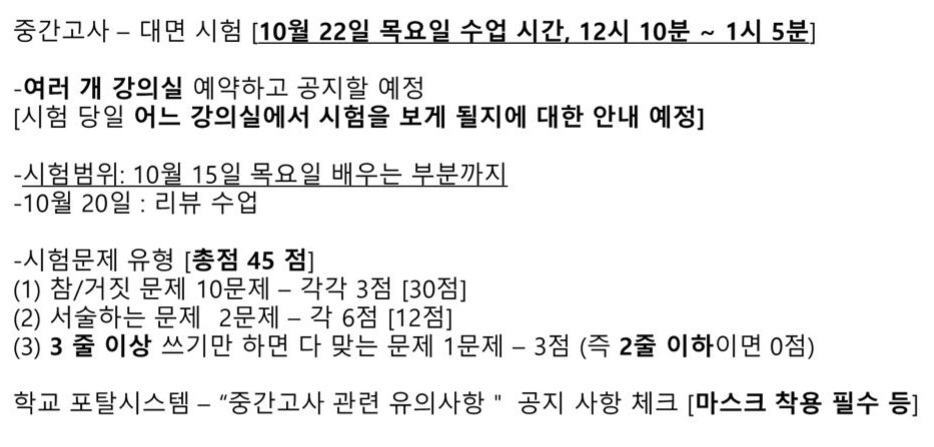

**12 시 정각에 본다.**

# 정리 강의

## 정량적 사고

1. 모델링 : 항해가능성 (프사이 공식.. 정량적 모델링이 가능하다)
2. 분석
3. 계산 문제 해결

1, 2, 3 의 전반적인 것 설명 가능해야 함

## 하이퍼텍스트 개념의 시초

- 하이퍼텍스트의 시초는 어떠한 것인가
- Hypertext 의 시작과 아이디어 알기

## 메멕스

- 베네바 부시가 제안

## 하이퍼텍스트 - 특별한 형식의 텍스트

- 하이퍼텍스트 라는 단어 자체는 테드 넬슨이라는 사람이 비순차적인 글쓰기를 지칭하는 용어. 신조어를 만듦 1960년대

### 하이퍼텍스ㅡ가 무엇인가

1. 독자가 일관하는 순서를 자기가 클릭하면서 정할 수 있는 텍스트
2. 텍스트 임의의 두 지점 사이에 하이퍼링크로 연결
3. 정보랑 상호작용하면서 사용자가 새로운 지식을 창출 할 수 있게 함

## 웹사이트의 항해가능성

- 사용자가 방문했을 때 찾고자 하는 것이 있을 때 사용자가 그것을 자유자재로 클릭하면서 원하는 정보를 얼마나 쉽게 찾을 수 있는가
- 키워드 검색 등의 기능은 제공되지 않으며 사용자는 **웹 사이트 주소** **자신이 찾고자 하는 정보** 만을 가짐
- 수치화되진 않지만 정량적으로 될 수 있다 그 사이에 분석이 필욯ㅁ

### 프사이 정리

- 외운다기 보다는 항해가능성을 모델링하기 위해서 어떠어떠한 요소들이 어떻게 가해졌는지 정리해볼 필요가 있으며 그것을 통해 정량적 사고가 무엇인지 알아냄.

## 세가지 타입의 링크들

1. virtual link
2. mandatory link
3. real link

## 경로의 강도를 정의하는 한가지 방법

- 프사이가 어떻게 나오게 된 건지를 설명한 것

## 두 페이지 간 내용적 연관성을 가중치로 부여하는 방법

- 특정 경로를 사용자가 많이 지나갈 확률에 대한 것을 고려해서 가중치를 고려해서 강도를 계산

### 예제

- 예제를 해봤던 거를 이제 자기가 여기서 중요한거는 항해가능성이라는게 노드가 뭐 의미는 없지만 계산해볼라고 위에 같이 설정되어있을 때 왼쪽 오른쪽 작은 것 같지만 구성이 되는 거에요. 왼쪽같이 되어있을 때 오른쪽 같이 되어있을 때 정량적인 기준을 갖고 계산을 했죠. 아 이케이케 되는 거구나 손으로 해보면서 이해 해보면 되겠죠

## 항해가능성 공식 Psi 공식을 도출하는 과정

- 예제를 직접 계산해보자 

- 어떻게 계산한다라는 것을 수업시간에 했는데 알아야할듯

## WWW 의 특징 및 시맨틱 웹이 등장하게 된 배경

## Semantic web 의 두가지 특징

1. 정보들을 컴퓨터가 직접ㅇ ㅣ해할 수 있는 형식으로 표현한다. RDF 형식으로 표현한다. HTML 같은 경우에가 WWW 를 쓰는 것이라면 Semantic 에서는 RDF 를 썻다.
2. 하이퍼링크들로 연결되는 것들 사이에는 내용적인 관련성이 존재한다. 일반 WWW 에서는 전혀 관련없는 것도 연결 가능 했지만 Semantic 웹에서는 내용적인 관련성이 존재하는 것에만 하이퍼링크가 존재

## 시맨틱 웹의 장점

- 새로운 정보를 자동적으로 추론할 수 있는 가능성
- 컴퓨터가 프로그램이 정보를 자동 추출함

WWW 에서는 반고흐가 사람이라는 정보를 추출하기가 쉽지 않으나, 시맨틱 웹에서는 새로운 정보를 추론 가능하게 한다.

## 시맨틱 웹에서 정보 표현에 사용RDF

- 주어, 서술어 목적어로 이루어져 있다 .고것만 기억하면 되겟져

## 시맨틱 웹을 바라보는 세가지 관점 및 시맨틱 웹이 등장하게 된 세가지 배경

- 세가지 설명하시오. 그러면 이거에요.. 중요하겟죠?
- 이걸 우리가 잘 이해해야 되는게 왼쪽에 보면 시맨틱 웹이 뭐냐 세가지 관점으로 설명하시오 그러면 이거에요. 

**Universal library**, **Computational agent 들이 활동할 수 있는 어떤 특정한 환경 backdrop**, **database 라든가 지식 base 들을 합병시키는  특정한 방법이라고도 할 수 있다.** 세 가지 설명하시오 라 하면 이거 쓰면 돼여

## RDF 를 이용한 정보 표현의 구체적인ㅇ ㅖ

테크니컬 한거니까 넘어가자

## 문맥자유문법의 정의

구조의 이해죠? 그런 예로써 하나.. 문맥자유 문법이 뭔지 설명하시오 라고 하면

네 개의 구성요소 V, T, S, P 로 이루어진 수학적인 구조이고

- V 는 논터미날이라고 부르는 심볼들의 유한 집합
- T 는 터미널이라고 부르는 심볼들의 유한 집합
- S 는 시작하는 논터미널
- P 는 생성 규칙 들의 유한 집합

이것을 갖고서 Hypertext 의 구성요소들을 표현했었다.
예제를 이해할 수 있을 정도가 되어야 함. 문맥자유문법가지고 이거를 표현할 수 있겠구나~ 문맥자유문법의 개념을 구조의 예로써 소개한 것도 있고 그걸 갖고서 하이퍼텍스트의 구성요소를 표현할 수 있다. 

## Hypertext is a structure

1. Matched pair 들의 유한집합
2. Hyperlink 들로 이루어져있다.

## 램지 정리 / 반데르바덴 정리

하나의 집합과 집합의 원소들이 어떤 관계이느냐 어떤 관계들이 그 안에 있느냐 등등 을 통틀어서 구조라고 한다. 구조가 복잡하다 간단하다 라는 기준이 쉽지 않다. 절대적인 기준이 있는 건 아니지만 이런 걸 표현하는 수학적으로 의미하는 표현하는 대표적인게 **The guiding result**. 이게 뭘 말하는가?
**양의 정수들에 대해서 덧셈과 곱셈으로 표현된 number theory 의 임의의 명제 하나를 참이냐 거짓이냐를 결정할 수 있는 알고리즘은 존재하지 않는다.**
이 말은 무슨 말이냐? 존재하지 않을만큼 구조가 복잡하다.