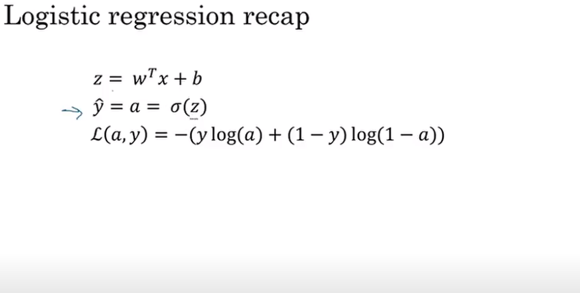
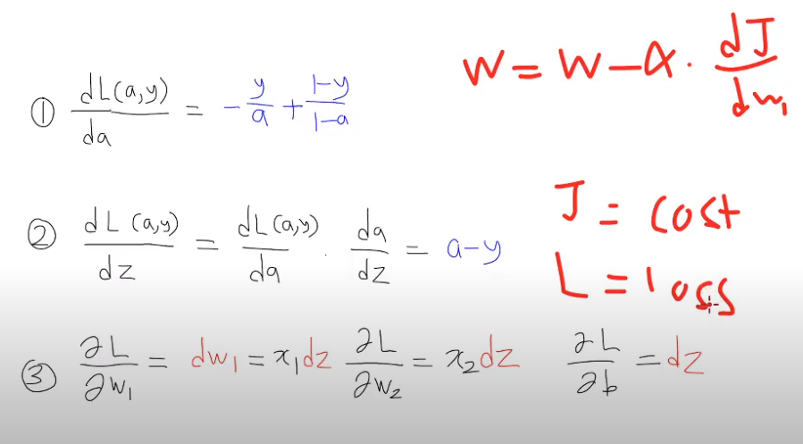

[미래연구소](http://futurelab.creatorlink.net/)

# 1교시

## 복습

- Supervised learning
  - binary classification
  - multiclass
  - regression
    - loss / cost function
    - Gradient descent

## Image data

- pixel 값(0-255) (black-white)
  - color : 3개의 channel `RGB`
  - graysale : 1개의 channel

## Image를 ML이 처리하는 방법

1. 숫자여야 한다 : pixel 값을 받는다
2. 1-dimension-array `vector` 여야 한다 : **flatten, reshape**

## Lecture : Logisitice Regression for binary classification

- 신경망을 구성할 때는 일반적인 roop가 아니라, 전체 training set을 두고 한다.

### Binary Classification

- 고양이 이미지를 두고 cat(1)인지 아닌지(0) 판별한다
- 이 이미지를 저장하기 위해서 **RGB**에다 64px 이라면, 3 x 64 x 64 행렬이 된다.
- 이 matrix 를 vetcor로 만들기 위해 Red matrix를 나열, Green 나열, Blue 나열한다.
- 이렇게 된다면 $$n = 64 * 64 * 3$$ 이 되어서 12,288의 `feature`를 가진다.

### Notation

$x$ = data 1개의 input = `feature vector` (feature의 개수 = `n_x`)

$y$ = data 1개의 label = binary에서는 0 or 1의 값

$(x,y)$ : training data 가 $m$개 있다.

$X$ : $[x^{(1)},x^{(2)}...x^{(m)}]$

> `vectorization` 이 쓰임

> $X$의 shape = $(n_x,m)$

$Y$ : $[y^{(1)},y^{(2)}...y^{(m)}]$

> $Y$의 shape = $(1,m)$

## Logistic regression의 5가지 과정

1. `Initialization`

   지금 과정에서는 시작점 $(w,b)$ 를 $(0,0)$으로 설정해주는 zero initialization을 한다

2. `Forward propagation`

   아래 강의의 sigmoid 취하는 부분

   앞으로 가기 때문에 forward

   아래의 backward 와는 반대이다

3. `Compute cost function`
   <p/>
4. `backward propagation`

   한번에 미분을 할 수가 없기 때문에, chain rule을 통해 미분한다. 뒤로 가면서 계산을 하기 때문에 backward 이다.

5. `gradient descent`

## Lecture : Logistic Regression

2. `Forward propagation`

   feature $x1$에서 weight $w1$을 곱해주므로 둘 다 $n_x$ dimension 이다.

   곱해줘야하므로 $x_1 * w_1^T$를 한다.

   `regression`의 경우에서는 $-oo ~~ oo$ 까지
   가능하지만, binary에서는 0과 1만 가져야 한다.

   이것을 위해서, `sigmoid`로 치역을 0과 1 사이로 제한한다.

   그러나, 여전히 $\hat{y}$ 값은 continuous 하다.

   그러므로, 0.5보다 크면 1 그것보다 작으면 0으로 predict 한다.

## Lecture : Logistic Regression cost function

기존 `regression` 의 방법으로는 복수의 극소점을 가져, `convex 문제`가 생기므로 다른 방법의 수식을 쓴다.

- `regression` 에서는 MSE
- `binary` 에서는 binary entropy loss function 가 효과적
- `multipleclass classification` 에서는 또 다른 function을 쓴다.

# 2교시

## Lecture : Logistic Regression Gradient descent



#### 수식을 다루는 마인드

> 수식을 보고 **어느 과정에 해당되는 것인지** 알자



#### 강조점

> **Logistic regression**

> **vectorization** : 행렬로 만들기

> 앞으로는 Linear Algebra 가 중요하다.

## C1W2L7

## C1W2L8

> `back propagation`이 무엇인지 왜 필요한지 알아야한다.

> 이에 대한 증명 과정을 세세하게 아는 것보다는 **직접 구현해보는 과정**이 더 중요하다.

## Lecture : Gradient descent on m examples

**수식보다는 왜 우리가 코드를 이렇게 짜면 안되고 vectorization을 해야하는가에 초점을 맞추자**

이전 강의에서는 하나의 훈련 표본만 사용한 것이라면

이제는 m개의 examples 에 대한 것

```c
// 비효율적인 코드
// for 문이 많이 필요함
// DL에서 for 문을 명시적으로 사용하면 효율이 떨어진다.
// => verctorization을 사용하자
J = 0;
dw1 = 0;
dw2 = 0;
db = 0;

for i = 1 to m
  // 2번 과정
  z[i] = w[i]x[i] + b
  a[i] = sigmoid(z[i])
  // 3번 과정
  J += -[y[i]log a[i] + (1-y[i])log(1-a[i])]
  // 4번 과정
  dz[i] = a[i] - y[i]
  dw1 += x1[i]dz[i]
  dw2 += x2[i]dz[i]
```

# 3교시

## Numpy 특강 1

> **잘 찾는 능력이 중요하다**

1. 함수를 처음 봤을 때 => `np.info('궁금한 함수)`
2. 함수 일부만 기억날 때 => `np.lookfor('궁금한 함수의 일부`)
3. numpy 공식 사이트
4. 구글링

> **내가 생각하는 기능을 scratch부터 직접 구현해보는 것이 중요하다**

## Lecture : vectorization

- for loop에서보다 vectorization의 비교에서 data set이 커질수록 걸리는 time의 차가 점점 커지는 것을 알 수 있다.
