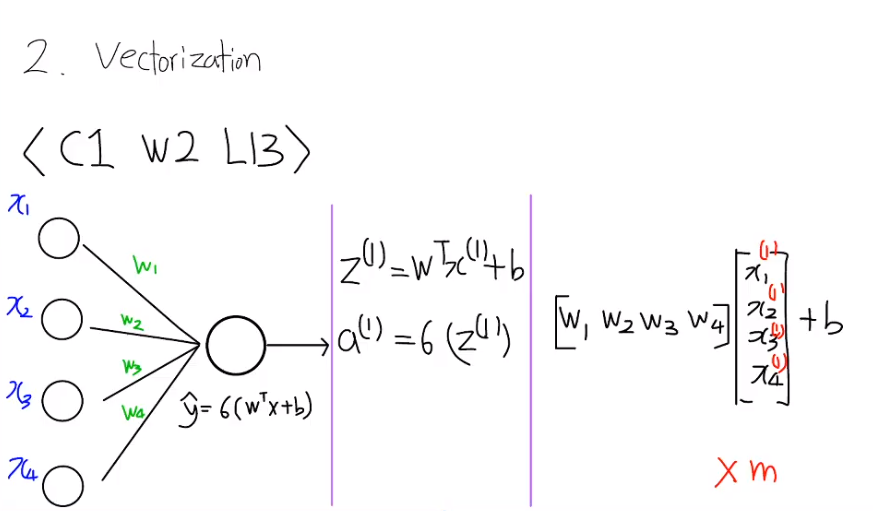
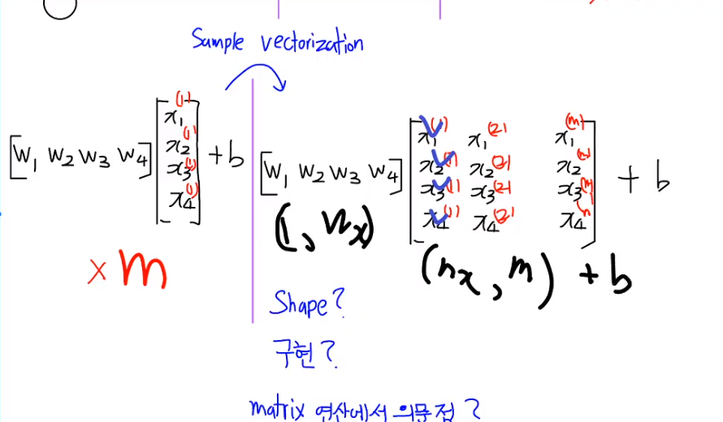
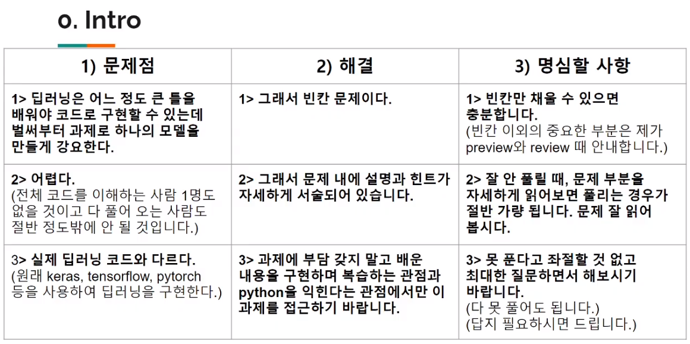
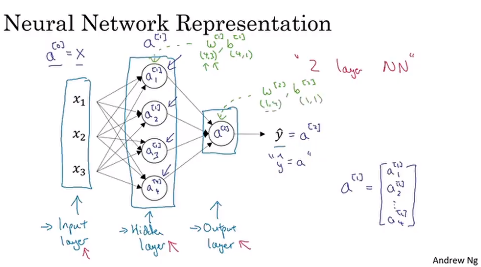

# Week 2 assignment 복기

[_2주차-과제_](https://n0mad.netlify.app/Machine-Learning/2020-07-13_2%EC%A3%BC%EC%B0%A8-%EA%B3%BC%EC%A0%9C/)

## 3번

미지의 array가 나왔을 때 `.shape` 을 찍어보는 것도 중요하다.

나중에 큰 데이터가 나왔을 때 파악하기가 힘들기에 `.shape` 을 통해 알아내는게 중요하다.

이것을 통해 저번주에 배운 feature 의 개수 example의 개수 등을 한번에 알아낼 수 있을 것이다.

> 어렵진 않지만 활용도가 중요한 `shape`

## 4번

## Broadcasting

> 많이 나오는 개념은 아니지만 보고 알 순 있어야 한다

```py
np.zeros((2,5)) + 3
```

shape이 다른데 더하기가 될까?

Broadcasting 을 통해 더하기가 된다

> 2주차 과제 마지막 부분과 일맥상통

# 2교시

> logistice regression 을 numpy 로 구현해보자

## Lecture : Vectorizing Logistice Regression

foward propagation 의 과정

$z_i = w^Tx_i + b$

```python
Z = np.dot(w.T, X) + b
```





Backward propagation 을 하는데

많은 gradient 들이 있지만

1. $dZ = A - Y$
2. $dW = X * dZ^T$
3. $db = 1/m * np.sum(dz)$

이 세가지가 중요하다

## 과제 설명



프레임워크 없이 numpy 로 하기 때문에 low-level 부터 해야된다.

그렇기에 나중 차시 과제들 보다 오히려 어려울 수 있다.

지금까지 배운 logistic regression 을 구현해 보는 것

프레임워크를 쓴다면 한 두줄로 구현해볼 수 있겠지만 추후에 로우 레벨을 건드릴 수 있기에 로우 레벨도 건드려보는 것

## Cat classification 해보기

> 이번 과제에서 해볼 것이다

1. binary classification
2. data preprocess (데이터 전처리)
   - 2주차 RGB 예시 / Image를 ML이 처리하는 방법을 생각해보자
   - 1d-array 로 flatten 해주는 것이 중요하겠다
   - image 한 장은 3d-array 일 텐데 어떻게 1d-array로 구현할 수 있을까
     - `.reshape` 함수를 사용해보자
     -

미지의 nd-array가 있을 때, 거의 모든 프레임워크에서(tensorflow 등), array.shape을 출력해보면 shape[0] 에는 m 이 들어 있다

## Question 2

4d-array

$(200, 64, 64, 3)$ 을

$(200, 12288)$ 로 `reshape` 한다.

> `reshape` 순서 문제를 잘 생각해보자 <p/> `transpose` 를 거치지 않으려고 순서를 바꾼다면 다르게 될 것이다

그것을 `transpose` 하여 우리가 배운 $X$ 형태로 만든다.

## Normalization

경험적으로 픽셀 값의 범위를 0~1 사이로 만들면 잘되기 때문에 모든 값을 255로 나누어주어서 범위를 축소시켜 준다.

## Question 7

### Predict 부분

y hat 의 값은 어떠한 값에 sigmoid를 취한 값이다.

그러나, binary classification이기 때문에 0,1 로 결과를 나누어야 하므로

0.5 이상이면 1

0.5 미만이면 0 으로 결과를 정한다.

## test accuaracy 부분

test accuaracy 가 82% 가 나오는데 이것에 대해 고민해보자

1. 나쁜 것인가?
2. 왜 나쁜가?
3. 해결책
   - hint : course 1 week 1 lec 4 : 딥러닝이 발전할 수 있었던 이유

## 질문

??

# 다음 차시 예습

- 지금까지와는 다르게 Node를 늘린다.

- 하나의 가중치만을 사용하는 것이 아니라 여러 개의 가중치를 사용한다

- 층(layer)이 많아진다 = 깊어진다 => deep learning

- layer 별로 인덱스를 붙이는 게 좋다

## Lecture : Neural Network Representation



> 2층 신경망이다 <p/> 공식적으로 입력 층은 넣지 않기 때문이다.

$a^0 = x$

a = activation

지금까지는 weight가 한 개 이기때문에 그 weight 하나를 이렇게 줄줄이 나열해서 $[w_1,w_2,w_3,...]$ 이런 방식으로 쓰여 왔지만 이제 weight가 여러 개 이기 때문에 각각의 weight를 행에 써준다

$$
\begin{bmatrix}
    w_1  \\
    w_2  \\
    w_3  \\
\end{bmatrix}
$$

이렇게 간다

$$
$$

$w$ 와 $b$ 의 shape에 대해 잘 생각해보자.

나중에 프레임워크를 다룰 때 도움이 될 것이기 때문이다

# 정리

지난 수업 복기와 과제 설명가 대부분이고 새로운 내용은 많지 않았다.

과제를 하면서 다시 한 번 복습하고 이론과 코딩을 연결시켜보자
