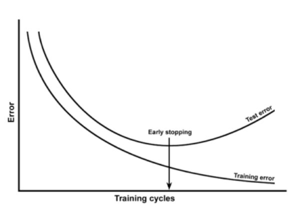

# Cat classification

```py
!python -m pip install opencv-python
```

> cv2 설치를 위해 pip를 통해서 설치해준다

```py
import numpy as np
import matplotlib.pyplot as plt
import h5py
import cv2
import PIL.Image as pilimg

%matplotlib inline
```

## Data

### Data 업로드

```py
def load_dataset():
    train_dataset = h5py.File('images/train_catvnoncat.h5', "r")
    train_set_x_orig = np.array(train_dataset["train_set_x"][:]) # your train set features
    train_set_y= np.array(train_dataset["train_set_y"][:]) # your train set labels

    test_dataset = h5py.File('images/test_catvnoncat.h5', "r")
    test_set_x_orig = np.array(test_dataset["test_set_x"][:]) # your test set features
    test_set_y = np.array(test_dataset["test_set_y"][:]) # your test set labels

    classes = np.array([b'non-cat', b'cat']) # the list of classes

    train_set_y= train_set_y.reshape((1, train_set_y.shape[0]))
    test_set_y = test_set_y.reshape((1, test_set_y.shape[0]))

    return train_set_x_orig, train_set_y, test_set_x_orig, test_set_y, classes
```

```py
# Loading the data (cat/non-cat)
train_set_x_orig, train_set_y, test_set_x_orig, test_set_y, classes = load_dataset()
```

```py
train_set_x_orig.shape
```

```
(200, 64, 64, 3)
```

- tranining data : $(x, y)$ 성능 향상을 위한 data == 문제집
- test data : $(x,y)$ 성능 측정 => 학습을 위한 것이 아니라 점수 매기는 data == 수능
- `train_set_x_orig` : 전처리 하기 전의 날것의 data

- 이 과제에서의 dataset 설명
  - training set, test set 에는 각 m_train, m_test 개의 이미지가 존재하며 이미지들은 cat(1) or non-cat(0) 으로 label 되어져 있다.
  - 각 이미지는 (`num_px`,`num_px`,3) 으로 이루어져있는 3channel RGB 이다.

### Data 확인

```py
# Example of a picture
## (X: image / y : 0 or 1)
index = 40
plt.imshow(train_set_x_orig[index])
print ("y = " + str(train_set_y[:, index]) + ", it's a '" + classes[np.squeeze(train_set_y[:, index])].decode("utf-8") +  "' picture.")
```

data 가 잘 업로드 되었는지 확인

실제로 run 해보면 data img 가 나오며 data의 cat / non-cat 이 출력됨

---

> 모든 코드를 옮기기엔 너무 많은 분량을 차지할 것 같아서
> 파일을 올려두고 중요한 점과 느낀 점을 정리해야겠다.

---

# Question 1

`train_set_x_orig` 와 `test_set_x_orig`의 shape을 보고 각 sample의 수가 몇 개 인지 즉, $m$ 이 무엇인지 알아내는 문제였다.

각 orignal data 에 shape을 찍어보면 4d-array의 꼴이 나오는데 3d-array 원소로 가진 배열이라고 생각할 수 있겠다.

각 3d-array 가 하나의 sample 이므로 처음 원소 즉, 0번째 index 값이 $m$ 이다.

> hint: `train_set_x_orig.shape` = `(m_train, num_px, num_px, 3)`. For instance, you can access m\_\_train by writing `train_set_x_orig.shape[0].`

## Data preprocess 데이터 전처리

> 1> flatten <p/>
> image dataset은 4d array <p/>
> image 자체는 3d array이지만 이를 딥러닝 모델 안에 넣으려면 1d array꼴로 만들어야 넣을 수 있습니다. <p/>
> 그래서 `(num_px, num_px, 3)`에서 `(num_px ∗ num_px ∗ 3, m)`꼴로 만들어야 합니다. 3주차에 배운 numpy 함수로 구현해봅니다. <p/>

# Question 2

위에 나온 데이터 전처리 과정인 _flatten_ 을 해주는 문제이다.

`train_set_x_orig.shape` = `(m_train, num_px, num_px, 3)` 이런 shape을 가지기 떄문에 data set 을 `(num_px ∗ num_px ∗ 3, m)` 이러한 꼴로 만들기 위해서는 `.reshape` 함수를 활용해 1, 2, 3 번째 index를 합친 후 transpose 해주면 되겠다.

> 2. normalizaition <p/><p/>
>    경험적으로 이미지 픽셀값의 범위를 0~1로 만들면 학습이 잘 됩니다. <p/>
>    좀 더 자세한 사항은 7주차에 안내하겠습니다. <p/>
>    그 때는 이미지 말고 csv파일도 normalize 해보는 구체적인 방법도 배울 수 있습니다.

### What you need to remember

Common steps for pre-processing a new dataset are:

- Figure out the dimensions and shapes of the problem $(m\_train, m\_test, num\_px, ...)$
- Reshape the datasets such that each example is now a vector of size $(num\_px * num\_px * 3, 1)$
- "Normalize" the data

# 정리

지금까지 했던 과정을 돌이켜 보자

- 데이터 가져오기

  - test data set과 train data set을 받아서 `train_set_x_orig`, `train_set_y_orig` 와 `test_set_x_orig`, `test_set_y_orig` 에 저장했다

- $m$ 찾기

  - `train_set_x_orig` 의 shape 을 보고 data set의 구조를 파악했다.
  - data set의 shape 은 `(m, num_px, num_px, 3)` 의 구조를 가지고 있었다.
  - `train_set_x_orig` 는 $(200,64,64,3)$
  - `test_set_x_orig` 는 $(50,64,64,3)$

- Data Preprocess

  _flatten_

  - data set 은 4d-array 라는 것을 위에서 확인하였다.
  - 3d-array 인 image 자체를 배열의 원소로 가진 4d-array
  - image 자체는 3d-array 이지만 DL 모델 안에 넣기 위해 1d-array로 바꿔줘야 한다.
  - 이를 위해 flatten 을 해준다
  - 수업 때 배웠던 vectorization의 꼴을 기억해보자
  - `.reshape` 과 `.T` 을 활용해 x 의 data set의 flatten 을 마쳤다.

    _normalization_

    - pixel 값은 모두 0 ~ 255의 값을 가진다.
    - 이미지 픽셀 값의 범위를 0 ~ 1로 만들면 학습이 잘 된다.

* model 함수 내를 살펴보자

  1. `w`와 `b`를 `initialize_with_zeros(X_train.shape[0])` 을 이용해 초기화한다. `w` 는 $(X\_train.shape[0], 1)$ 의 shape을 가진 0 들이 될 것이고, `b` 는 0 일 것이다.
  2. `parameters`, `grads`, `costs` 를 `optimize(w,b,X_train, Y_train ...)` 을 이용해 초기화한다.
  3. `optimize` 안을 보자.

     `num_iterations` 만큼 for 문을 돈다.

     1. `grads`, `cost` 를 `propagate(w,b, X, Y)` 를 이용해 초기화 한다.

        `grads` 안에는 `dw` 와 `db` 가 구해져 있으며 (backward propagation),

        `cost` 는

        (forward propagation) $A = \sigma(w^T X + b) = (a^{(1)}, a^{(2)}, ..., a^{(m-1)}, a^{(m)})$

        (compute cost function) $J = -\frac{1}{m}\sum_{i=1}^{m}y^{(i)}\log(a^{(i)})+(1-y^{(i)})\log(1-a^{(i)})$

        을 이용하여 구해진다.

     2. `grads` 안에서 `dw`, `db` 를 꺼내서 `dw`, `db` 의 값으로 초기화 해준다.

     3. $w = w - \alpha * dw$ 와

        $b = b - \alpha * db$
        를 이용해서 `w` 와 `b`를 update 해준다.

        > b 도 갱신해주어야 하나?

     4. 100번째 반복마다 `costs` 에 `cost` 를 append 해준다.

  반복이 끝나면 `params`, `grads` 그리고 `costs` 를 return 한다.

  생략

  ---

지금까지 tensorflow 같은 프레임워크를 쓰지 않고 numpy 만으로 cat classification 을 구현해 보았다.

train data를 이용해서 logistic regression 모델을 구현하였는데 우리가 train data 로 이용한 data를 이용하여 모델을 쓸 때는 정확도가 99%에 육박했지만 test data 로 모델을 돌려 보았을 때는 정확도가 82% 였다.

무엇이 문제였을까?

Overfitting 에 대해 알아보자

# Overfitting

> overfitting 은 학습 데이터를 과하게 잘 학습하는 것을 뜻한다.



우리가 가진 train data set 은 결국 세상에 존재하는 모든 데이터의 부분집합 일 수 밖에 없기 때문에 필연적으로 Overfitting 이 발생할 수 밖에 없다.

> 만약 우리가 흰색 고양이에 대한 img 만을 train data 로 쓴다면 노란색 고양이 img (test data) 를 고양이로 판독하지 못할 가능성이 큰 것이다.

### 참고

- [로지스틱 회귀]("https://ratsgo.github.io/machine%20learning/2017/04/02/logistic/")

> 어렵다..

- [[머신러닝] - Overfitting (과적합)]("https://untitledtblog.tistory.com/68")
- [Machine Learning 스터디 (3) Overfitting]("http://sanghyukchun.github.io/59/")
