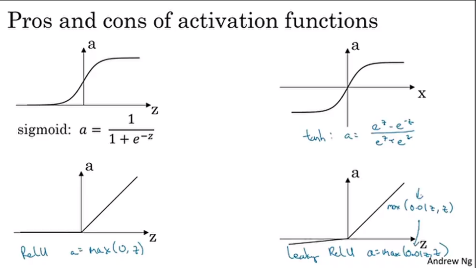
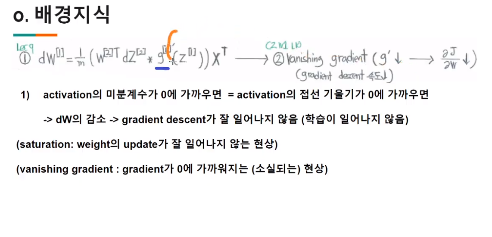
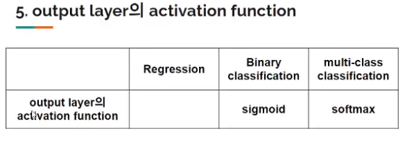

# 1교시

지금까지는 -> 방향의 vectorization 만 해왔지만 이제는 아래 방향으로도 vectorization 을 할 것 이다.

- $z^{[l]}_i$

$ l $ : layer index

$ i $ : node index

- $n^{[l]}$ : $l$ 번째 노드의 개수

$w^{[1]} X + b^{[i]} = Z^{[1]}$

이 식의 shape 을 보면

$(n^{[1]}, n^{[0]})(n^{[0]}, m) + (n^{[1]}, 1) = (n^{[1]}, m)$

이 될 것이다. (b를 더할 때 broadcasting이 일어남)

# 2교시

> sigmoid 는 많이 쓰이는 것은 아니다.  
> 문제점을 알고 더 좋은 activation function 을 써보자.

- 같은 layer 에서는 같은 activation function 을 써야한다.

> vectorization 하기 때문에 자명하다.

- 다른 layer 끼리는 다른 activation function 을 사용할 수 있다.

## Lecture : Activation functions

> 각 함수들의 장단점을 배우고 도출되는 과정도 배우자.  
> 치역과 기울기의 범위를 통해 나오는 장단점을 정리해보자.

우리가 배운 foward propagation 에서 sigmoid 함수를 쓴다

하지만, 우리는 이것에 다른 것을 쓸 수도 있다.

tanh 라는 함수를 쓰면 sigmoid 보다 항상 나은 결과를 쓴다.

이는 데이터의 center 가 0.5 가 아닌 0이 되게 만들어 줄 것이다.

tanh 는 거의 대부분의 기능이 있으면서도 sigmoid 보다 우월하다.

> 각 layer 의 activation function 은 다를 수 있다.

하지만, 이 두 함수는 기울기에 대한 문제가 있다.

이를 해결하기 위해 reLU 함수가 등장했다.

1. binary classification -> sigmoid
2. 하지만 이걸 제외하고는 sigmoid 보다는 tanh를 쓰는게 좋을 것
3. 다른 뉴런에서는 ReLU 을 사용하는 것이 더 나은 선택일 수 있다. ( hidden layer에 사용할 함수를 모르겠다면 ReLU를 써라.)

- z 가 음수 일 때 기울기가 0이라는 문제가 있어서
- Leaky ReLU를 쓰기도 한다.
- 문제가 별로 크지 않기 때문이다.

ReLU를 쓰면 신경망의 학습 속도는 다른 것보다 더 빨라진다.

> 선택해야 할 것이 많지만 최적의 방법을 선택하는 것은 쉽지 않다.   **어떤 선택을 해야할지 모르겠다면 하나씩 시도해보아라.**

## 배경지식

활성화 함수의 특징을 살필 때,

1. 치역
2. 기울기의 범위

를 살펴보자.

기울기가 0이 되는 activation 을 피해야 한다.

## Lecture : Derivaties of Activation functions

- Sigmoid

z 가 양수에서 커지거나 음수에서 작아지면 점점 $g'(z)$ 가 점점 0에 가까워진다

z 가 0 일때 기울기가 $\frac{1}2$ 이다.

- tanh

z 가 양수에서 커지거나 음수에서 작아지면 점점 $g'(z)$ 가 점점 0에 가까워진다

z 가 0 일때 기울기는 1이다.

sigmoid 보다는 $g'(z)$ 가 0에 가까운 구간이 적다

그러나, vainishing gradient 가 많이 일어난다.

- ReLU and Leaky ReLU

$g(z) = max(0,z)$

$g(z) = max(0.01z, z)$

z 가 0 일 때는 미분 불가능 이지만 걱정말자.. 0이나 1로 설정해

- sigmoid, tanh 의 vanishing gradient 문제는 해결 함.
- 그러나, 여전히 절반이 grdient가 0 이다. (dying ReLU)
- 그래서.. Leaky ReLU 를 쓰기도 함. (GAN 과 같은 train 이 어려운 경우에 사용)
- 그냥 ReLU 를 주로 써..
- 그렇다면 그냥 $y=x$ 같은 선형함수 쓰면 되지 않을까?? => 다음 강의

## Lecture : Why do you need non-linear activation functions?

- 선형 함수를 쓴다면 많은 layer 를 쓰더라도 layer가 쌓이지 않는다. 즉, deep 해지지 않는다.
- 그러므로, 비선형 함수를 쓴다.
- 어려운 내용이므로 더 참고하고 싶다면

[A visual proof that neural nets can compute any function]("http://neuralnetworksanddeeplearning.com/chap4.html")

non-linear 한 함수를 쓴다면 내가 원하는 데이터만 공간 상에서 옮길 수 있다.

---

Output layer 에서는 특수한 경우로 해줘야 할 수 있다.

예를 들면,

## Lecture : Random initialization

지금까지는 0으로 w와 b를 초기화햇는데 문제가 생길 수 있다.

1. row symmetric ( 모든 행의 값이 같음)

파라미터를 업데이트하더라도 값이 같다.

> 아까 선형 함수를 activation 함수로 사용하지 않는 이유랑 비슷

그러므로, 노드가 여러 개 있으나 한 개 있으나 효과가 다르지 않다.

2. vanishing gradient

~위의 배경지식 사진을 보자.

w가 0이 되면 vanishing gradient 가 일어난다.

1. initialize 되는 값이 같으면 안된다.
2. 0이 되면 안된다.

## Solution

1. np.random.randn
2. 너무 큰 값을 곱하지 않기 위해 0.01 을 곱한다.

> 그럼 지난주 과제는 왜 잘 됐지? 0으로 했는데
>
> > $dW^{[1]}$ 의 식을 보면, $W^{[2]}$ 가 들어가는 것을 알 수 있다.
> > 지난 주 과제는 hidden layer 가 하나 뿐이기 때문에 괜찮다.  
> > layer 가 두 개 이상이라면 zero initialization 하면 안된다. 나중에 또봄

**b 는 0** 으로 초기화.

**w 는 random**

# Numpy 특강

np.sum 의 axis, keepdims 속성을 알아본다.

[2주차 과제](https://n0mad.netlify.app/Machine-Learning/2020-07-12_2%EC%A3%BC%EC%B0%A8-%EA%B3%BC%EC%A0%9C/)

를 참고하자.

수업 시간에 배운 것을 구현할 때 도움이 될 것 이다.

---

- hyperparameter 와 parameter 의 차이를 생각해보자.
- hyperparameter 의 예시
