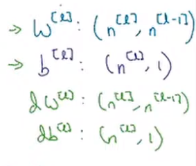
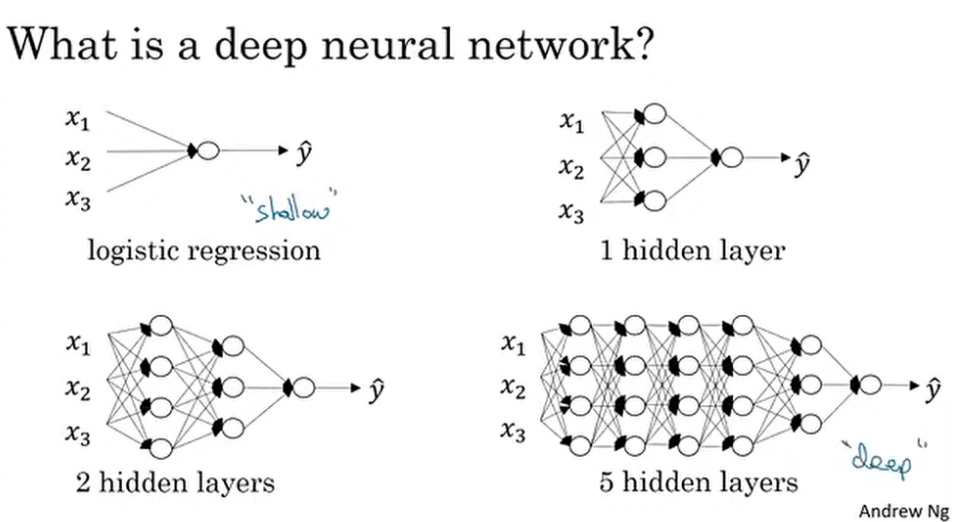
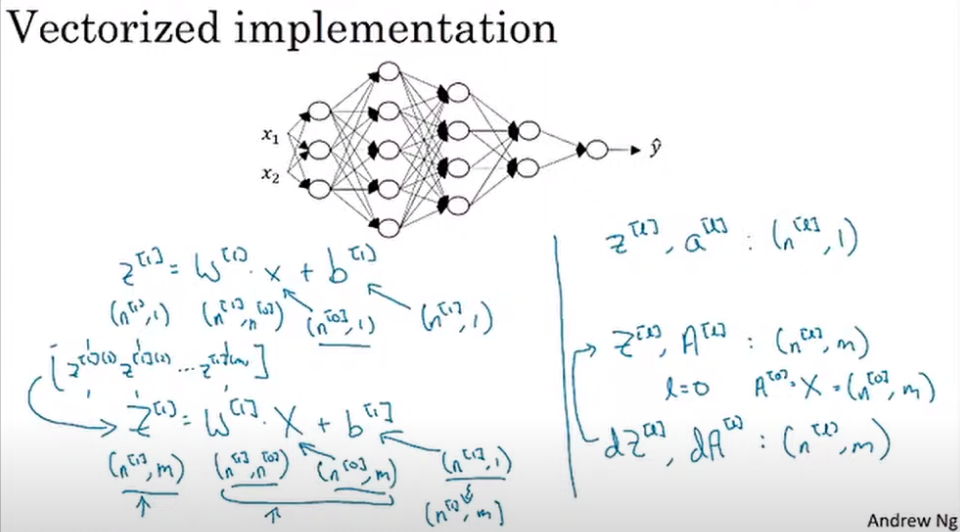
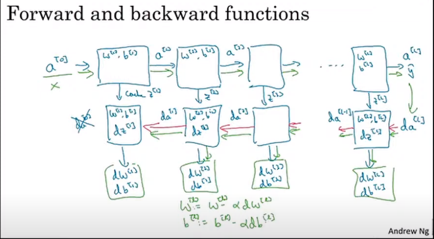
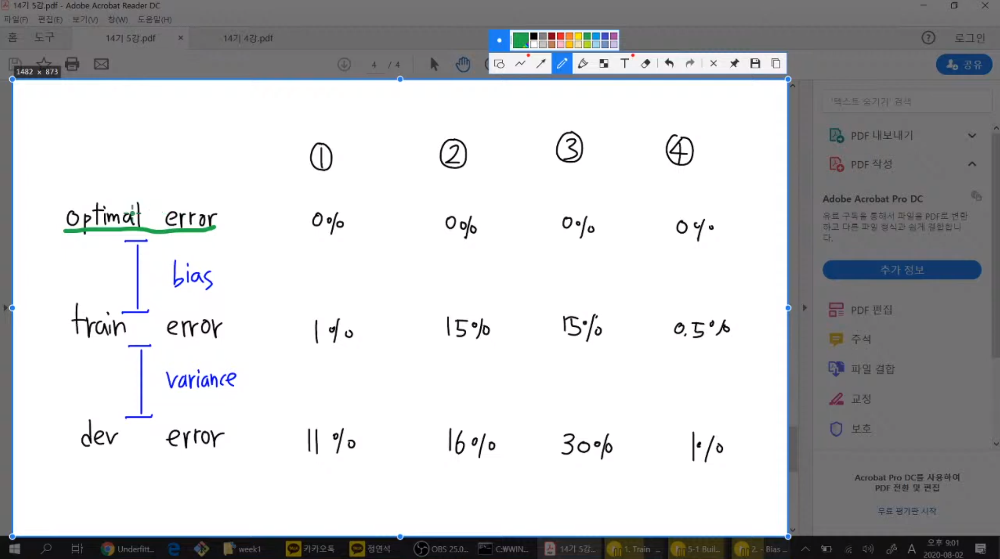

# Lecture : Deep L-layer Neural network

## What is a deep neural network?

시작하기 전에 몇 개의 hidden layer 가 적절할지는 모른다.

그러므로, 여러 가지를 해보고 맞는 방법을 택하면 된다.

L = (#layer)

$n^{[l]}$ = number of units in layer $l$

$a^{l}$ = $g^{[l]}$

**각 layer 에서 shape**

$(n^{[l]}, n^{l-1})(n^{[l-1]}, m) + (n^{[l]}, 1)$

# Lecture : Getting your matrix dimensions right

> 후에 배울 때 이해하기 어려울 수 있다. 지금 잘 알고 가자.
>   이 부분에서 오류가 잘 나옴

# Lecture : Building blocks of deep neural networks

$Z^{[l]}$ 을 cache 하는 것이 나중에 back prop 할 때 좋다.

나중에 ML 을 위해 GPU 를 산다면 메모리가 중요하다.

cache 를 GPU에 저장하기 때문에.

아무리 작아도 GPU의 메모리가 11 ~ 12 GB 는 돼야.

## Hyperparameter vs parameter

Hyperparameter 에는 tune 이라는 용어가 많이 등장

- 악기를 조율하듯이. 직접 실험해보면서 성능보며 우리가 고쳐나간다. (수동)

- learning rate
- iterations #
- L (hidden layer #)
- hidden units 
- choice of activation functions

parameter 에는 update 라는 용어가 많이 등장할 것

- 최적의 값을 알아서 찾아나간다. (자동)

    
# Lecture : Hyperparameters vs parameters

> hyperparameter 의 값을 한 번에 2개 이상 씩 변경 한다면 
>   각 hyperparameter 의 변경이 어떠한 영향을 미치는지 명확히 알아낼 수 없기 때문에 하나씩 변경하며 알아내는 것이 좋다.

---

이제는 course 2 로 넘어간다

---

# Lecture : Train / dev / test / sets

실제 ML 을 만드는 것은 매우 반복적이다.

처음엔 아이디어 단계에 그칠 것이다.

그러나 Coding 후 experiment 를 통해 점점 나은 네트워크를 찾아낸다.

# Holdout validation (data split 기법)

## No Free Lunch

1. dataset 마다 최적인 hyperparameter 가 다르다.
2. 공짜 점심은 없다. 여러 번의 시도를 거쳐서 최적인 hyperparameter를 찾아야한다.

## Holdout validation

> 위 문제의 해결을 위한 방법

> data 를 다 쓰지 않고 검증을 위해 남겨둔다.

1. 학습시키는 data (train data) 따로, 검증하는 data (test data) 따로 split 한다.
2. 학습한 data로 검증하는 건 unseen data에 대한 일반성을 확보하지 못하기 떄문이다.

data set 을

1. **training** set
   - 모델을 학습시키는 data
   - 최적의 parameter를 찾는 과정
   - **fit** 하는 과정
   - 문제집
2. dev set (**validation** set)
   - 내가 선택한 모델(hyperparameter의 조합)이 최적의 모델인지. 검증하는 data
   - 최적의 hyperparameter 를 검증 -> 결과에 따라 tuning
   - 여러번 **evaluate** 할 수 있다.
   - 이 data 는 gradient descent를 하지 않는다.
   - 공부방법
3. **test** set
   - 최종 test 에 사용하는 data
   - 한 번만 **evaluate** 한다.
   - 수능

으로 나눈다.

이전의 ML 에서는

70% 30% 로 train set / test set 으로 설정했지만

60 20 20 으로 train / dev / test set 으로 설정하는게 합리적이다.

그러나 빅데이터 시대에는 추세가 바뀔 수 있다.

데이터의 수가 상당히 많아지면서 dev set + test set 에 그렇게 큰 비율을 주지 않아도 충분한 data 수가 되기 때문이다.

dev, test 가 10,000 개 정도 되면 나머지는 train 으로 해도 무방하다.

하지만, 10,000개 로 부족한 경우가 있는데 이는 나중에 배운다.

1. 2-way holdout = train + test
2. 3-way holdout = train + validation + test

프로젝트 할 때는 2-way 로 많이 한다.. 데이터가 부족하기 때문

data set 을 나누더라도, 모든 것이 같은 data 여야 한다.

- 최소한 validation = test = unseen 은 성립해야한다.
- 나중에 다시 자세히 다룸

# Underfit / Overfit

underfit : 학습 초반 모델 -> 초기화 직후여서 최적의 parameter가 아닌 상황

fit : train 할 수록 주어진 training data 를 잘 맞춘다

overfit : 과도하게 학습을 하다보니 향후 존재할 unseen data 는 빗나가게 된다. 함수가 점점 복잡해지기 때문이다.

그래서, 중간중간 학습하지 않는 data (validation) 을 통해 조절해 주어야 한다.

이는 모델의 크기에도 적용된다.

# Lecture : Bias / Variance

training error 와 dev error 에 대해 잘 생각해보자

지금까지의 과정은 optimal error 가 0 에 가까울 때의 경우지만, 이미지가 흐리거나 그럴 때는 optimal error 가 높을 수 있다. 이는 다른 경우이다.

