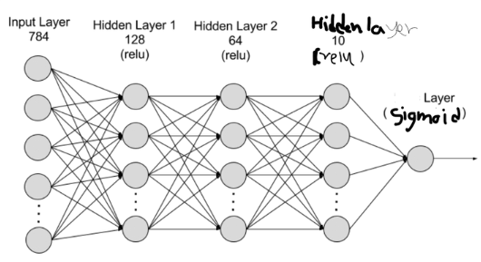

# 실습 : Holdout Validation

```py
from tensorflow.keras.datasets import mnist
```

예시 데이터를 가져온다.

흑백 데이터이며 이미지가 숫자를 나타낸다.

y 에는 해당하는 숫자 값이 들어있다.

여기서 이제 중요한 것은 data 를 나누는 것이다.

## Holdout 기법

### Slicing

numpy 의 slice 를 이용하여 행렬을 그냥 나누어서 할당해 준다.

### scikit-learn 의 train_test_split

scikit-learn 은 ML framework 이다.

DL 에서의 tensorflow 라고 생각하면 된다.


```py
from sklearn.model_selection import train_test_split
```

train_test_split 을 import 해준다.

여러 개의 array 를 첫 인자로 가질 수 있으며 그것들은 나누어지는 array 이다.

- test_size : test 부분에 split 할 비율
- train_size : train 부분에 split 할 비율
- random_state : random seed 값
> 오류를 줄이기 위해 seed 를 유지하자
- shuffle : data 를 섞을지 말지
- **stratified** : y 의 비율을 유지시키며 분배할지 말지

# 실습 : Build the model by Sequential

tensorflow, keras 에 입문한다.

Sequential과 dense 를 이용하여 layer 들을 만들어보고 하나의 완결된 model 을 구성해보자.

## Dense

```py
from tensorflow.keras.layers import Dense
```

dense 로 개개의 layer를 구성한다.

1. unit : 해당 layer 의 unit의 개수
2. activation : activation function 'relu' 이렇게
3. input_shape : feature의 개수
4. input_dim : feature 의 개수

**첫번째 layer 에는 3. 4. 번 중 하나를 설정해야 한다.**

## Sequential

> model 을 간단하게 만드는 keras 의 가장 강력한 기법
> model 을 만들 때 layer를 순차적으로 쌓아가며 만듦.


```py
from tensorflow.keras.models import Sequential
```

### 1번째 방법

```py

dense1 = Dense(units = 32, activation='relu', input_shape=(784,))
dense2 = Dense(72, activation = 'tanh')
dense3 = Dense(1, activation = 'sigmoid')

layers1 = [dense1, dense2, dense3]

model1_1 = Sequential(layers1)

```

각 layer 를 만들고 Sequential 에 집어 넣어준다.

> model.summary() 로 요약해서 볼 수 있다.

## 2번째 방법

```py
model2 = Sequential()

model2.add(Dense(64, activation='relu', input_dim = 784))
model2.add(Dense(100, activation = 'relu'))
model2.add(Dense(128, activation = 'relu'))
model2.add(Dense(32, activation = 'relu'))
model2.add(Dense(10, activation = 'softmax'))
```

```
Model: "sequential"
_________________________________________________________________
Layer (type)                 Output Shape              Param #   
=================================================================
dense (Dense)                (None, 64)                50240     
_________________________________________________________________
dense_1 (Dense)              (None, 100)               6500      
_________________________________________________________________
dense_2 (Dense)              (None, 128)               12928     
_________________________________________________________________
dense_3 (Dense)              (None, 32)                4128      
_________________________________________________________________
dense_4 (Dense)              (None, 10)                330       
=================================================================
Total params: 74,126
Trainable params: 74,126
Non-trainable params: 0
```

add 를 이용해서 빈 Sequential 부터 시작하여 layer를 쌓아나간다.

직관적이어서 좋은듯

## Assignment

실습에서의 내용을 코드로 다시 복습해보고



를 Sequential 과 Dense 를 이용하여 구현해보자

> input_dim 과 unit 갯수의 차이를 잘 모르겠다.