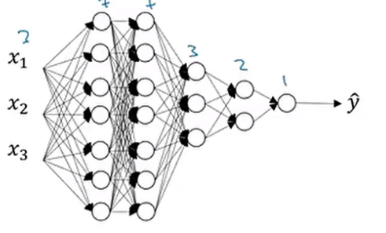

# Lecture : Softmax

Multiclass classification 에서 쓰이는데 여기서, 지금까지 배운 regression, binary classification 과는 다르게 output layer 의 unit의 개수가 class의 개수이다.

1. t = z의 모든 원소를 exp 한 것. (지수화)
2. a = t 를 t.sum 으로 나눈 것 (정규화)
3. output layer 에서의 a 에는 각 class의 원소일 확률이 들어있게 된다.

> 특이한 점은 softmax 를 취한 뒤에도, 같은 shape 을 갖고 있다는 점이다.

softmax 는 sigmoid 에서 유도되었다.

잘보면 상당히 유사함

[관련 수학적 증명 정리](https://de-novo.org/2018/05/03/logistic-cross-entropy-loss%EC%9D%98-%ED%99%95%EB%A5%A0%EB%A1%A0%EC%A0%81-%EC%9D%98%EB%AF%B8/)

## One-hot encoding - MCC 의 label 표현법

각 label 에 해당하는 자리에 1 을 넣고 다른 label 자리에는 0 을 넣어두어서 어떤 label 을 나타내는지 보여준다.

categical var 을 one-hot vector 로 변경

# Lecture : training a softmax classifier

softmax 는 hardmax 와는 대조적이다.

hardmax 는 1, 0 을 매핑하지만 softmax는 확률을 매핑해준다.

Class 가 2개 일 때 softmax 를 쓰면 결국 logistic regression 이 될 것이다.

**softmax 회귀는 2개 이상의 다중 카테고리의 로지스틱 회귀를 일반화 한 것**

## Soft max 의 Loss function

[categorical cross entropy loss function](https://wordbe.tistory.com/entry/ML-Cross-entropyCategorical-Binary%EC%9D%98-%EC%9D%B4%ED%95%B4)

# Lecture : Basic "recipe" for machine learning

> 저번 강의의 error 유형을 생각해보자

high bias (= underfitting) ?

- bigger network (layer를 늘린다든지..)
- train longer (epoch 측면)
- other model
- etc

high variance (= overfitting) ?

- get more data
- regularlization
- drop out (node 를 삭제해보면서 학습)
- augmentation
- 앙상블
- other model

## Regularlization

> 모델이 과도하게 복잡해지는 것을 방지

1. $L_2$ reg (이걸 씀)

weight 을 줄여주는 효과

큰 값이면 큰 값일 수록 더 많이 줄인다.

1보다 작은 수를 곱해주기 때문.

2. $L_1$ reg

# Lecutre : Why regularization reduces overfitting

high variance 는 network가 너무 복잡해지는데에 기인한다.

weight 를 0에 가깝게 만든다면 거의 모든 hidden layer 가 없는 셈 치게 된다.

그렇게 된다면 간단한 NN이 된다.

그러므로, high variance 와 weight 를 0에 가깝게 만든 상황 둘 가운데의, 적합한 NN 을 찾는다.

이 적절한 NN 을 만드는 $\lambda$ 값을 찾는다.

# Lecture : Dropout regularization

> 가장 유명한 교수님이 은행원이 맨날 바뀌는 것을 보고 만들었다.
> <br> 부정행위를 방지하려고 은행원이 일하는 날짜를 바꿨는데, 실제로 줄었다고 한다는 것에서 착안했다.
> <br> 그러므로, 이를 모델에 적용하여 unit 을 제거해보면서, 학습시키면서 model을 바꿔줘 보았다는 것이다.

노드를 랜덤으로 제거해보면서 소규모 네트워크를 훈련시키는 것이다. 앙상블과 관련

```py
d3 = np.random.rand(a3.shape[0], a3.shape[1]) < keepprob
```

이러한 방식으로 어떠한 노드를 남길 것인지 정한다.

```py
a3 = np.multiply(a3, d3)
```

를 하여 남길 노드만 남긴다.

d3 에서 0 인 노드는 곱해져서 사라질 것이기 때문

```py
a3 /= keep_prob
```

keep_prob 으로 나누어줌으로써 scale 자체는 맞춰준다.

test 단계에서는 drop out 을 하지 않는다.

앙상블과 비슷한 느낌이다.

딥러닝에서 효과적

# Lecture : Understanding drop out

L2 정규화와 비슷한 역할을 할 수 있다.

## <font color='red'> 세부사항 </font>



위의 그림에서 overfitting 이 걱정되는 가장 많은 weight 은 $w^{[1]}$ 이기 때문에 이곳에서는 keep_prop 을 좀 작게 해주는 것이 좋다.

반대의 경우에는 keep_prop 을 높여도 된다.

input layer 에서의 일반적인 방법은 1로 설정하는 것이다.

입력 레이어에서 drop out을 설정하려면 1에 가까운 숫자를 설정해라.

컴퓨터 비젼 분야에서는 drop out 을 기본 값으로 사용한다.

그렇지만, 이것은 정규화 기법이라는 것을 기억하자.

overfitting 상황에서만 사용하는 것이 좋다.

정리

1. layer 별로 다른 drop_rate 를 설정하자. (복잡한 곳에서, w의 shape이 클수록, 많이 drop)
2. input layer 에는 drop out 을 쓰지는 말자

# 실습

과제 할 때 다시 보자.

- evaluate 와 predict 의 차이

evaluate 는 x 에 해당하는 y를 알고 있을 때 forward propagation 을 포함한 모든 과정을 하여 y를 산출하고 비교하여 모델의 성능을 확인하기 위한 작업이다.

그러나, predict 는 input x 를 단순히 foward propagation 만을 하여 y 값을 나타낼 것이다.

이 모델이 작동될 실제 device 에서 일어날 작업이다.
