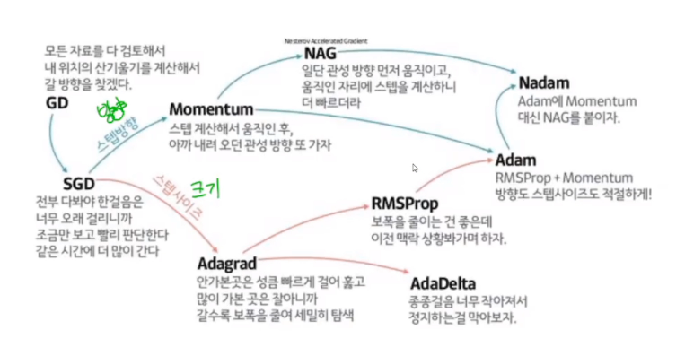

# Lecture : Normalizing inputs

고교 과정에서 배운 표준화를 진행한다.

평균을 빼고 표준편차로 나누어 주는 방법.

$\frac{X-m}{\sigma}$

왜 normalize input 을 해야하는가?

cost function 을 나타냈을 때, 정규화를 한 데이터의 윤곽선은 더욱 원형을 나타내어서 더 나은 gradient descent 를 해낼 수 있다.

따라서, feature 의 범위가 매우 다르다면, 표준화하는 것이 정말 중요하다.

항상 표준화 하는 것이 좋을 것.

1. 강의에 나온 standardization
2. min-max scaler (저번에 255로 나누어 준 느낌)

# Random initialization 의 문제점

## 용어

1. fan-in (들어오는 layer 의 unit 개수)
2. fan-out

---

fan-in 이 길수록 출력되는 fan-out 의 값이 커져서 **gradient exploding** 이 일어난다.

fan-in 이 짧을수록 출력되는 fan-out 의 값이 작아져서 **gradient vanishing** 이 일어난다.

layer 별로 매번 다른 w 상수를 고르기 어렵다.

**fan-in이 클수록 초기화 상수를 작게 설정하면 된다.**
**fan-in 에 반비례한 초기화 상수를 사용하자!**

## Xavier initialization (= glorot)

보편적으로 잘 된다.

fan-in 과 fan-out 을 모두 고려하는 방식을 선택한다.

하지만 ReLU를 쓰면 0 주변에 W 값들이 과도하게 몰릴 수 있다.

## He initialization

fan-in 만 고려

ReLU 계열에 특화된 방식

# Lecutre : Weight initialization for deep learning

사용하는 함수마다 사용되는 weight 초기화 수식은 다르다.

이는 또 다른 하이퍼 파라미터가 되겠다.

무엇이 정답일지는 모른다.

Xavier 나 He 둘 중 하나를 쓰자

# Lecture : Mini-batch graient descent

> 머신 러닝의 적용은 경험에 의존한다.

샘플을 작은 batch 로 나누는데 $X^{T}$ 로 나타낸다.

mini-batch gradient descent 는 전체 샘플을 한 번에 수행하는 것ㅠ 이 아니라 mini-batch 하나만을 한 번에 수행한다.

Batch = data 전체 = 5,000,000 개

> 메모리 상으로 5,000,000 개를 전부 띄울 수 없기 때문에, mini-batch 로 나누어서 하는 것이다.

mini-batch : 단일 iteration 에서 gradient descent 하는데 사용하는 data의 총 개수 ( 1,000개 )

epoch : data 전체를 train 한 횟수

# Lecture : Understanding mini-batch gradient descent

mini-batch size = 1 이라면 stochastic gradient descent

1 ~ m 사이의 미니 배치 크기를 잘 선택하는 것이 좋다.

미니 배치 크기가 너무 크거나 작다면 문제를 초래할 것이다.

이는 항상 최솟값에 도달할 수 있다는 것을 보장하지는 않지만 미니 배치 크기를 최적으로 설정해야한다.

어떻게 선택할 수 있을까?

훈련 세트가 작으면(2,000 미만) -> batch gradient descent

더 큰 훈련 세트가 있는 경우 -> 64 ~ 512 를 선택하여 mini-batch

> 미니 배치 크기를 2의 거듭제곱으로 설정하면 더 빠르다.

## batch_size 규칙

1. 2의 거듭제곱으로 설정하기
2. 최솟값은 보통 $2^5$ 으로 잡는다.
3. 최댓값은 크면 클수록 좋다. 하지만, Out of memory error 가 나서 안될 것이다.
4. batch_size 가 작다는 건 noise 가 크다는 것이다. overfitting 을 막는 효과는 있겠지만 미미하므로 이것을 위해 낮추지 말자.

# Optimizer

> 수학적인 것들은 연구를 목표로 삼는 분들이 알면 좋겠다. 적용이 우선

## Learning Rate

learning rate 는 log scale 로 변화시켜서 적용해본다.

$0.1$ -> $0.001$ 이런 느낌으로

그래프를 보고 learning rate 가 빠른지 아닌지 good 인지 판단할 수 있어야한다.

## SGD

1. random 하게 추출한 mini-batch 씩 gradient descent 한다.

### 단점

1. gradient 가 dimension 별로 차이가 크면 minimum 을 찾기 어렵다.
2. saddle point, local minima 를 만나면 멈출 수 있다.

이 두가지 문제를 어떻게 해결할까.

**관성 Momentum** 을 이용하여 이전의 운동량을 반영해보자.

NAG ( Nesterov Accelerated Gradient ) 도 있다.

Adam 은 속력과 방향 둘 다에 관성을 준다.

보편적으로 Adam 을 쓰면 거의 다 잘 됨.
