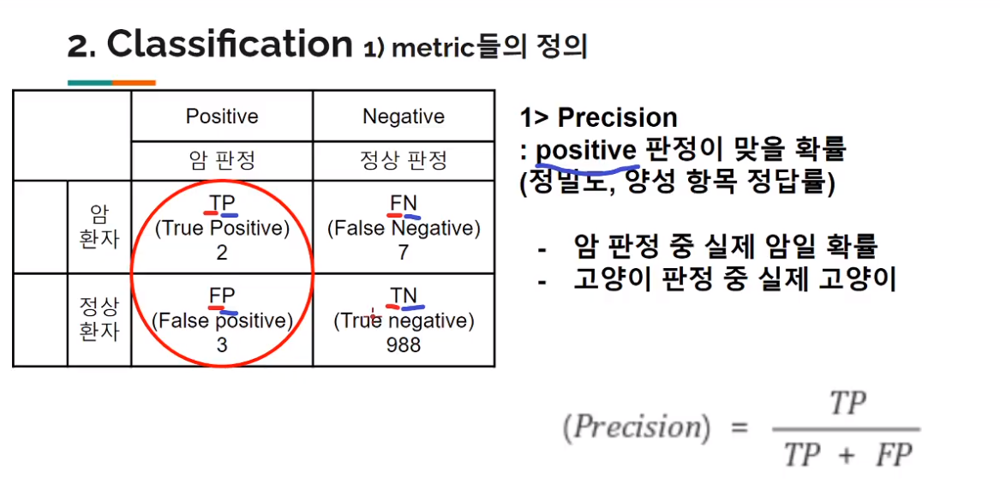
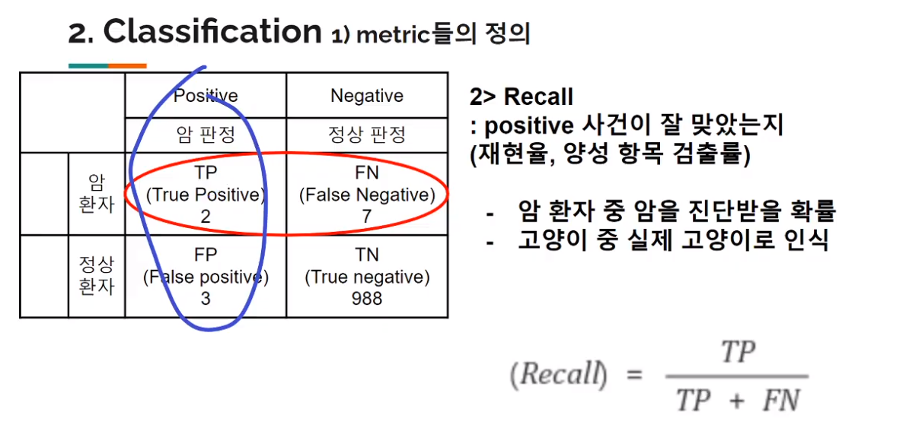
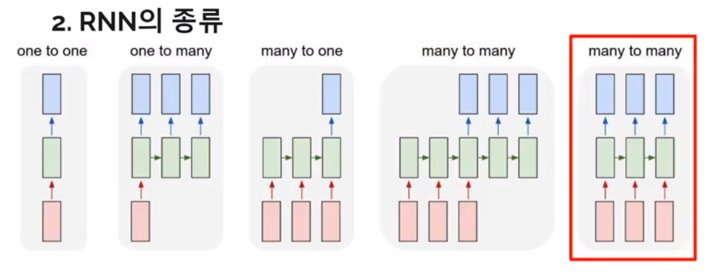

# 1교시

# Metrics

## Regression 에서

1. MAE (mean absolute error)

outlier 에 덜 영향 받는다.

차이를 직관적으로 알 수 있다.

2. RMSE (root mean square error)

outlier에 더 가중치를 둔다.

RMSE 를 많이 쓴다.

metrics 들은 .complie 에서 쓰겟지

## Classification 에서

1. Accuracy

지금까지 써온 metric 이지만 안 좋은 상황이 있을 수 있다.

암 / 정상 판정의 예시

Data 가 imbalance 하게 있어서 accuracy 로는 정확한 performance 측정이 어렵다.

2. Precision (Positive 판정 얼마나 정밀했나)

암 판정 중 실제 암일 확률

고양이 판정 중 실제 고양이

3. Recall (Positive 사건을 잘 재현했는가)

암 환자 중 암을 진단받을 확률

고양이 중 실제 고양이로 인식

---

Data imbalance 를 파악하고 case 맞는 metrice 을 설정해야함.

class 별로 데이터 개수가 고르게 있다면 **Accuracy**

불균형적이라면 **F1 score**

# RNN (Recurrent Neural Network)

RNN 의 기본 단위 **cell**

cell 여러 개 붙어있는 것이 하나의 layer

Cell의 input

1. $x_t$ : 해당 시점의 input feature
2. $h_{t-1}$ : 이전 cell 의 state 값

Cell 의 output

1. $h_t: cell에서의 연산 결과$

input data 의 shape

(sample, time\_\_step, input\_\_dim)

cell 내부는 unit 으로 구성되어있다.

actviation function 으로 tanh 를 자주 쓸 것.

layer 를 얼마 쌓지 않기 때문

Cell 연산에서는

activation(이전 꺼 + 현재 연산)

이 구조가 반복 되는 것.

output 연산은 방식이 각각 다른데 위의 사진처럼 여러 종류가 있다.

RNN 에서 option 으로 선택할 수 있다.

layer 하나 더 쌓고 싶으면 직전 layer 의 `return_sequences` 를 `True` 로 설정하라.

그러면 한 차원 높게 출력하여 그대로 output 을 받아낼 수 있다.

> $w_{hh}, w_{xh}, w_{hy}$ 는 어느 셀에서나 다 같은 값이다.

지금 배운건 vanilla RNN.

자주 쓰게 될 것들

1. LSTM (좀 더 복잡한 것)
2. GRU (조경헌)

---

시계열을 가지고 있는 data 의 경우에는 shuffle 을 하지 않는다.

---

## 실습

실습 동영상을 보고 RNN 에 대해 더 공부해보자
