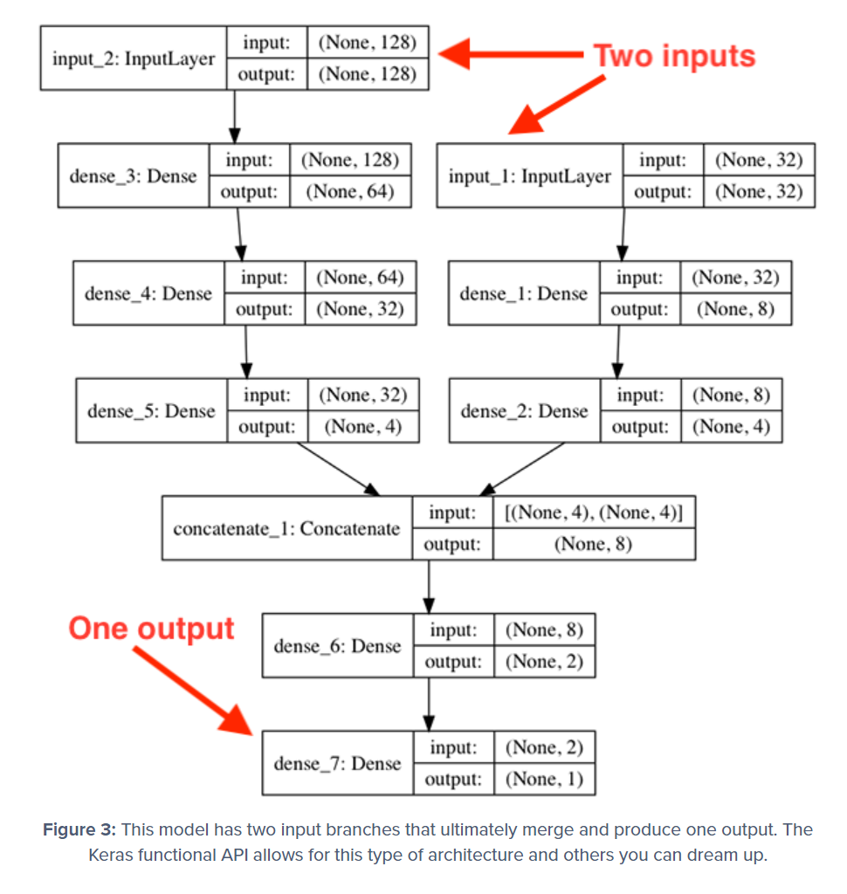
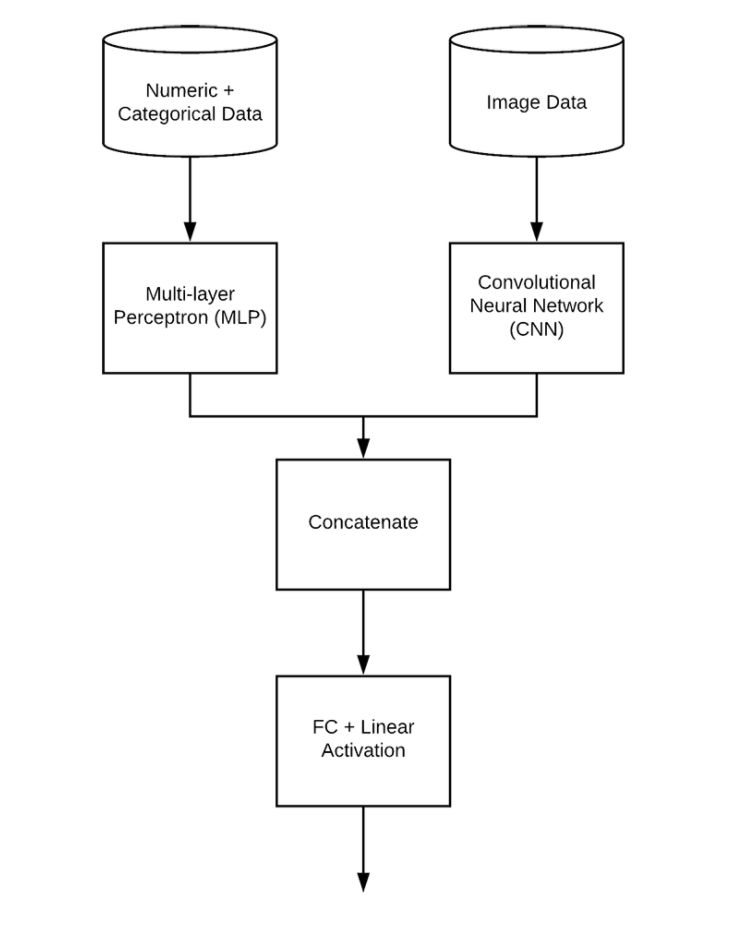

# ML with multiple inputs

_[keras-multiple-inputs-and-mixed-data](https://www.pyimagesearch.com/2019/02/04/keras-multiple-inputs-and-mixed-data/)_ 를 보자.

Keras 의 **functional API** 를 통하여 multiple inputs 를 다룰 수 있다.
지금까지 써온 sequential API 와는 반대로 non-sequential 한, 더 복잡한 모델을 만들 수 있다.

- Multi-input models
- Multi-output models
- Models that are both multiple input and multiple output
- Directed acyclic graphs
- Models with shared layers

```py
inputs = Input(shape=(10,))
x = Dense(8, activation="relu")(inputs)
x = Dense(4, activation="relu")(x)
x = Dense(1, activation="linear")(x)
model = Model(inputs, x)
```

> 이런 것이 **functional API** 를 사용한 것이다.

```py
# define two sets of inputs
inputA = Input(shape=(32,))
inputB = Input(shape=(128,))
# the first branch operates on the first input
x = Dense(8, activation="relu")(inputA)
x = Dense(4, activation="relu")(x)
x = Model(inputs=inputA, outputs=x)
# the second branch opreates on the second input
y = Dense(64, activation="relu")(inputB)
y = Dense(32, activation="relu")(y)
y = Dense(4, activation="relu")(y)
y = Model(inputs=inputB, outputs=y)
# combine the output of the two branches
combined = concatenate([x.output, y.output])
# apply a FC layer and then a regression prediction on the
# combined outputs
z = Dense(2, activation="relu")(combined)
z = Dense(1, activation="linear")(z)
# our model will accept the inputs of the two branches and
# then output a single value
model = Model(inputs=[x.input, y.input], outputs=z)
```

위 코드를 살펴보자.



모델이 두 개의 다른 branch 를 가진다.
하나의 branch 는 128-d 의 input, 다른 하나는 32-d input 을 받으며 각자의 branch 는 concatenated 하기 전까지 독자적으로 operate 된다.

> 이 프로젝트에서는 집 가격에 대한 Numeric + Categorical Data 를 하나의 branch 에 넣고, 다른 하나에는 집 Image Data 를 삽입하여 Concatenate 시킨다.



- 첫 branch 는 simple Multi-layer Perceptron (MLP) 가 될 것이다.
- 두 번째 branch 는 CNN 이 될 것이다.
- 이 branch 들은 multi-input Keras model 을 구성하기 위해 concatenated 될 것이다.

## MLP 만들기

- MLP 는 Keras 의 `Sequential` API 로 만든다.

> > 이 프로젝트와 내 것이 다른 점은 나는 Numeric data 가 단 하나라는 점이다. 어떻게 MLP 를 구성해야 할까?

- MLP 에서는 원래 regression 을 사용하였으나 이 branch 에서는 **regression 을 사용하지 않을 것이다.** `regress=False` 를 이용해서. 왜냐하면 **Regression 은 뒤의 mixed data network 에서 사용 될 것이기 때문이다.**

## CNN 만들기

`Conv2D` `Activation` `BatchNormalization` `MaxPooling2D` `Flatten` `Dropout` 등을 적절히 사용하여 CNN 을 구성하자.

- 또 다른 특이점은, Conv2D 를 거치고 난뒤 이것의 output 을 Flatten 시켜서 Dense 에 넣은 뒤 또 다른 FC Layer 에 넣는다는 점이다. node 의 수를 MLP 와 맞춰주는 것은 필수는 아니지만, 이것은 branches 의 balance 를 좋게 할 것이다.
- **regression 을 사용하지 않을 것이다.** `regress=False` 를 이용해서. 왜냐하면 **Regression 은 뒤의 mixed data network 에서 사용 될 것이기 때문이다.**

# Multiple inputs with Keras

> 여기서 **branches come together** 한다. 또한, Training 도 여기서 일어날 것이다.

필요한 package 들을 import 하자.

```py
from pyimagesearch import datasets
from pyimagesearch import models
from sklearn.model_selection import train_test_split
from tensorflow.keras.layers import Dense
from tensorflow.keras.models import Model
from tensorflow.keras.optimizers import Adam
from tensorflow.keras.layers import concatenate
import numpy as np
import argparse
import locale
import os
```

데이터를 알맞게 전처리 한 후에 이제 layer 를 연결해볼 차례이다.

## Ready for some magic?

```py
# create the MLP and CNN models
mlp = models.create_mlp(trainAttrX.shape[1], regress=False)
cnn = models.create_cnn(64, 64, 3, regress=False)
# create the input to our final set of layers as the *output* of both
# the MLP and CNN
combinedInput = concatenate([mlp.output, cnn.output])
# our final FC layer head will have two dense layers, the final one
# being our regression head
x = Dense(4, activation="relu")(combinedInput)
x = Dense(1, activation="linear")(x)
# our final model will accept categorical/numerical data on the MLP
# input and images on the CNN input, outputting a single value (the
# predicted price of the house)
model = Model(inputs=[mlp.input, cnn.input], outputs=x)
```

아까 만들었던 mlp 와 cnn 을 생성한다. 여기서 중요한 점은 **regress=False** 를 넘겨주어서 regression 을 막아준다는 점이다. 그후 `mlp.output` 과 `cnn.output` 을 `concatenate` 해준다.

그런 다음 우리의 마지막 FC layer 에 **combinedInput** 을 넘겨준다.

> > 내 프로젝트와 다른 점은 마지막 output 의 activation 을 "linear" 로 설정했다는 점이다. 이 프로젝트에서는 continous 한 집 값을 예측하기 때문이다. 나는 "softmax" 로 설정하고 unit 수를 10개로 하여 digit 을 예측하면 되겠다.

> > ? 하지만 여기선 "linera" 를 사용하여 regression 을 행해준다고 하였다.

```py
opt = Adam(lr=1e-3, decay=1e-3 / 200)
model.compile(loss="mean_absolute_percentage_error", optimizer=opt)
# train the model
print("[INFO] training model...")
model.fit(
	x=[trainAttrX, trainImagesX], y=trainY,
	validation_data=([testAttrX, testImagesX], testY),
	epochs=200, batch_size=8)
# make predictions on the testing data
print("[INFO] predicting house prices...")
preds = model.predict([testAttrX, testImagesX])
```

그 후 완결된 모델을 짠 뒤 `compile` 해주고 `fit` 한다.

> > "mean_absolute_percentage_error" 로 하지 않고 "categorical entropy loss" 로 설정하는게 맞겠다. optimizer 는 그대로 Adam 으로 해보자.

## Conclusion

> 이전에 수행했던 프로젝트에서는 이러한 결과를 낳았었다.

1. numerical/categorical data 를 사용한 just MLP 가 **22.71**% 의 error 를 낳았다.
2. image data 를 사용한 just CNN 이 **56.91**% 의 error 를 낳았다.

이번에 수행한 mixed input 은 더 나아지긴 했으나 **26-27**% 의 error 를 낳음으로써 **not even as great as the simpler MLP method** 한 결과를 생성했다.

# 컴퓨터 비전 학습 경진대회에 적용해보자
