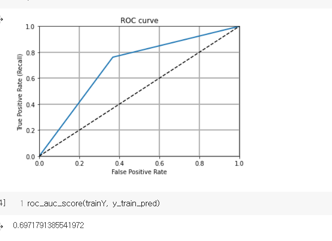
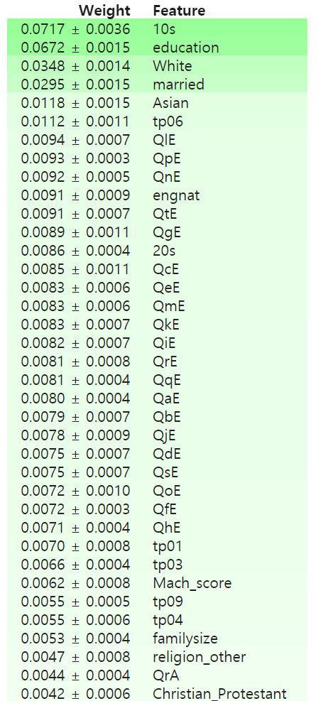
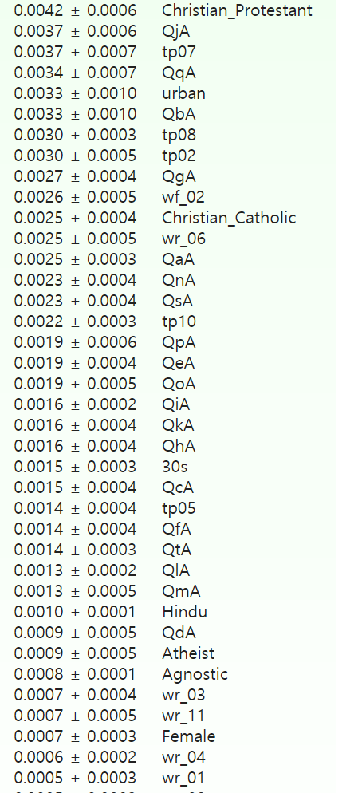
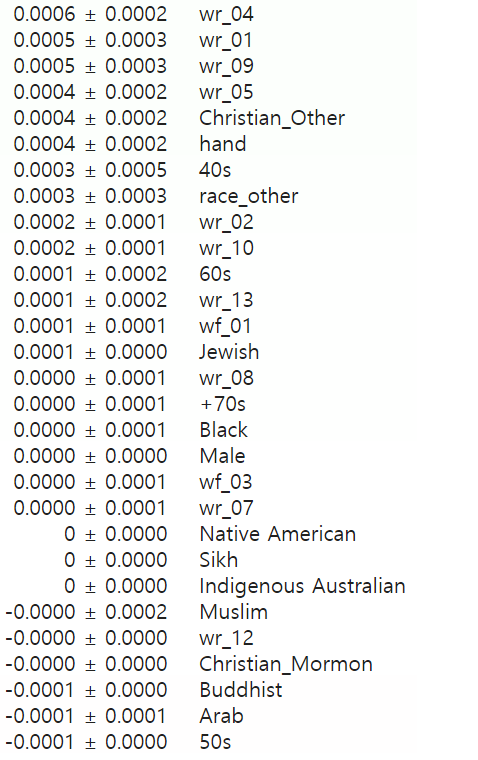
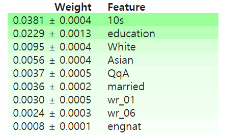
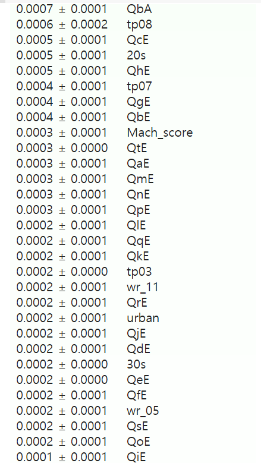
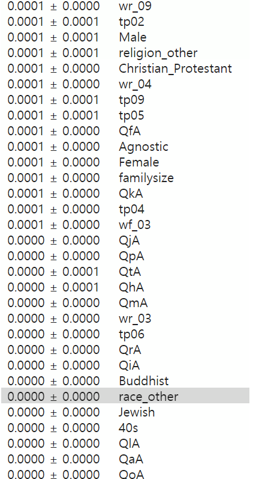
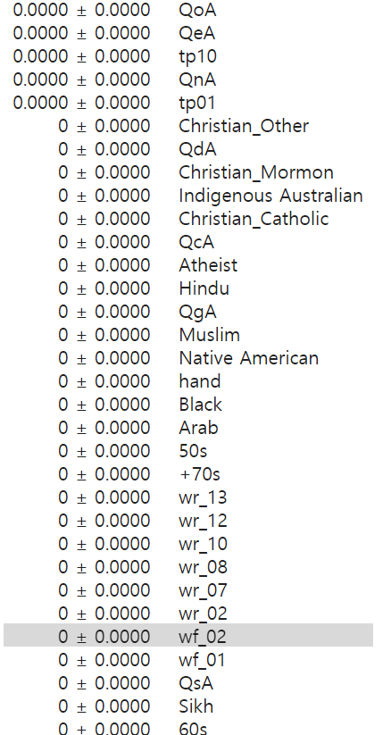

# 10월 5일

1. `pd.get_dummies` 를 이용하여 train data 안의 비정형 데이터들을 categorical 하게 바꿈.

- `LGBMClassifier` 를 사용하여 간단히 모델을 구축해봄

- `cross_val_score`, `cross_val_predict` 를 사용하여 Kfold validation 을 해보았으며 `confusion_matrix` 를 봄.

- `datetime` 과 `timezone` `utc` 를 활용하여 제출 파일 제목을 날짜화 시킴.

- 원래 비정형 데이터 였던 것을 숫자화 시킨 column 들이 있다. **education, engnat, hand, married** 가 그러하다. 그렇다면 이것들을 categorical 하게 바꾸면 어떨까?

> 4번 을 적용하지 않았을 때

> 4번 을 적용했을 때
>
> 쓸모없다.

> LGBM model 의 parameter 를 바꿔보았다. learning_rate 를 줄이고 `boosting_typ` 을 **'dart'** 로 바꿔보았다. 맨 아래 LGBM 관련 글을 참고해보자

## QT

> 더 나은 모델을 구축하여 Kfold 를 시도해보자.
>
> 
semi-supervised learning 을 적용해볼 수 있을까?
>
> regression 문제인 것 같은데.. binary classification 으로도 가능하지 않을까?

 
 
 

# 10월 6일

- `Keras` 의 `Dense` 를 사용하여 binary classification 해보았으나 미미한 효과..
- 답변에 걸린 시간 **QaE ~ QtE** 를 `MinMaxScaler` 로 전처리 해봄.
- ROC curve 를 그려보고 AUC score 를 산출해봄. AUC score 가 가장 신뢰성 있는 값인 듯 함
- StratifiedKFold 를 적용함.

**Min-Max Scaler 적용**

| factor    | Voted    |
| --------- | -------- |
| QdA       | - 0.1233 |  |
| education | - 0.3198 |  |
| married   | - 0.2144 |  |
| wr_01     | - 0.1078 |  |
| wr_06     | - 0.1024 |  |
| wr_11     | - 0.1167 |  |
| 10s       | + 0.3930 |  |
| 20s       | - 0.1038 |  |
| 30s       | - 0.1242 |  |
| 40s       | - 0.1340 |  |
| 50s       | - 0.1134 |  |
| Asian     | + 0.1331 |  |
| White     | - 0.1516 |  |

 
 
 
 
 
 
 

# 읽어본 글

- [LGBM](https://nurilee.com/lightgbm-definition-parameter-tuning/)

- [One-hot Encoding vs Dummy Encoding](https://www.youtube.com/watch?v=PJ3E45AopM8)

# 10월 8일

- `SVM` 을 적용해보자

- (SVM)[http://hleecaster.com/ml-svm-concept/]
- (MIT SVM 강의)[https://www.youtube.com/watch?v=_PwhiWxHK8o]

**parameters**

1. C

outlier 를 얼마나 허용할 것인가. 값을 낮출수록 hard margin 으로 margin 이 작아져 overfitting 가능. 높일수록 sofr margin 으로 margin 이 커져 underfitting 가능

2. kernel

**poly, linear, rbf** 로 설정가능

3. gamma

**결정 경계를 얼마나 유연하게 그을 것인가?** gamma 를 높일수록 결정 경계를 구불구불하게 그려 overfitting 초래 가능

**0.56의 낮은 정확도**

**DNN 을 구축해서 써보자**

# 10.13

- Permutation Importance

확인한 결과

거의 모든 feature 가 양수를 띠지만

음수와 0 인 것들을 drop 해보고 train 해보자.

drop 하지 않고 한 AUC score는 **0.76515** 였다.
drop 한 뒤 **0.76488** 떨어졋다.

- randomforest permutation Importance

- **pseudo labeling**

**가장 큰 성능 증진을 이뤄주었다.**

같은 모델을 가지고

**0.7 이상 0.1 이하를 labeling** 시 AUC : **0.79245**

위의 모델에 대해서

**0.8 이상 0.1 이하를 labeling** 시 AUC : **0.79493**

위의 모델에 대해서

**0.9 이상 0.1 이하를 labeling** 시 AUC : **0.78198**

- **max-depth 조정**

맨 마지막 pseudo labeling 을 적용함

>> data leakage 의 범위는 어디까지인가? 

**max depth : 6** 시 AUC : **0.783** 0.7875
**7** : 좀 더 높음

- **kfold** N 을 10으로 높임. : **0.7847**

- `lgbm.Classifier` 로 바꾸어서 `GridsearchCV` 가능케함. `lgb` 가 아니라 `lgbm.Classifier` 로 바꾼 뒤 성능차이는 없음. `fit` method 를 가능케할뿐. AUC score 자체는 떨어졌으나 사실상 제출 점수는 차이가 없으며 더 높아진 수준을 나타낸다. 그냥 이렇게 쓰고 RandomSearchCV 를 쓰는것이 더 나아보임. 