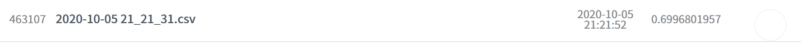

# 10월 5일

1. `pd.get_dummies` 를 이용하여 train data 안의 비정형 데이터들을 categorical 하게 바꿈.

- `LGBMClassifier` 를 사용하여 간단히 모델을 구축해봄

- `cross_val_score`, `cross_val_predict` 를 사용하여 Kfold validation 을 해보았으며 `confusion_matrix` 를 봄.

- `datetime` 과 `timezone` `utc` 를 활용하여 제출 파일 제목을 날짜화 시킴.

- 원래 비정형 데이터 였던 것을 숫자화 시킨 column 들이 있다. **education, engnat, hand, married** 가 그러하다. 그렇다면 이것들을 categorical 하게 바꾸면 어떨까?

> 4번 을 적용하지 않았을 때

> 4번 을 적용했을 때
>
> 쓸모없다.

> LGBM model 의 parameter 를 바꿔보았다. learning_rate 를 줄이고 `boosting_typ` 을 **'dart'** 로 바꿔보았다. 맨 아래 LGBM 관련 글을 참고해보자

## QT

> 더 나은 모델을 구축하여 Kfold 를 시도해보자.
>
> 
semi-supervised learning 을 적용해볼 수 있을까?
>
> 전형적인 regression 문제인 것 같은데.. binary classification 으로도 가능하지 않을까?

# 읽어본 글

- [LGBM](https://nurilee.com/lightgbm-definition-parameter-tuning/)
