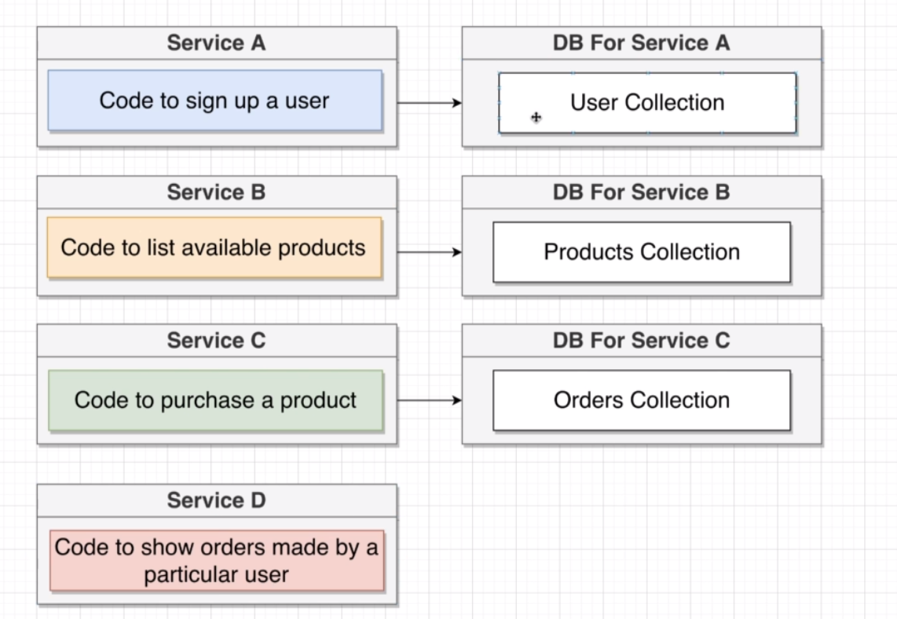
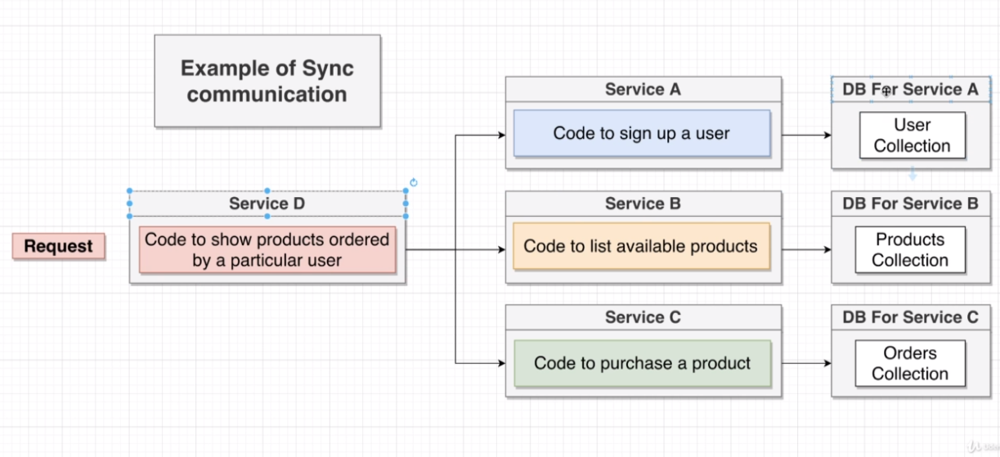
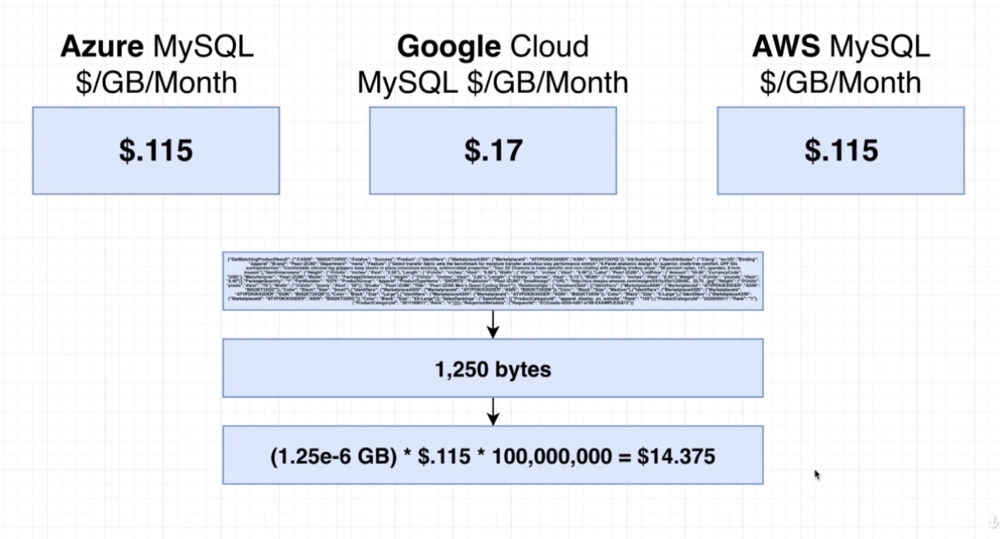

이 포스트는 [_Stephen Grider_](https://www.udemy.com/user/sgslo/)의 [**Microservices with Node JS and React**](https://www.udemy.com/course/microservices-with-node-js-and-react/learn/lecture/) 를 수강한뒤 정리한 것입니다.

# Monolithi

`A monolith` 는 우리가 구현하려는 app의 **모든 feature 들을 구현**하기 위해

1. _Routing_

2. _Middlewares_

3. _Business Logic_

4. _Database access_

가 다 들어가 있다.

> 필자는 `monolith` 만을 써왔고 이 글을 읽는 대부분의 분들도 그렇지 않을까

# Microservice

`A single microservice` 는 우리가 구현하려는 app의 **single feature 를 구현**하기 위해

1. _Routing_

2. _Middlewares_

3. _Business Logic_

4. _Database access_

를 포함한다

만약 내 앱에 service A, B, C, D 가 있다면 각각에 상응하는 middleware 들과 router 그리고 DB가 있다는 것이다.

이러한 세분화는 서비스간의 독립성을 보장하여 다른 서비스의 오류가 또 다른 서비스의 오류를 낳지 않고 그 서비스들의 작동을 보장할 수 있는 것이다.

> 여기까지 보고 " 그래 그냥 feature 들을 분리시키기만 하면 되겠지 " 라고 생각할 수 있지만 현실은 그렇지 않다.

# Challenge with microservices

## Data management between services

> 가장 중요한 문제

**microservice** 에서는 service 마다 자기 자신만의 DB를 가지고 있다.

또한, **절대로** 다른 서비스의 DB를 접근하지 않는다. 자기 자신의 DB만 접근하는 것이다.

만약, Service A의 Feature A가 Service B의 DB에 접근하여 데이터를 가져온다고 하였을 때, 만약 B의 DB 안의 Schema가 바뀐다면 Service A는 고장날 것이다.

## So, why DB per service

1. 각 서비스가 독자적으로 작동한다
2. DB schema나 structure는 바뀔 수 있다
3. 서비스마다 최상의 효율을 보이는 DB의 형태는 다를 수 있다. sql? nosql?

---

만약, 아래와 같은 서비스를 microservices로 구현하려면 어떻게 해야할까? 다른 서비스들의 DB 데이터들이 필요한 경우에 말이다.

# Two general strategies

> JS에서의 `Sync` `Async` 가 아니다!

1.  Sync
2.  Async

    ## Sync communication

    Sync Communication 에서는 필요한 DB의 data를 그 DB에 해당하는 service에 접근하여 얻어낸다.

    아래 예시를 보자

    

    ### Pros

    ***

    1. 개념적으로 이해가 쉽다
    2. 서비스 D 는 DB가 필요하지 않다.

    ### Cons

    ***

    1. 서비스들 간의 종속성을 만든다.
    2. 서비스 간의 요청이 하나라도 실패한다면, 모든 것이 실패한다
    3. 여러 서비스들에 접근해야 했을 때, sync의 속도는 가장 느린 서비스 request의 속도가 될 것이다.
    4. 너무 많은 request를 초래할 수 있다.

    ## Async Communication

    > db-per-service pattern 과 마찬가지로 async communication은 이상하고 비효율적으로 보이겠지만 hold on!

    1. Event Bus 만 활용

    > Service D 는 DB가 없을 것
    > 현실에서 쓰이긴 하지만 Sync 의 단점들만을 안고 있다고 볼 수도 있다. 이번 강좌에서는 2번을 쓸 것

    1. Event Bus 를 활용하여 data를 저장

    Service D의 DB를 생성해두고 다른 DB에 변화가 생기면 event bus를 통하여 그 값을 전달해주어서 Service D의 DB를 동시에 채워넣어주는 것.

    만약 위의 예시에서 새로운 product를 등록한다면 해당 부분을 처리하는 Service는 자신의 DB에 그것을 등록함과 동시에 Event bus에 값을 전달해줌

    > "새로운 제품 등록됐는데 관심 있는 Service~" 이런 느낌

    그러면 Service D 가 그 값을 전달받아서 자신의 DB에 등록한다

    그러면 결국 Service D는 fully populated

    ## Pros

    1. Service D 는 zero dependency
    2. Service D 는 자신의 DB에만 접근하면 되기에 매우 빠르다

    ## Cons

    1. Data duplication..
    2. 이해가 어렵다

    ***

    

    > 아마존의 상품 정보 100,000,000 개를 1달 저장하는데 14달러 정도 밖에 들지 않을 것

## 읽어볼만한 글

- [Microservice-architecture란]("https://medium.com/webeveloper/microservice-architecture%EB%9E%80-ca9825087050")

- [마이크로서비스 기반 클라우드 아키텍처 구성 모범 사례 - 윤석찬 (AWS 테크에반젤리스트)]("https://www.slideshare.net/awskorea/microservices-architecuture-on-aws")

- [MSA]("https://brunch.co.kr/@yesjun/2")
